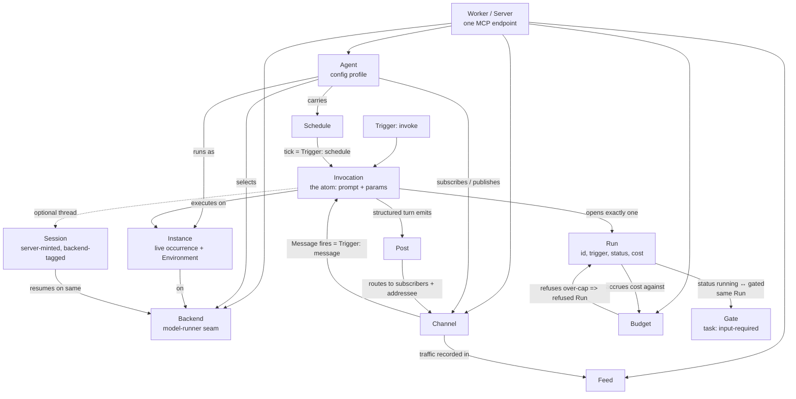

# Agent Worker MCP Server: A Contract for Agentic Work as an MCP Service

> A north-star specification for a general, language-agnostic Agent Worker MCP Server.

## Abstract

This specification defines a general, language- and backend-agnostic contract for exposing agentic work as a Model Context Protocol (MCP) service, so that any client, from a one-shot CLI to a hosted thousand-agent fleet, can discover and drive long-lived agents through a single uniform surface. Its core thesis is that an agent and an MCP server are the same shape: all capability composes from one atom, a single "prompt" operation (a required prompt plus optional, backend-negotiated parameters), which projects onto one MCP tool and executes synchronously, as a pollable MCP task, or as an incremental stream. Around that atom the spec fixes the nouns that make a fleet legible: agents as named configuration profiles over swappable backends, resumable sessions with server-minted ids, cron-driven triggers, channel-based inter-agent messaging, first-class runs with live observability and enforced budgets, and gateable world-writing actions contained to allowed roots. Every enumeration, error, artifact reference, and access-control decision is defined once in a normative registry and cited verbatim, and every capability is negotiable and self-testable against a conformance ladder. It is explicitly not a workflow or DAG engine: deterministic fan-out and synthesis compose with this server by calling the prompt tool, and are out of scope here.

## Design principles

- The atom is one prompt operation. Every capability, whether a scheduled tick, a message-triggered turn, or an interactive session, composes from a single prompt call rather than a bespoke verb; if a feature cannot be expressed as the atom plus parameters, it belongs in a different layer.
- An agent and an MCP server are the same shape, and the MCP surface IS the architecture. Capabilities project onto MCP primitives (tools for actions, resources with subscriptions for observable state, prompts for templates, tasks for long runs with input-required holds); there is no second, private API behind the surface.
- The core names no backend and no model. A backend is a swappable model-runner behind a seam; different backends support different parameter subsets, so parameter support is negotiated and reported, never assumed, and an unsupported parameter is a typed, discoverable failure, not silent coercion.
- Agents are configuration, not code. An agent is a named profile of default parameters plus a base prompt; creating, tuning, and scheduling agents is data manipulation, and the same server powers a solo CLI and a hosted fleet without code changes.
- Structured output and token streaming are distinct, non-combinable modes. A JSON output schema makes the model emit JSON for agent-to-agent messages; incremental token streaming is opt-in via a progress channel; a caller selects one, and the contract never pretends to deliver both at once.
- Every invocation is a first-class, observable run. Runs carry identity, trigger kind, status, timings, and cost; watching a long multi-agent run LIVE is a first-class requirement, not an after-the-fact report, and cost is tracked against budgets that refuse runs past a cap.
- World-writing is gateable, untrusted input is contained, and spend is bounded. Side-effecting actions can be held for approval and resumed; caller-supplied paths are confined to an allowed root; approval, elicitation, budgets, and isolation are the governance surface, and they are negotiable capabilities, not deployment folklore.
- One normative vocabulary, cited verbatim. Trigger kinds, run statuses, task states, gate and hold states, error codes, and artifact addressing are each fixed once in a registry; no section invents its own strings, and any two sections that name the same concept name it identically.
- Large payloads live out of line behind a uniform artifact reference. Diffs, results, previews, and message bodies over an inline threshold are addressed by a single artifact URI scheme with defined creation, sizing, retention, and access control, so no message or run record carries a payload.
- Capabilities are discoverable, tiered, and self-testable. A client negotiates against a conformance ladder and a capability descriptor covering parameters, modules, limits, identity, and tenancy; a deployment can advertise, and a test can assert, exactly what it supports.
- This is not a workflow engine. Deterministic fan-out, join, and synthesis are a separate concern that composes with this server by calling the prompt tool; the spec deliberately does not rebuild orchestration, DAGs, or mechanical joins, and convergence is achieved by prompting, not by a mandatory mechanical barrier.

## Contents

1. Thesis and scope
2. Core model and vocabulary
3. The prompt primitive and execution model
4. Agents, configuration and backends (revised)
5. Sessions and memory
6. Scheduling and triggers
7. Inter-agent communication (revised)
8. Observability
9. Safety, governance and permissions
10. The MCP surface and client integration (revised)
11. Durability, deployment and scale
12. Conformance, tiers and extensibility

## Thesis and scope

### What this specifies

An **Agent Worker MCP Server** is a backend that exposes agentic work as a Model Context Protocol (MCP) contract. It takes the one operation every agent reduces to, run a prompt against a model-runner and return (or stream) a result, and publishes it, plus the state and lifecycle around it, as MCP primitives. Any conforming MCP client can then drive it: discover its capabilities, invoke the atom, resume a session, watch a run, approve a gate, subscribe to a channel.

This document specifies the **contract**, not an implementation. It describes the shapes a server MUST expose, the semantics those shapes MUST obey, and the freedoms an implementation MAY exercise. Wherever this spec names a field, a state, or a transition, an implementation is bound by it; wherever it describes a mechanism (a runtime, a store, a scheduler), the implementation is free to choose one, provided the observable contract holds. Where a name is enumerable, a trigger kind, a run status, a task state, an error code, the authoritative list is the **vocabulary registry** appendix, and every section (including this one) draws from it verbatim rather than restating a variant.

The spec is **language-agnostic and backend-agnostic**. It defines no code, no wire framing beyond MCP itself, and no model-runner. A conforming server MAY be a hundred-line CLI wrapper around one local model or a hosted service fronting a fleet; both satisfy the same contract if they project the same MCP surface.

### The core identity: an agent and an MCP server are the same shape

The organizing insight is an equivalence, not an analogy:

> An agent is a thing you send a prompt and get work back from. An MCP server is a thing a client sends a request to and gets a result back from. **These are the same shape.** An agent's work surface, its one real operation plus the state around it, projects cleanly onto MCP's primitives with nothing left over.

Taken seriously, this collapses two designs into one. You do not build an agent and then bolt an MCP server onto it, nor build an MCP server and script an agent behind it. The agent's capabilities *are* the server's surface. The projection is total and direct:

| Agent-side concept | MCP primitive | Why it fits |
|---|---|---|
| Run a prompt (the atom) | **Tool** | An action the client invokes with arguments and gets a result from. |
| A long run you can poll/cancel | **Task** | MCP tasks give a handle to poll, wait, or cancel; a hold maps to input-required. |
| Incremental token output | **Progress channel** | Opt-in streaming over the request's progress notifications. |
| Observable state (sessions, runs, channels, feed) | **Resource** (with subscription) | Named, readable, subscribable state the client can watch live. |
| Base/system prompt, reusable templates | **Prompt** | Parameterized message templates the client can list and fill. |
| Capability discovery | **initialize / list** | The client learns what this server can do before driving it. |

This table is the thesis-level claim; the normative projection, which tool the atom binds to, what each resource contains, how a hold surfaces, is fixed in the **MCP surface** section.

Because the projection is total, the MCP surface **is** the architecture. There is no second, private interface that the "real" agent speaks; the server has no capability it does not express as an MCP primitive. A server MUST NOT require an out-of-band side channel to perform core work (invoking the atom, resuming a session, observing a run, clearing a gate). If a capability exists, it MUST be discoverable and drivable through MCP.

### The client/server reframe of the AI coding desktop

The familiar AI coding desktop, a monolithic app where the editor, the agent loop, the model calls, the session history, and the approval prompts are one process, is a **fused client and server**. Pull them apart along the MCP seam and every desktop concept lands on a server-side concept that a detached client can drive:

| Desktop (fused) | Server-side (this spec) |
|---|---|
| Open project / folder | A working directory bound to an invocation or agent profile |
| Chat thread | A resumable **session** (server-minted id, resume-safe) |
| "Run the agent" | **Invoke** the prompt atom (sync, streamed, or as a task) |
| Named assistant / mode / persona | A named **agent profile** (default params + base prompt) |
| Background / scheduled task | A **schedule** (a tick invokes the atom) |
| Continue on another machine | A second client attaching to the same server |
| "Allow this action?" popup | A **gate** (task holds at input-required, resumes on approval) |
| Activity / history pane | The **runs** resource and the **feed** |

The consequence is decoupling of client from compute. The thing that renders a conversation and the thing that runs the agent need not be the same process, the same machine, or even the same session: a run started by a schedule is watchable by a human's client; a session begun in a CLI is resumable from a desktop; a gate raised under one client is clearable by another. **Detachment is a first-class requirement, not an incidental capability.** The normative contract for it is split by concern: **Durability** fixes what state survives a disconnect or restart, and the **MCP surface** fixes how a client reattaches, replays, and approves.

### Clients and scale

A single conforming server MUST power the full range of clients and the full range of deployments without a protocol fork. The client difference is entirely presentation, not contract: a desktop agent app, an editor, a one-shot or REPL CLI, a hosted fleet service, and **another agent** all drive the same tools and resources; they differ only in how they render the result. The enumerated client-to-primitive mapping is owned by **Core model**. That last client closes the equivalence on itself: because the server exposes agentic work as an MCP tool, and MCP clients can themselves be agents, an agent driving this server is indistinguishable from any other client. Multi-agent composition needs no separate protocol; it is one server's client being another server.

Scale is likewise a deployment property, not a protocol fork. A client MUST NOT need to know whether it is talking to a one-shot process or a thousand-agent host to invoke the atom, resume a session, or watch a run. The contract is additive: a minimal server MAY implement only the atom as one tool, and each further capability (sessions, schedules, channels, runs, budgets, gates, isolation) is independently adoptable. A server MUST NOT make a lower rung depend on a higher one, and a client MUST discover, via capability negotiation, see **Relationship to MCP**, which rungs a given server backs rather than assume. The conformance ladder that names the rungs is owned by **Conformance**.

### What "worker" means

"Worker" is a deliberate, load-bearing choice of word, and it fixes three properties:

1. **Long-lived, not request-scoped.** A worker outlives any single invocation. Sessions persist, schedules keep ticking, channel subscriptions stand, and runs accumulate. A server MUST NOT require that agent state be reconstructed from scratch on every call; a session's continuity is the server's responsibility, not the client's. What continuity means concretely across disconnects and restarts is fixed in **Durability**.
2. **Driven, not autonomous-by-fiat.** A worker does work that is dispatched to it. Every unit of work is the *same atom* under a **trigger**, and a server MUST record the trigger kind on every run so that a human, a schedule, and a peer agent are distinguishable in the record but identical in mechanism. The canonical set of trigger kinds is fixed once in the **vocabulary registry** (`invoke`, `schedule`, `message`, `gate_resume`); this section names them only to make the point and defers the trigger-to-run admission mechanics to **Scheduling**.
3. **One of possibly many.** "Worker" implies a fleet is a normal, not exceptional, deployment. Identity (which agent, which session), accounting (which run cost what), and isolation (whose files, whose budget) MUST be explicit enough that N workers coexist without collision. A single-worker deployment is the N=1 case of the same model, not a different one.

"Worker" does **not** mean a job-queue task, a stateless function, or a DAG node. The unit of work is an agent turn, and the agent persists between turns.

### Relationship to MCP

MCP is the **sole** external contract. This spec adds semantics *on top of* MCP primitives; it does not extend the wire protocol, define new message types, or require client behavior beyond conformance to MCP.

- A conforming server MUST be a conforming MCP server. Everything a client needs, capability discovery, invocation, streaming, tasks, resources, prompts, MUST be reachable through standard MCP.
- This spec constrains **how** the primitives are used; it does not invent primitives.
- Where MCP offers a mechanism, this spec MUST use it rather than a parallel one: long runs use **tasks**, not a bespoke polling endpoint; live state uses **resource subscriptions**, not a private event bus; streaming uses the **progress channel**, not a side socket.
- Capability negotiation is the compatibility contract. Because rungs are additive, a client MUST discover what a server supports rather than assume, and a server MUST advertise only the capabilities it actually backs. How MCP-native capabilities relate to the namespaced capability descriptor is settled in **Conformance**.

Two properties of the shared model are thesis-level claims restated here for context, but their normative rules, including how a call that requests both is resolved, are owned elsewhere and are not re-asserted here as MUSTs:

- **Structured output and token streaming are distinct, non-combinable modes.** A JSON-schema'd result makes the model emit JSON, not prose; there is no partial-JSON token stream. Structured output is for agent-to-agent messages; streaming is for human-legible progress. The normative rule, and the resolution when one call asks for both, is fixed in **Prompt §8**.
- **Streaming is opt-in.** Absent a progress token, a server returns the final result only; a progress token is the client's request to receive incremental output. The normative form of this is also in **Prompt §8**.

### In scope

- The **prompt atom** and its projection onto one MCP tool, including its parameter set (a required prompt plus optional model, effort, tools, working directory, session, timeout, and profile-supplied defaults). The canonical field names, units, and precedence are owned by **Agents** and **Prompt §1**.
- **Async execution** via MCP tasks (poll / wait / cancel) and **opt-in incremental streaming** via the progress channel.
- **Agent profiles**: named configuration (default params + base/system prompt) as data, and the backend seam behind which swappable model-runners live.
- **Sessions**: server-minted, resumable, backend-tagged threads that hide and decouple from the backend's own resume token, and refuse cross-backend resume.
- **Scheduling**: an agent's schedule (timezone, run-on-start) as an invocation trigger.
- **Inter-agent communication**: channels, subscriptions, directed and reply-threaded posts, and depth bounds, with convergence by prompting rather than a mandatory mechanical join.
- **Observability**: runs as first-class records, a channel feed, live watching of in-flight runs, and cost/budget visibility.
- **Safety and governance**: gates for world-writing actions, path containment to an allowed root, budget caps, and per-agent/per-instance isolation.
- The **MCP surface** as the architecture: the mapping of every capability above onto tools, resources, prompts, and tasks.

### Out of scope

| Not specified here | Why | Where it lives instead |
|---|---|---|
| A workflow / DAG / orchestration engine | Deterministic fan-out and synthesize is a distinct concern; rebuilding it here would bloat the atom. | A **client** that calls the prompt tool. It composes with this server, it is not part of it. |
| A specific model-runner or provider | The core names no backend by design; different backends support different parameter subsets. | Behind the backend seam, chosen at deployment. |
| Wire protocol / transport | MCP already defines it. | The MCP specification. |
| Client UX (chat panes, editors, dashboards) | Clients differ only in presentation; the contract is identical. | Each client. |
| Prompt engineering / agent behavior quality | Governed by the profile's prompt and the operator, not the contract. | Agent profiles and their authors. |
| A mandatory persistence technology | Continuity is a contract, not a storage mandate. | Implementation choice, as long as sessions/runs survive per **Durability**. |

The dividing line is sharp and worth stating plainly: **this spec is the substrate that makes agentic work drivable and observable over MCP; it is not the thing that decides what work to do.** Deciding, planning, decomposing, fanning out, synthesizing, is a client's job, and a client that does it is just another agent invoking the atom.

## Relationship to the MCP protocol and the agent-protocol landscape

This spec is not inventing new machinery where the protocol already has it. Its
execution and governance surfaces map onto standardized MCP features, and a
conforming server MUST use them rather than a private equivalent.

### Async execution is the MCP Tasks Extension (SEP-2663)

The pollable, cancellable execution model in this document IS the MCP **Tasks
Extension** (`io.modelcontextprotocol/tasks`, SEP-2663), which exists explicitly
to carry long-running work "such as Agent communication." A conforming server
MUST express task-augmented runs through it:

| This spec | MCP Tasks (SEP-2663) |
|---|---|
| Run the atom as a task | task-augmented `tools/call` |
| Poll status | `tasks/get` (the blocking `tasks/result` was removed) |
| Server push of status | `notifications/tasks` |
| Cancel | `tasks/cancel` |
| Fulfil a hold | `tasks/update` |
| Run status | `working` / `input_required` / `completed` / `failed` / `cancelled` (last three terminal) |

Task augmentation is negotiated globally (the client declares the tasks
extension in its capabilities) and reported per tool (a tool advertises whether
it forbids, permits, or requires task augmentation); a server MUST NOT return a
task handle to a client that has not declared support.

### Gates and approvals are input-required plus elicitation

A world-writing action held for approval is not a bespoke channel: the run
transitions to `input_required` and surfaces an **elicitation** request
(`elicitation/create`) in its `inputRequests`, which the client answers via
`tasks/update`. The run stays `input_required` until every request is answered,
then resumes. Approval, and any other mid-run question, is therefore already
carried by the protocol; the gate is a policy over it, not a new transport.

### Streaming and UI

Incremental token output uses MCP progress notifications on the request's
progress channel (opt-in via a progress token). A server MAY additionally use
**MCP Apps** (server-rendered UIs, standardized in the 2026-07-28 release) to
present approval, observability, or run-inspection surfaces to a human at a
client, but MUST NOT require them: every capability MUST remain drivable through
tools, resources, and tasks alone.

### Positioning versus A2A

MCP governs how an agent reaches tools and capabilities; **A2A** (Agent2Agent,
now under the Linux Foundation) governs how autonomous agents discover and
delegate to one another across vendors, via Agent Cards. The inter-agent bus in
this spec is *internal* to one worker and is deliberately distinct from A2A: it
is coordination among a server's own agents, not cross-vendor delegation. A
conforming server MAY **bridge** to A2A, publishing its agents as A2A Agent Cards
and accepting A2A tasks, while continuing to serve MCP for tool execution; such a
bridge is an optional capability and out of the normative core here. The intended
layering is A2A for cross-org orchestration, this MCP surface for driving a
worker, and the internal bus for a worker's own agents.

### References

- MCP Tasks Extension: [SEP-2663](https://modelcontextprotocol.io/seps/2663-tasks-extension), [overview](https://tasks.extensions.modelcontextprotocol.io/)
- MCP 2026-07-28 specification release candidate (elicitation, MCP Apps): [blog](https://blog.modelcontextprotocol.io/posts/2026-07-28-release-candidate/)
- A2A and the agent-protocol landscape: [MCP vs A2A](https://auth0.com/blog/mcp-vs-a2a/)

## Core model and vocabulary

This section fixes the nouns and the enums. It is the **single source of truth** for the concept set: every later section is defined in terms of these terms and MUST cite the enumerations published here **verbatim**. An implementation MUST NOT rename a concept, MUST NOT introduce a second concept that occupies the same role, and MUST NOT invent an enum value not registered here. Where a term maps onto an MCP primitive, that mapping is normative and is stated in the term's entry. Where the deep semantics of a term live in another section, this section gives the canonical name and shape and **defers** the mechanism to that owning section rather than restating it.

Three invariants frame everything below.

1. **The atom is the Prompt.** A single *invocation* of a prompt is the only unit of work the model defines. There is no second execution primitive.
2. **A Run is exactly one invocation, and only a Trigger mints a Run.** There are exactly **three** Triggers (below). Lifecycle transitions of an existing Run, gate approval, cancellation, timeout, are **not** Triggers and MUST NOT mint a new Run; they change the status of the Run that already exists.
3. **The surface is the architecture.** Each noun projects onto an MCP primitive class, and clients discover and drive the Worker only through that projection. A noun with no MCP projection is not part of the contract.

### Canonical enumerations (normative registry)

These three enums are authoritative. Any section that records a trigger kind, a run status, or a task state MUST use exactly these values, spelled exactly this way. No section may add, drop, or re-spell a value; a capability that needs a new distinction records it in a separate field (e.g. a `reason` or a scheduling-admission outcome), never by extending these enums.

**Trigger kinds**, the cause that mints a Run. Exactly three:

| kind | cause | reduces to |
|---|---|---|
| `invoke` | a client calls the `prompt` tool | the invocation itself |
| `schedule` | an Agent's Schedule ticks | an invocation with the Agent's defaults |
| `message` | a Message fires a subscribed Agent | a structured invocation over the Channel context |

There is no `gate_resume`, `tick`, `bus`, `subscribe`, `manual`, `task`, or `resume` trigger. `manual` is `invoke`. `tick`/`subscribe`/`bus` are `schedule`/`message`. `task` is an *execution shape* of an `invoke` (sync vs. task), not a cause. Gate resume is a status transition of an existing Run (invariant 2), not a trigger.

**Run statuses**, the lifecycle of a Run. Exactly seven:

| status | meaning | terminal |
|---|---|---|
| `queued` | admitted, not yet executing | no |
| `running` | executing a turn | no |
| `gated` | paused awaiting Gate approval | no |
| `succeeded` | completed normally | yes |
| `failed` | errored; **includes timeout** (a timeout is a failure, never a silent truncation) | yes |
| `cancelled` | stopped by a client or the Worker before completion | yes |
| `refused` | rejected at admission (budget cap, unsupported parameter, storm/depth bound) before any turn ran | yes |

No other run status exists. `pending` is `queued`; `completed` is `succeeded`; `canceled` (one `l`) is `cancelled`; `input_required`/`blocked` at the *run* level is `gated`. Streaming is an execution mode, not a status. A schedule tick that is skipped or coalesced does **not** open a Run and therefore has no run status; those admission outcomes are recorded by Scheduling (which owns them), not as run statuses here.

**Task states**, the MCP task projection of an async Run. These are the standard MCP task states; the mapping from run status is fixed:

| run status | MCP task state |
|---|---|
| `queued`, `running` | `working` |
| `gated` | `input-required` |
| `succeeded` | `completed` |
| `failed`, `refused` | `failed` |
| `cancelled` | `cancelled` |

`gated` ↔ `input-required` is the **one** held-for-approval state under two names: `gated` is the run-status name, `input-required` is its task-state projection. They are the same state, never two.

### Glossary at a glance

| Term | One-line definition | MCP projection | Identity |
|---|---|---|---|
| **Server / Worker** | The process that exposes agentic work as an MCP contract and executes it | The server endpoint itself | Endpoint address |
| **Agent** | A named configuration profile: default params plus a base prompt. Not code | A `prompt` template + an `agent://` `resource`; invoked through the single generic `prompt` tool with an `agent` argument | Agent name (stable) |
| **Instance** | A live, running occurrence of an Agent; the unit that holds an Environment and executes Runs concurrently | `resource` (`instance://`, readable) | Instance id (server-minted) |
| **Backend** | A swappable model-runner behind a seam; supplies the actual turn | None directly; named in Agent/Session/Run records | Backend id |
| **Prompt / Invocation** | The atom: one prompt plus optional params. An invocation is one call of it | `prompt` tool call, optionally as a `task` | Invocation = Run id |
| **Run** | The first-class record of one invocation | `resource` (readable, subscribable); the `task` handle when async | Run id (server-minted) |
| **Session** | A resumable thread of Runs with a server-minted id, tagged to one Backend | `resource` (readable, subscribable) | Session id (server-minted) |
| **Trigger** | The cause that mints a Run: `invoke`, `schedule`, or `message` | Recorded field on the Run; not a standalone primitive | (enum) |
| **Channel** | A named topic Agents subscribe to; a Message fires subscribers | `resource` (subscribable) | Channel name |
| **Message / Post** | The unit carried on a Channel; a Post is a Message an Agent emits from a turn | Content within Channel/Feed resources | Message id |
| **Schedule** | A cron spec (timezone, run-on-start) an Agent carries; a tick mints a `schedule` Run | Config on the Agent resource | (per Agent) |
| **Feed** | The observable stream of Channel traffic across the Worker | `resource` (subscribable) | Singleton per Worker |
| **Budget** | A cost/token cap that refuses Runs past a limit | Config + a readable `resource` | (per scope) |
| **Gate** | A hold on a world-writing action pending approval, then resumed | The Run's `gated` status, projected as a `task` in `input-required` | Gate id (= paused task) |
| **Environment** | The isolated execution context (cwd, allowed root, env) an Instance's Runs occupy | Config on Agent/Instance; recorded on Runs | (per Agent/Instance) |

### The nouns

#### Server / Worker

The **Worker** is the unit of deployment: one process (or logical service) that holds a set of Agents, Backends, Instances, Sessions, Runs, Channels, and a Feed, and executes agentic work. The **Server** is the Worker's MCP face. They are the same object named from two sides. The specification uses **Worker** for the executing whole and **Server** only where the MCP-endpoint aspect is what matters.

- A Worker MUST expose exactly one MCP endpoint as its entire public surface. A capability absent from the MCP surface is absent from the contract.
- The same Worker MUST back a one-shot CLI (one client, one invocation, exit) and a hosted fleet (many clients, many long-lived Agents) with no change in contract. The difference is deployment, not model.
- A Worker MUST advertise its capabilities through MCP discovery so a client can drive it without out-of-band knowledge.

#### Agent

An **Agent** is a named *configuration profile*, not code: a base/system prompt plus default values for the Prompt's optional parameters (model, effort, tool grant, Environment, Backend selection, Schedule, Channel subscriptions, Budget). An invocation of an Agent is the atom run with that Agent's defaults filled in, then overridden by anything the caller passes.

```json
{
  "name": "reviewer",
  "base_prompt": "You review diffs for correctness and...",
  "backend": "backend-A",              // optional; else Worker default
  "defaults": {
    "model": "large", "effort": "high",
    "tools": ["read", "shell:test"],   // a grant, not a capability list
    "timeout_ms": 600000
  },
  "environment": "env-review",         // optional isolated context
  "schedule": { "cron": "*/20 * * * *", "tz": "UTC", "run_on_start": false },
  "channels": { "subscribe": ["reviews"], "publish": ["notify"] },
  "budget": "budget-reviewer"
}
```

- An Agent MUST be identified by a stable name and MUST be pure configuration. Behavior comes from the prompt and the Backend, never from Agent-specific code paths.
- Each Agent projects onto **one MCP `prompt` template** (its base prompt, with the atom's parameters as prompt arguments) plus one readable `agent://` resource for its config. Agents are **not** exposed as per-agent tools; every invocation goes through the single generic `prompt` tool with an `agent` argument (the tool contract is owned by the Prompt section).
- Parameter resolution and precedence, and the validation of a supplied parameter against the selected Backend's capabilities, are **owned by the Agents section**. This section only asserts that a caller argument overrides an Agent default; the full precedence ladder (and whether a Backend's built-in defaults form a tier) is settled there.
- An Agent MAY carry a Schedule, Channel subscriptions, a Budget, and an Environment; all are optional. An Agent with none of these is a valid manual-only profile.

#### Instance

An **Instance** is a live, running occurrence of an Agent: the unit that actually holds an Environment and executes Runs. An Agent is static configuration; an Instance is a running occupant of that configuration. The distinction matters because concurrency, isolation, and per-occurrence Environment attach to the Instance, not to the Agent template.

- An Instance MUST have a **server-minted id** and MUST project onto a readable `instance://<id>` resource, so a client can address and observe one specific running occurrence (its current Runs, its Environment, its status).
- Concurrency limits (e.g. `max_concurrent`) are enforced **per Agent over its Instances**. Each Instance MAY run in its own isolated Environment; two Instances of the same Agent MAY be isolated from each other.
- Every Run MUST record the Instance that executed it, alongside the Agent. Where an implementation does not distinguish occurrences (single-instance-per-Agent deployments), it MUST still surface a stable Instance id so the addressing contract holds uniformly.

#### Backend

A **Backend** is a swappable model-runner sitting behind a single seam: given assembled context and parameters, it produces one turn's result. The core model names **no** Backend; Backend identity is data. Different Backends support different subsets of the optional parameters and execution modes.

- The core MUST NOT hardcode any Backend. A Backend MUST be selectable by id on an Agent or invocation, with a Worker default.
- A Backend MUST declare which optional parameters and which execution modes (streaming, structured output, task/async, session resume) it supports. The Worker MUST surface this for discovery and MUST reject an invocation that asks a Backend for an unsupported parameter or mode (the rejection is a `refused` Run; the negotiation rules are owned by the Agents section).
- Each Run and each Session MUST record the Backend that produced it. This tag is load-bearing for Session resume.

#### Prompt / Invocation

The **Prompt** is the atom: a required prompt string plus optional backend parameters. An **Invocation** is a single execution of it. This is the one operation the model defines and the one tool it projects onto.

```json
// invocation input (field names and full schema owned by the Prompt section)
{ "agent": "reviewer", "prompt": "Review PR #58",
  "params": { "effort": "high" },          // overrides Agent defaults
  "session": "sess-01H...",                // optional: continue a thread
  "output_schema": { /* JSON schema */ },  // optional: structured mode
  "stream": true,                          // opt-in token streaming
  "idempotency_key": "..." }               // optional; de-dup, owned by Prompt §7
```

- An invocation MUST require a prompt and MUST accept the optional parameter set; every parameter has a default from the Agent or Worker. Every Trigger ultimately constructs an invocation.
- **Async is opt-in via MCP tasks.** Calling the tool as a task MUST return a handle the client can poll, wait on, or cancel; the handle IS the Run. A plain (non-task) call MAY block to completion.
- **Streaming is opt-in via the request progress channel.** With no progress token the Worker MUST NOT stream; with one it MAY emit incremental output.
- **Structured output and token streaming are distinct, mutually exclusive modes.** The normative rule for what happens when both are requested is **owned by the Prompt section (§8)**; this section only records that a JSON `output_schema` makes the Backend emit a JSON value (the machine-readable mode used for Agent-to-Agent Posts), not token-streamed prose.

#### Run

A **Run** is the first-class, durable record of exactly one invocation. Every invocation, from every Trigger, MUST produce exactly one Run; a Worker MUST NOT execute a turn without opening a Run.

The **canonical Run schema is owned by the Observability section.** This glossary entry fixes only the identity, the status enum (above), and the invariants; other sections point to Observability for the field set and add only their own concern (result payload in Prompt, persisted subset in Durability, audit view in Governance).

```json
// illustrative subset; canonical fields live in Observability
{ "id": "run-01H...", "agent": "reviewer", "instance": "inst-01H...",
  "session": "sess-01H...", "trigger": "schedule", "backend": "backend-A",
  "status": "succeeded",                   // one of the seven canonical statuses
  "started_at": "...", "ended_at": "...",
  "cost": { "input_tokens": 1200, "output_tokens": 340, "usd": 0.02 } }
```

- A Run MUST carry a server-minted id, the Agent, the Instance, the Session (if any), the Trigger kind, the Backend, a status drawn from the canonical enum, timings, and cost. It projects onto a readable, subscribable resource; when async, the Run is the task handle.
- **Gate resume is a Run transition, not a new Run.** A Run may move `running → gated → running` when a Gate holds and is approved (same Run, same Session); rejection moves it to `cancelled`. See Governance §2 for the gate lifecycle.
- **Live observation** of a Run (status, streamed output, cost as they change) is a first-class requirement; its contract (the observation channels, sequencing, reconnect/replay) is **owned by the Observability section**. This section states the requirement and defers.

#### Session

A **Session** is a resumable thread that ties successive Runs together with continuity of conversational state. Its id is **server-minted** and decoupled from, and hides, the Backend's own resume token. The full resume contract, including the `session_backend_mismatch` refusal and any forking capability, is **owned by the Sessions section**; this entry fixes the noun and the Backend-tag invariant and defers the mechanism.

- A Session MUST be identified by a server-minted id and MUST be tagged with the Backend that owns its thread. A resume against a Session MUST run on that same Backend; a cross-backend resume MUST be refused (mechanism and error name owned by Sessions).
- Continuing a Session MUST be requested by passing its id on an invocation; the Worker translates the id to the Backend's resume token internally. Clients never see the token.
- A Session is optional. An invocation with no Session is a fresh, self-contained turn. How a Channel thread maps onto a Session for `message`-triggered Runs is defined by the Inter-agent and Sessions sections.

#### Trigger

A **Trigger** is the cause that mints a Run. It is not a standalone primitive; it is a recorded property of the Run drawn from the three-value enum above. Every Run MUST record its Trigger kind, and a Worker MUST NOT record a Trigger value outside the registry.

#### Channel

A **Channel** is a named topic that Agents subscribe to for inter-agent communication. Delivering a Message to a Channel fires its subscribers.

- A Channel MUST be addressable by name and MUST project onto a subscribable resource. Subscription is an Agent-config relationship (publish set, subscribe set).
- A Message arriving on a Channel MUST fire each subscribed Agent as a `message`-triggered invocation. That firing runs in **structured mode** so the turn can emit Posts as machine-readable values.
- The cascade/depth/storm bound that keeps firing from running away is **owned by the Inter-agent section**; this section records that Messages carry a `depth` and defers the breach behavior there.

#### Message / Post

A **Message** is the unit carried on a Channel. A **Post** is a Message an Agent emits from a fired turn. A fired turn emits a **structured envelope**, `{ "posts": [ ... ] }`, and each Post inside it has a **freeform prose `body`**, with bulk content moved out-of-line to a `ref`. The envelope is the machine-readable wrapper; the body is prose. Do not conflate the two.

```json
{ "id": "msg-01H...", "channel": "reviews",
  "from": "reviewer",                 // server-stamped; a publisher MUST NOT set/forge it
  "to": "implementer",                // optional directed addressee
  "reply_to": "msg-01H...",           // threads a cascade
  "body": "sliced #341 into three issues",   // freeform prose
  "ref": "run://.../artifact/plan",   // optional out-of-line payload for bulk content
  "depth": 3 }
```

- A Post MUST route to the Channel's subscribers **plus** any directed addressee in `to`. Replies MUST thread via `reply_to`. The `from` field MUST be stamped by the Worker from the emitting principal; a publisher MUST NOT set or forge it (owned by Inter-agent).
- Every Message MUST carry a `depth`. The depth bound and what happens when a firing would exceed it are owned by the Inter-agent section.
- Convergence of a multi-Agent conversation is achieved by **prompting** ("agree, then stop"), not a mandatory mechanical join. The model MUST NOT require a barrier/join primitive.

#### Schedule

A **Schedule** is a cron specification an Agent carries: a cron expression, a timezone, and an optional run-on-start flag. A tick mints a `schedule`-triggered invocation using the Agent's defaults; it introduces no new execution path.

- A Schedule MUST specify its timezone explicitly. `run_on_start`, when set, MUST fire one invocation at Worker/Agent start in addition to the cron cadence.
- Tick admission, coalescing, skip, missed-tick catch-up on boot, is **owned by the Scheduling section**, which is the single authority on catch-up behavior. This section does not define a backfill policy.

#### Feed

The **Feed** is the Worker-wide observable stream of Channel traffic: the ordered record of Messages and Posts as they flow. Where a Run records one invocation, the Feed records communication.

- A Feed MUST be a subscribable resource so a client can watch inter-agent traffic live. It MUST be distinct from Runs: Runs answer "what executed"; the Feed answers "what was said".

#### Budget

A **Budget** is a cost cap, in tokens and/or currency, scoped to an Agent, a Session, an Instance, or the Worker, enforced against accumulated Run cost.

- A Budget MUST be able to **refuse** a Run whose execution would exceed the cap, surfacing a `refused` Run with a reason, never a silent truncation.
- Because currency cost is notional on some Backends, a Budget MUST track tokens even when also expressed in currency.
- **Enforcement** (caps, scopes, on-breach behavior, who may raise a cap) is owned by the Governance section; **visibility** (the `budget://` resource, warnings, live cost) is owned by the Observability section. This entry fixes the noun and defers both.

#### Gate

A **Gate** is a hold placed on a world-writing action so a human (or authorized client) can approve it before it proceeds. A gated action puts its Run in the `gated` status, projected as an MCP task in `input-required`.

- A gated action MUST pause the **same** Run awaiting input; approval MUST **resume that same Run and Session** (`gated → running`), and rejection MUST cancel it cleanly (`gated → cancelled`). Approval mints no new Run.
- A Gate MUST NOT be bypassable through a different client path; because the surface is uniform, every client hits the same Gate.
- The full gate lifecycle, payload, batching/drop, auto-allow, plan-vs-diff placement, and how an approval Gate differs from a mid-turn elicitation hold, is **owned by the Governance section (§2)**. This entry carries only the noun and its `gated`/`input-required` projection.

#### Environment

An **Environment** is the isolated execution context an Instance's Runs occupy: working directory (`cwd`), an allowed-path root that contains untrusted callers, environment variables, and any sandbox boundary. It is a property of an Agent or an Instance, not a separately addressable primitive.

- Each Agent or Instance MAY run in its own isolated Environment. When a caller is untrusted, paths it supplies MUST be contained within the Environment's allowed root.
- The Environment is configuration on the Agent/Instance; it appears in Run records for auditability but is not addressed directly by a client (an Instance is; its Environment is read through it).

### How the nouns relate

The Worker is the container. Every path of causation funnels through one of exactly three Triggers into a single invocation of the atom, which opens exactly one Run. Gate approval is a transition *within* a Run, not a fourth way in.



Read in prose:

- A **Worker** hosts **Agents**, **Backends**, **Channels**, a **Feed**, and **Budgets**. An **Agent** runs as one or more **Instances**, each holding an **Environment**.
- Three **Triggers**, `invoke`, `schedule`, `message`, each construct one **Invocation** of the atom. There is no fourth way to mint a Run.
- Every **Invocation** executes on an **Instance** (hence a **Backend**), optionally within a **Session** (which resumes only on its owning Backend), and opens exactly one **Run**.
- A **Run** accrues cost against its **Budget** (which may `refuse` it) and MAY enter the `gated` status pending a **Gate**; approving the Gate resumes the *same* Run.
- An Invocation fired by a Message runs structured and emits **Posts**, which route back to Channel subscribers and any directed addressee; that traffic is recorded in the **Feed**, bounded by the Message depth.

The through-line: **Trigger → Invocation → Run**, with Instance, Session, Backend, Budget, Gate, Channel, and Environment as the axes that qualify a given Run, and the three canonical enums as the shared vocabulary every later section draws from. Hold this shape fixed and every later section is an elaboration of one axis.

## The prompt primitive and execution model

The server exposes exactly one unit of work: a **prompt operation**. Every trigger, a client call, a schedule tick, a channel message, a gated continuation, reduces to invoking this one operation (the funnel is derived in the Core model). This section OWNS: the atom's input shape, the two execution shapes (synchronous and task) and the task lifecycle, the streaming event taxonomy, cancel / timeout / retry semantics, the single normative rule for structured-vs-streaming, and the result payload's projection onto the MCP tool result. It defers, by reference: parameter resolution and backend negotiation (Agents), gate lifecycle (Governance §2), the canonical run record and the live-observation contract (Observability), what survives disconnect (Durability), the client-facing reattach protocol and the tool's wire schema (MCP surface), cross-backend resume (Sessions), and post routing (Inter-agent).

> **Vocabularies.** Trigger kinds, run statuses, task states, gate states, and error codes are drawn verbatim from the canonical **Vocabulary & Errors appendix**. This section cites those enums; it does not mint its own. Where a term below appears in `code font`, it is a registry value.

### 1. The atom

A prompt operation is a required instruction plus optional parameters, resolved against a named agent profile. It MUST project onto a single MCP tool named `prompt`. The tool's wire input schema is owned by MCP surface; the fields below are its normative meaning.

| Field | Req. | Meaning |
|---|---|---|
| `prompt` | MUST | The instruction text. The one field with no default. |
| `agent` | SHOULD | Name of the configuration profile supplying defaults and base/system prompt. Omitted → server default profile. |
| `session` | MAY | Server-minted session id to continue a thread (Sessions). Omitted → fresh, stateless turn. |
| `model` | MAY | Backend model selector. |
| `effort` | MAY | Reasoning/effort tier where the backend supports it. |
| `tools` | MAY | Tool grant for this turn (allow/deny set). |
| `cwd` | MAY | Working directory for filesystem-bearing backends. Contained to an allowed root (Governance). |
| `timeout_ms` | MAY | Wall-clock bound for the turn, in milliseconds (§6). |
| `output_schema` | MAY | JSON Schema. Its presence selects **structured mode** (§8). |
| `idempotency_key` | MAY | De-duplicates retried submissions (§7). A first-class field of the `prompt` tool input schema, so clients can discover and rely on it. |
| `metadata` | MAY | Opaque caller tags echoed into the run record (Observability). |

**Field names are wire-authoritative:** `cwd` and `timeout_ms` (milliseconds) are the normalized names; other sections MUST use these exact spellings and units.

**Resolution is not defined here.** How these fields are merged against agent-profile and deployment defaults, which are load-bearing versus advisory, and how the resolved set is validated against the target backend's declared capabilities (failing closed with a `capability_unsupported` error when a required parameter cannot be honored) are all specified in **Agents → Parameter resolution and negotiation**, which owns the precedence ladder. This section only asserts the invariant that follows from it: the prompt is the only guaranteed input, and every other field is a lever with a default. That is what lets the same tool serve a bare CLI one-shot (`prompt` alone) and a fully-specified fleet dispatch (every field set).

### 2. Two execution shapes: synchronous and task

The identical operation runs in one of two shapes, chosen by the caller through MCP, not by a separate tool:

| Shape | Selected by | Returns | Use when |
|---|---|---|---|
| **Synchronous** | Plain tool call | The final result inline, when the turn completes | Short turns; a caller that will block anyway |
| **Task** | Tool call issued as an MCP **task** | A task handle immediately; result retrieved later | Long turns, detached control, gated work, anything worth watching live |

A server MUST support the task shape for the `prompt` tool. A server MAY additionally answer synchronously. Gateable or long work SHOULD run as a task, because only the task shape exposes poll / wait / cancel / input-required. A synchronous call is semantically a task the caller chose to await in one hop; the result payload (§9) is identical.

**Task lifecycle** the server MUST implement. Task states are the MCP-protocol layer; each maps 1:1 to a canonical **run status** (owned by Observability). The mapping is normative and resolves the "one held state, four names" confusion: the held-for-approval state is `input_required` at the task layer and `gated` at the run layer, and any section's `blocked` or `pending` name for a held run refers to this same state.

| Task state | ≡ Run status | Meaning | Legal next |
|---|---|---|---|
| `submitted` | `queued` | Accepted, not started (behind budget/lock/queue) | `working`, `rejected`, `cancelled` |
| `working` | `running` | Turn executing | `input_required`, `completed`, `failed`, `cancelled` |
| `input_required` | `gated` | Paused at a gate; needs an answer to resume (§3) | `working`, `failed`, `cancelled` |
| `completed` | `succeeded` | Terminal; result available |, |
| `failed` | `failed` | Terminal; error available |, |
| `cancelled` | `cancelled` | Terminal; caller- or system-cancelled |, |
| `rejected` | `refused` | Terminal; admission refused (budget/queue deadline) before any turn ran |, |

Note the canonical spelling `cancelled` (two l's) and the terminal run status `succeeded` (not "completed"); every section MUST use these.

Task operations the server MUST expose (mapping to MCP task methods):

- **poll**, return current state and, if terminal, the result/error; non-blocking.
- **wait**, block up to a caller-supplied duration for the next state change or a terminal state; MUST be resumable, so a reconnecting client's repeated waits observe the same task.
- **cancel**, request cancellation (§5).
- **list**, enumerate the caller's tasks with state and timings.

A task is owned by the server, not by the connection that created it: the connection is a lease, and a detached client MAY drop while a different client re-attaches by id to poll / wait / cancel / approve. **What state survives disconnect and restart** is specified in Durability; the **client-facing reattach and replay protocol** is specified in MCP surface. This section asserts only the ownership invariant that both build on.

### 3. Input-required: the gate projection

World-writing actions and mid-turn questions surface as the `input_required` task state (≡ run status `gated`) rather than as a side channel. The **gate lifecycle**, approval versus clarification kinds, payload, batching, auto-allow policy, plan-versus-diff placement, and the deterministic resolution of an unanswered gate, is owned by **Governance §2**. This section specifies only the projection and the resume semantics.

When a turn reaches a gate, the server MUST (a) transition the task to `input_required`, (b) attach an **input request** describing what is needed, and (c) hold the turn's continuation.

```json
{
  "state": "input_required",
  "input_request": {
    "id": "gate_7f3",
    "kind": "approval",          // approval | question | choice (Governance §2)
    "prompt": "Push branch fix/pool-guard and open PR #58?",
    "schema": { "type": "object", "properties": { "approved": {"type":"boolean"}, "reason": {"type":"string"} } },
    "ref": "worktree:fix/pool-guard"
  }
}
```

The caller resumes by supplying input keyed to `input_request.id`. Two rules are load-bearing for this section:

- **Resume continues the same run, and does not mint a new one.** Resumption MUST continue the *same* execution, same `run_id`, same `session`, same in-flight turn, so that "approve the plan" continues the very turn that proposed it. The canonical trigger vocabulary (Core model) includes `gate_resume` to *name this continuation event* in logs and the live feed, but a run's `trigger` field records the cause that **created** it (`invoke`, `schedule`, or `message`) and MUST NOT change on resume. `gate_resume` therefore never appears as a run's creating trigger.
- **No auto-approval.** A gate left unanswered past its deadline MUST resolve deterministically per Governance §2 (default: the run fails with a `gate_timeout` error). The server MUST NOT auto-approve on timeout.

### 4. Streaming: opt-in, over progress

Incremental output is **off by default** and rides the MCP request **progress** channel. A caller opts in by supplying a progress token on the call; with no token, the server MUST NOT stream and MUST return only the final result. Streaming is a delivery option on top of either execution shape, a task MAY stream while it runs, then deliver its final result on completion.

Each progress notification carries one **event**. Servers MUST tag every event with a `type` from this closed taxonomy (owned here) so clients render or ignore per type without parsing prose:

| `type` | Payload | Meaning | Client contract |
|---|---|---|---|
| `text` | `{ delta }` | A fragment of the model's prose answer | Concatenate in receipt order to reconstruct the answer |
| `thinking` | `{ delta }` | A fragment of reasoning/scratch output | MAY be hidden; MUST NOT be mistaken for `text` |
| `tool_use` | `{ name, phase, input?, output? }` | A backend tool call starting/finishing | Render as activity; `phase` ∈ `start`/`end` |
| `turn` | `{ phase, index }` | Turn boundary within a multi-turn run | `phase` ∈ `begin`/`end`; delimits sub-turns |
| `status` | `{ state, detail? }` | A task-state / run-status transition | Drive a status line; `state` is a registry value (§2) |

Rules the server MUST honor:

- Events of a given `type` are **ordered**; `text` deltas concatenated in receipt order MUST equal the final answer's text. The server MUST NOT require clients to reorder.
- Streaming is **best-effort and lossy-tolerant**: a client that joins late, drops, or ignores progress MUST still obtain the complete, authoritative answer from the final result. Progress is an accelerant, never the system of record, the run record (Observability) is.
- `thinking` and `text` MUST be distinct types; a client MUST be able to suppress reasoning without losing the answer.

Watching a long or multi-agent run **live** is a first-class requirement of the system, but its full contract, the observation channels, sequence numbering, and reconnect/replay guarantees, is owned by **Observability**. This section contributes only the event taxonomy those channels carry, and the rule that a server SHOULD emit `status` and `turn` events even to callers that do not consume `text`, so a supervisor can render progress without parsing a token stream.

### 5. Cancellation

Any non-terminal task MUST be cancelable by its owner and by system policy (budget breach, shutdown). Cancellation is **cooperative and bounded**:

- The server requests the turn stop at its next safe checkpoint, then transitions to `cancelled`.
- Side effects already committed (a pushed branch, a sent message) are NOT rolled back; cancel stops *future* work, it is not a transaction abort. Uncommitted work prepared in isolation (a worktree, a staged action) SHOULD be discarded on cancel.
- A cancel on an `input_required` task MUST release the gate and discard the held continuation.
- Cancellation MUST be **idempotent**: cancelling a terminal or already-cancelled task is a no-op returning current state, not an error.

A partial result MAY accompany the `cancelled` terminal state (whatever text/cost accrued before the stop), clearly marked partial.

### 6. Timeouts

`timeout_ms` bounds a single turn's execution wall clock. On expiry the server MUST transition the task to `failed` with a `timeout` error and record accrued cost. A timeout MUST NOT silently truncate and return a partial answer *as if complete*: a truncated turn is a failure, not a success with less text. Timeout interacts with retries (§7), a timed-out idempotent turn MAY be retried, a non-idempotent one MUST NOT be auto-retried.

Servers SHOULD distinguish **queue time** (waiting in `submitted`/`queued` behind budget or lock) from **execution time**. `timeout_ms` bounds execution; a separate queue deadline MAY bound how long a task waits before it is `rejected` (≡ `refused`).

### 7. Retries and idempotency

Turns are **not idempotent by default**, a turn may push, post, or spend. The server MUST NOT transparently retry a turn that could have produced side effects unless the caller supplied an `idempotency_key`.

- **Submission de-duplication.** If a call arrives with an `idempotency_key` matching an in-flight or recently-completed task, the server MUST return that existing task's handle/result rather than start a new turn. This makes client retries after a dropped connection safe.
- **Internal retry.** The server MAY retry a turn that failed *before* any external side effect (e.g. a backend connection error during `submitted`/early `working`) without a key, since no effect escaped. Once a `tool_use` with external effect has fired, the server MUST surface the failure rather than retry.
- **Retry visibility.** A retry MUST emit a `status{ state:"working", detail:"retrying" }` event and increment a retry count on the run record; retries are never invisible.

```
on submit(key):
  if task = store.find_active_or_recent(key): return task   # dedup
  else: task = start(); store.bind(key, task); return task
```

### 8. Structured and streaming are mutually exclusive (normative owner)

This subsection is the single normative source for how `output_schema` and streaming interact; every other section (Thesis, Core model, Agents, MCP surface, Conformance) states the rule in one line and cross-references here.

Supplying `output_schema` selects **structured mode**: the backend is constrained to emit a single JSON document conforming to the schema. Supplying a progress token selects **streaming**: incremental prose deltas. They address different consumers and MUST NOT be combined.

| | Streaming (token stream) | Structured (schema) |
|---|---|---|
| Consumer | A human or live viewer watching prose form | Another agent/program parsing a result |
| Output | Prose, emitted incrementally as `text` deltas | One JSON object, valid only when complete |
| Partial value | Every delta is meaningful on its own | A half-emitted JSON object is neither valid nor useful |
| Model behavior | Free-form generation | Generation constrained to the schema |

The conflict is fundamental: a JSON schema makes the model emit **JSON, not prose**, so there is no prose stream to deliver, and a partial JSON document is not parseable. Therefore the rule is **reject, not ignore**:

- If a call supplies **both** `output_schema` and a progress token, the server MUST reject it with an `invalid_combination` error and MUST NOT start a turn. This is the same fail-closed discipline as §1: a request the server cannot honor as asked is an error, never a silent drop of a requested capability. It also removes the earlier reject-versus-ignore hedge, there is one rule, and it is reject.
- Structured mode MAY still emit non-`text` progress events (`status`, `turn`, `tool_use`) so a supervisor can watch a structured turn's *progress*; what it MUST NOT emit is a `text` stream, because the output is one JSON object, not prose. Emitting these non-`text` events does not require a progress token to have been paired with a schema, it applies when a token is supplied to a structured call only insofar as the call was not rejected, i.e. it is the mechanism a *structured task* uses to expose liveness through the run's observation channels rather than through the request progress channel.

Structured mode is the substrate for agent-to-agent messages: a fired turn runs structured so its emitted posts are machine-routable, precisely because that turn's output is data, not narration (Inter-agent).

### 9. The result payload and its MCP projection

Every prompt operation, in either execution shape, resolves to one result. That result **is** a **run**, but the canonical run record (`run_id`, `agent`, `session`, `trigger`, `status`, `timings`, `cost`, retry count, and audit fields) is defined once and owned by **Observability**. This section does not redefine it. This section owns only the **result payload**: the turn's answer or structured output, its digest, its emitted posts, and how all of it maps onto the MCP tool result. Synchronous and task retrieval MUST return the identical payload.

**Payload contents** (this section's concern):

| Field | Meaning |
|---|---|
| `answer` | Free-text mode: the model's prose reply. **Mutually exclusive with `output`.** |
| `output` | Structured mode: schema-conformant JSON (§8). **Mutually exclusive with `answer`.** |
| `summary` | One-line digest of the turn; SHOULD always be present and cheap to read (what a feed or supervising agent scans without loading the full turn). |
| `posts` | Structured emissions routed to channels/addressees; empty for a turn that addresses only its caller. Post **shape and routing are owned by Inter-agent**; each post's `body` is prose. |
| `session` | Server-minted session id, present whenever the turn ran in or minted a resumable thread; never the backend's own resume token (Sessions). |
| `turn` | Zero-based turn index within the session. |
| `backend` | The backend that ran the turn (Sessions; a session is tagged with its backend and refuses a cross-backend resume). |

**Projection onto the MCP tool result.** The MCP tool result carries `content`, `structuredContent`, and `_meta`; the payload maps as follows, so this section and MCP surface describe the same bytes:

| Payload | MCP result location | Notes |
|---|---|---|
| `answer` | `content` (text block) | Free-text mode only |
| `output` | `structuredContent` | Structured mode only; XOR with `answer` |
| `run_id` | `_meta.run_id` | Anchor to the canonical run (Observability) |
| `session`, `turn`, `backend` | `_meta.session` / `_meta.turn` / `_meta.backend` | Reconciles the Sessions return shape |
| `summary` | `_meta.summary` | |
| `posts` | `_meta.posts` | Inter-agent emissions |
| `cost` | `_meta.cost` | Mirrors the run's cost (Observability); MUST be present even on `failed`/`cancelled`/`refused`, since accrued spend is real |
| status ≠ `succeeded` | `isError` + `_meta.error` | `error` = `{ code, detail }`; `answer`/`output` MAY be absent or marked partial |

**Contract rules:**

- `answer` and `output` MUST NOT both be present in one result.
- The result's `status` is a canonical run status (§2 mapping); a terminal payload carries `succeeded`, `failed`, `cancelled`, or `refused`.
- On a non-`succeeded` status, `_meta.error.code` MUST be a value from the canonical error registry. The codes this section raises:

| Code | Raised when | Retryable |
|---|---|---|
| `capability_unsupported` | A resolved parameter the backend cannot honor (§1, via Agents) | No |
| `invalid_combination` | `output_schema` + progress token both supplied (§8) | No |
| `timeout` | Execution exceeded `timeout_ms` (§6) | Only if idempotent (§7) |
| `gate_timeout` | A gate went unanswered past its deadline (§3, Governance §2) | No |
| `budget_exceeded` | Refused or halted by a budget cap (enforcement owned by Governance §3) | No |
| `backend_error` | The backend failed mid-turn after an external effect (§7) | No |
| `cancelled` | Owner- or system-cancelled (§5) | N/A |

The result is the join point for the rest of the system: its `run_id` anchors observability, its `cost` feeds the budget cap, its `session` feeds resume, its `posts` feed the channel bus. The prompt primitive stays small precisely because everything downstream reads this one payload rather than reaching into the turn.


## Agents, configuration and backends

An agent is not code. It is a **named configuration profile**: a base prompt, a set of default parameters for the prompt atom, and a set of capabilities (what channels it hears, when it wakes on its own, which tools it may call, which environment and credentials it runs under, which backend runs its turns). The server holds these profiles, resolves a concrete parameter set at call time, and hands the result to a backend that actually runs the model.

This section **owns parameter resolution, precedence, and backend-capability negotiation** for the whole spec: the atom's parameter *field table* is defined in Prompt §1, but how a concrete parameter set is derived from configuration and validated against a chosen backend is fixed here, and every other section defers to it. It also fixes the shape of a profile, the instance model, the backend seam, and the rules that keep multiple backends coherent in one deployment.

### The agent profile

A profile is declarative data. An implementation MUST be able to construct, inspect, and serialize a profile without executing any model turn. A profile has this shape (fields marked optional MAY be absent, in which case a lower-precedence default applies):

```json
{
  "name": "reviewer",                    // stable id, unique within a deployment
  "backend": "backend-a",                // REQUIRED: which backend runs this agent's turns
  "base_prompt": "You review diffs...",  // system/persona prompt, prepended to every turn
  "defaults": {                          // default parameters for the prompt atom (Prompt §1)
    "model":   { "family": "reasoning", "tier": "high" },
    "effort":  "high",
    "tools":   ["fs.read", "vcs.read"],  // the tool grant (an allowlist)
    "working_dir": "workspace/reviewer",
    "timeout": 600                        // atom's `timeout` field; unit per Prompt §1
  },
  "capabilities": {
    "subscriptions": ["reviews", "pr"],  // channels this agent wakes on (Inter-agent comms)
    "schedule":      { "cron": "*/20 * * * *", "tz": "UTC", "run_on_start": false },
    "sandbox":       { "isolation": "container", "net": "deny", "root": "workspace/reviewer" },
    "environment":   "env.reviewer"      // named credential/env set, resolved out-of-band
  },
  "limits": { "budget_cap_usd": 5.0, "max_concurrent": 1 }
}
```

Every field except `name`, `backend`, and `base_prompt` is optional; the whole profile except those three MAY be empty, yielding an agent that runs the atom with deployment defaults. `name` MUST be unique within a deployment and stable across restarts (sessions, runs, schedules, subscriptions, and instances reference it). The parameter field names in `defaults` (`working_dir`, `timeout`, `model`, `effort`, `tools`, …) are exactly the atom's fields as defined in Prompt §1; this section MUST NOT introduce a differently named or differently unitized alias for any of them.

`limits.budget_cap_usd` names a cap; **enforcement semantics are owned by Governance §3** (scopes, on-breach behavior, who may raise it) and its live visibility by Observability. This field only declares the value the profile carries.

### Instances

A profile is a template. The server MAY materialize **multiple concurrent instances** of one profile, each a live running materialization with its own isolated environment. An instance is a first-class addressable unit:

| Property | Rule |
|---|---|
| identity | Each instance MUST have a server-minted id, unique within the deployment and stable for the instance's lifetime. |
| addressing | A client MUST be able to name a specific instance when invoking, observing, or cancelling it; `agent` alone selects the profile, `agent`+instance id selects one materialization. |
| observability | Every run MUST record the instance id it ran on, so a client can watch or attribute work per instance, not only per profile. |
| bound | `limits.max_concurrent` bounds the number of live instances of a profile; the server MUST refuse to materialize past it. |

When a caller invokes an agent without naming an instance, the server MAY route to an existing idle instance or materialize a new one within the bound; the chosen instance id MUST appear on the resulting run.

### Parameter resolution and precedence

Every prompt turn runs against a fully-resolved parameter set. Resolution is a strict, deterministic overlay. The server's overlay has **exactly three precedence tiers**, highest wins:

| Precedence | Source | Example |
|---|---|---|
| 1 (highest) | explicit call parameters | a client passes `effort: "low"` on this invocation |
| 2 | agent profile `defaults` | `effort: "high"` |
| 3 (lowest) | deployment defaults | `timeout: 300` for all agents |

Backend built-in defaults are **not** a server precedence tier. They are the *floor* beneath resolution: any atom parameter still unset after the three-tier overlay is filled by the chosen backend's own default at dispatch (for example, the backend's built-in model choice when a profile expresses no `model`). The server neither reads nor overrides these; the backend supplies them. This keeps the precedence model identical to Prompt §1 and the Core model (call → agent → deployment), with the backend as an implicit floor rather than a fourth configuration level.

Resolution and validation are separate steps: resolution produces an *intended* parameter set from configuration; validation (negotiation, below) decides whether that set is *runnable* on the chosen backend. A turn MUST NOT begin until validation passes.

```
resolve(call, agent, deployment):
    params = merge(deployment.defaults, agent.defaults, call.params)  // low→high, 3 tiers
    return validate(params, backend_of(agent).descriptor)   // negotiation; backend fills the floor
```

### The backend seam

A **backend** is a swappable model-runner sitting behind a fixed seam. The core server names **no** backend and hard-codes **no** model, effort scale, or tool set. Each backend is registered under a deployment-local name (`backend-a`, `backend-b`) and MUST advertise a **capability descriptor** that tells the server what it can do:

```json
{
  "name": "backend-a",
  "params": {                            // which atom parameters it accepts, with domains
    "model":  { "kind": "descriptor|concrete", "families": ["reasoning","fast"], "tiers": ["low","high"] },
    "effort": { "kind": "enum", "values": ["low","medium","high"] },
    "tools":  { "namespaces": ["fs.read","fs.write","vcs.read","vcs.write","net"] },
    "timeout": { "kind": "int", "max": 1800 }
  },
  "features": {
    "structured_output": true,           // can constrain output to a JSON schema
    "token_streaming":   true,           // can stream incremental output
    "session_resume":    true,           // can resume a prior turn's context
    "isolation":         ["process","container"]
  }
}
```

The server MUST treat this descriptor as the single source of truth for what a backend supports. The server MUST NOT assume a parameter, model, tool, or feature is available on a backend that has not advertised it. A backend MAY advertise a strict subset of the atom's parameters; supporting the full atom is not required. Backends need not be model-only: a backend MAY be a remote agent exposed over MCP, so long as it satisfies the descriptor contract and the atom's run/session semantics.

### Capability and parameter negotiation

After resolution, the server validates the intended parameter set against the target backend's descriptor. Parameters divide into **load-bearing** (correctness or safety depends on them) and **advisory** (a hint the model may honor). The server MUST classify each parameter and apply these outcomes:

| Situation | Classification | Server MUST |
|---|---|---|
| parameter supported, value in domain | any | apply it |
| parameter unsupported OR value out of domain | load-bearing (structured-output schema, tool grant, sandbox root, working dir) | **reject the call** with a typed error naming the parameter and backend |
| parameter unsupported OR value out of domain | advisory (effort, a soft model tier) | drop or clamp it, and **record the substitution** on the run |
| a requested tool namespace is outside both the grant and the backend | load-bearing | reject; a turn MUST NOT run with a tool the grant forbids |
| `structured_output` requested, backend lacks the `structured_output` feature | load-bearing | reject (a structured agent-to-agent message cannot be faked as prose) |

Two negotiation invariants:

1. **A dropped advisory parameter is never silent.** The substitution MUST be recorded on the run record (owned by Observability) so an operator can see that `effort: high` became `effort: medium` on a backend that tops out at medium.
2. **Structured output and token streaming are distinct, non-combinable modes.** Their combination is resolved in one place: **Prompt §8 owns the both-supplied contract.** This section does not restate or override it; a call that supplies both is handled per §8, and negotiation here concerns only whether each mode is individually supported by the backend (the `structured_output` row above; token streaming validated the same way against the `token_streaming` feature).

### Model portability

An agent SHOULD express model **intent**, not a concrete backend model id. Intent is a portable descriptor over two axes the atom defines abstractly:

| Axis | Portable values | Backend obligation |
|---|---|---|
| `family` | `reasoning`, `fast`, `long-context` (deployment MAY extend) | map to a concrete model it runs |
| `tier` | `low`, `medium`, `high` | map to an effort/size point on that family |

A backend MUST map a portable descriptor it advertises to a concrete runner, and MUST reject a descriptor it does not advertise rather than silently choosing an arbitrary model. An agent MAY instead pin a **concrete** backend-specific model id (`kind: "concrete"`); doing so makes the profile non-portable and valid only on backends that recognize that id. Portability is the default recommendation because it lets the same profile move across backends unchanged; a concrete pin is an explicit, backend-coupling choice. The server MUST NOT invent a mapping of its own; mapping lives entirely in the backend.

### Capabilities as triggers, not new execution paths

Capabilities are the parts of a profile that let an agent act beyond a single client-driven call. Each is optional and independently projectable onto an MCP primitive. Crucially, a capability does not add a new way to *execute* the atom; it adds a new **trigger** for the one execution path. The canonical trigger vocabulary is fixed by the Core model, `invoke | schedule | message | gate_resume`, and this section uses those terms verbatim; it does not define its own.

| Capability | Trigger kind (Core model) | Contract |
|---|---|---|
| `subscriptions` | `message` | Channels whose messages fire a turn for this agent. A fired turn runs structured so the agent can emit posts; semantics owned by Inter-agent comms. |
| `schedule` | `schedule` | A cron expression, timezone, and optional run-on-start. A tick MUST resolve and invoke the atom exactly as a client call would; it is not a privileged path. Admission and catch-up semantics owned by Scheduling. |
| `tools` (in `defaults`) | (applies to every trigger) | The tool grant: an allowlist of tool namespaces the turn may use. The backend MUST expose to the turn the grant intersected with what the backend supports, and MUST NOT expose a tool outside the grant. |
| `sandbox` | (applies to every trigger) | Isolation class, network policy, filesystem root. World-writing tools MUST be gateable (lifecycle owned by Governance §2); caller-supplied paths MUST be contained to `sandbox.root`. |
| `environment` | (applies to every trigger) | A named set of credentials, config, and secrets, resolved by reference and never inlined into the profile; two agents naming different environments MUST NOT share process-visible secrets. |

Because a scheduled tick, a channel message, and a client call all invoke the same atom, observability stays uniform: each is a first-class run tagged with its trigger kind, on a named instance. (The live-observation contract for watching a long or multi-agent run as it happens is owned by Observability; this section only guarantees that every trigger produces such a run.)

### Isolated environments

Each agent, and each concurrent instance of an agent, MAY run in its own isolated environment, and the server MUST support this. Isolation spans four surfaces:

| Surface | Rule |
|---|---|
| configuration | An instance sees only its resolved parameter set, base prompt, and grant; it MUST NOT read another agent's profile or defaults. |
| credentials / environment | Resolved by the named `environment` reference; secrets MUST NOT cross between agents naming different environments, and MUST NOT be serialized into the profile. |
| tool set | The effective toolset is `grant ∩ backend.tools`; the isolation boundary MUST enforce that a turn cannot reach a tool outside it. |
| filesystem / execution | `sandbox.isolation` selects the class (`process`, `container`, …) the backend advertises; caller-supplied paths MUST be contained to `sandbox.root`; world-writing actions MUST remain gateable per Governance §2. |

An implementation SHOULD default to the strongest isolation the chosen backend advertises and the deployment permits, and MUST fail closed: if a profile requests an isolation class the backend does not advertise, the server MUST reject rather than downgrade silently.

### Multiple backends in one deployment

A single deployment MAY register several backends and run agents against different ones simultaneously. These rules keep it coherent:

1. **Every agent names exactly one backend.** A profile without a resolvable `backend` is invalid and MUST be refused at load time, not at first call.
2. **Sessions are backend-tagged.** A session is minted against the backend that ran its first turn and carries that tag; a **cross-backend resume MUST be refused.** The tag mechanism and the `session_backend_mismatch` error are **owned by Sessions**; this section only requires that negotiation respects the tag and never routes a resume to a foreign backend.
3. **Descriptors are per-backend.** Negotiation always validates against the specific backend an agent names, so the same resolved parameter set MAY be runnable on one backend and rejected on another. This is expected, not an error in the profile.
4. **Portable profiles move; pinned profiles do not.** An agent expressing model intent (portable descriptor, advisory effort) can be re-pointed to a different backend by changing one field; an agent with concrete pins or a feature dependency the new backend lacks MUST be rejected on re-point, surfacing the incompatibility rather than degrading.

The net contract: the core names no model and no backend, an agent is portable data materialized as one or more addressable instances, and each backend is a self-describing runner behind one seam. Resolution is three tiers over a backend floor; negotiation validates that resolved set against the named backend's descriptor; adding a backend is a registration plus a descriptor; moving an agent is a field change that either validates or fails loudly.

## Sessions and memory

A **session** is a resumable thread of turns. It is the only continuity primitive in the contract: the atom (the prompt operation) carries an optional `session` parameter, and everything about "same conversation, later" flows through it. A turn with no session is a stateless one-shot; a turn with a session either opens a new thread or continues an existing one.

This section **OWNS** two rules that other sections reference rather than restate: server-minted session ids that hide the backend's native token, and cross-backend resume refusal (`session_backend_mismatch`).

### The session parameter

| `session` value | Meaning |
|---|---|
| omitted / `null` | Stateless one-shot. No thread is created, nothing to resume. |
| `"new"` / `{ "create": true }` | Mint a new session; its id is returned in the result. |
| `"<id>"` | Resume that thread from its latest committed turn. |
| `{ "fork_from": "<id>", "at": <turn> }` | Branch a new independent thread from a point in an existing one (negotiated capability; see **Forking**). |

Any turn that bears a session (created, resumed, or forked) **MUST** return the session id and the committed turn index so the caller can thread the next turn without having tracked anything itself. The result envelope itself is owned by the prompt primitive (§9); this section contributes exactly three fields to it:

| Field | Meaning | Owner |
|---|---|---|
| `session` | server-minted session id for the thread just advanced | this section |
| `turn` | monotonic index of the turn just committed | this section |
| `backend` | the session's immutable backend tag | this section |

```json
{ "session": "s_9fA2…", "turn": 7, "backend": "backend-x",
  "output": "…" }        // output/answer, summary, posts per §9
```

A one-shot turn (no session) omits `session`, `turn`, and `backend`; every other §9 field is unaffected. These three fields **MUST** appear verbatim wherever §9's result is returned, so a client threads the next call from the same record.

### Server-minted ids hide the backend token

The server mints an opaque, stable id for every session. That id is the **only** session handle a client ever sees or supplies.

- The server **MUST** maintain the mapping `session_id → { backend, cursor, … }`, where `cursor` is the backend's own native resume/continuation token.
- The backend's cursor **MUST NOT** appear in any tool result, resource representation, log, or error surfaced to a client.
- Many backends mint a **fresh** continuation token on every turn. The server **MUST** absorb that rotation behind the stable id: after each committed turn it updates the stored cursor while the id is unchanged. A client that saved `s_9fA2…` after turn 1 resumes correctly at turn 50.

Rationale: decoupling gives one durable, uniform handle across backends whose native tokens are opaque, rotating, format-divergent, and sometimes absent. It also lets the server relocate, rehydrate, or garbage-collect backend state without invalidating the id the client holds.

```
session = {
  id,                 // server-minted, opaque, stable for the thread's life
  backend,            // tag: which backend runner owns this thread
  agent,              // profile it was created under (optional)
  status,             // active | idle | expired | closed  (see appendix vocabulary)
  cursor,             // native backend continuation, server-only, never emitted
  parent,             // {session, at_turn} if forked, else null
  created_at, updated_at, last_turn_at,
  turn_count,
  labels,             // optional caller metadata (for listing/filtering)
  stats               // {tokens_in, tokens_out, cost, …}
}
```

Session `status` (`active | idle | expired | closed`) is defined by this section and is **distinct** from a Run's status (owned by Observability): it describes the durability of a thread's backend state, not the outcome of any one turn.

### Backend tagging and cross-backend refusal

A session is **tagged with its backend at creation** and that tag is immutable. Because the stored cursor is a backend-specific artifact and the live conversation state lives inside that one backend, resuming it under a different runner is meaningless.

- On resume or fork, if the turn resolves to a backend different from the session's tag (whether named explicitly or via the agent profile), the server **MUST** refuse with `session_backend_mismatch` and **MUST NOT** attempt to feed the cursor to the wrong runner.
- Per-turn parameters **MAY** drift on resume, `model`, `effort`, `tools`, `working_dir`, `timeout`, subject to what the backend supports (parameter resolution and backend negotiation are owned by the Agents section). The **backend alone is fixed**. A profile whose backend changed cannot resume its old sessions; it can only start new ones (or fork via transcript reseed, below).

This is the single normative statement of cross-backend refusal; other sections cite `session_backend_mismatch` and defer here.

### Continuity semantics

A resumed turn continues from the **latest committed turn**, in order. Turns on one session are sequenced; the server assigns each a monotonically increasing turn index and commits it (cursor + record update) atomically on success. A turn that fails or is cancelled **MUST NOT** advance the cursor or the turn count, a failed continuation leaves the thread exactly where it was, so a retry resumes the same state rather than a half-mutated one.

Continuity is **backend-native by default**: the server hands the backend its cursor and the backend replays its own thread state. The server does not reconstruct context by re-sending prior prompts unless it is acting as the memory of record for a backend that lacks native resume (below).

### Where memory lives

Two tiers, with a clean seam between them.

| Concern | Backend-owned | Server-owned |
|---|---|---|
| Live conversation context (what the model attends to next turn) | **MUST** hold, addressed by cursor | **MAY** hold a transcript |
| Native continuation token | holds it | stores + rotates it, **hidden** |
| Turn transcript (prompts + results) | **MAY** (opaque) | **SHOULD** retain durably |
| Timings, cost, tokens per turn |, | **MUST** (canonical run record: Observability) |
| Identity, backend tag, parent, status |, | **MUST** |
| Caller labels / metadata |, | **MUST**, if listing is offered |

The backend owns the **hot** memory, the actual context the model resumes into. The server owns the **durable** record: identity, lineage, and optionally a transcript. Per-turn accounting (timings, cost, tokens) is persisted as part of the canonical run record owned by Observability; the session's `stats` is a rollup of those runs. The transcript is what makes cold re-entry, migration, and transcript-based forking possible when the backend's own state has evaporated.

For a backend with **no native resume**, the server **MAY** act as the memory of record: retain the full transcript and reconstruct context by replaying it into a fresh backend invocation each turn. This is a legitimate but heavier mode, cost and latency grow with thread length, and it **MUST** be declared via the `sessions.reseed` capability flag (below) so clients and the scheduler can reason about it rather than discover it by surprise.

### Threads, channels, and the session boundary

The session is the **one and only** continuity primitive. "Thread" and "session" name the same noun; the contract says *session* for the durable handle.

- A channel thread (Inter-agent) is **not** a second continuity primitive. Reply-to threading is metadata over posts, owned by Inter-agent; it does not create sessions.
- A message-triggered turn (a fired subscription) **MUST** run on exactly one session. A subscription binds `(agent, session)`; the delivered message continues that bound session, and the server serializes it per the concurrency rule below like any other turn.
- One run advances **exactly one** session. A fired turn's `reply_to` **MUST** resolve to a post within that same session. A `reply_to` naming a post authored in a different session is a foreign-session reference and **MUST** be refused; a run **MUST NOT** span two sessions.
- How a post is threaded within a channel, and how `reply_to` is resolved to a post, are owned by Inter-agent. This section owns only the invariant that the resolved continuation is a single session and the backend tag rules apply to it unchanged.

### Forking

Forking is a **negotiated capability** (`sessions.fork`), not a mandatory core operation; a client discovers it from the capability descriptor and Conformance tiers it. Where unsupported, a `fork_from` request is refused with `fork_unsupported`.

A fork creates a **new, independent** session that branches from a point in an existing one:

```json
{ "session": { "fork_from": "s_9fA2…", "at": 5 } }
```

- The fork gets a fresh id and records `parent = { session: "s_9fA2…", at_turn: 5 }`.
- Fork semantics are **copy-on-write**: turns on the child **MUST NOT** affect the parent or its cursor, and vice versa.
- A fork inherits the parent's **backend tag**; cross-backend forking is a `session_backend_mismatch`.
- If the backend can branch its own thread natively, the server forks there. Otherwise the server **MAY** fork by replaying the retained transcript up to `at` into a fresh backend thread, if `sessions.reseed` is advertised. If neither native branching nor transcript reseed is available, the fork **MUST** be refused with `fork_unsupported`.

Forking is the sanctioned way to explore several continuations from a shared prefix (three candidate approaches from the same grounding), a set of independent children, each linearly serialized, instead of racing turns on one thread.

### Session capabilities

The server **MUST** advertise the following in the capability descriptor so clients and the scheduler negotiate rather than probe. Cross-backend resume is **never** offered, it is always refused, by contract, and needs no flag.

| Flag | Meaning |
|---|---|
| `sessions.fork` | `fork_from` is accepted (native branch or reseed) |
| `sessions.reseed` | server can reconstruct context from a retained transcript into a fresh backend thread (enables no-native-resume backends, transcript forks, and rehydration) |
| `sessions.rehydrate_on_expire` | a resume of an `expired` session transparently reseeds and keeps the id, rather than refusing |
| `sessions.list` | sessions are projected as a listable/subscribable resource |

### Expiry, retention, and rehydration

Backend state is frequently ephemeral (a TTL); the server's session record **MAY** outlive it. Status tracks the divergence:

| Status | Meaning | Resumable? |
|---|---|---|
| `active` | a turn is in flight now | per concurrency policy (queue/reject) |
| `idle` | committed, awaiting the next turn | **yes** |
| `expired` | backend state gone (TTL lapsed) | only by reseed-from-transcript; else refuse |
| `closed` | explicitly ended by a client | no; a fork **MAY** still seed from a retained transcript |

- The server **SHOULD** expose separate, configurable retention for **backend state** (usually the backend's TTL, which the server tracks) and its own **metadata + transcript**.
- Resuming a session whose backend state has expired: if `sessions.rehydrate_on_expire` is advertised the server **MUST** rehydrate transparently (replay the retained transcript into a fresh backend thread, keeping the id); otherwise it **MUST** refuse with `session_expired`. The behavior **MUST** be discoverable from that flag, never silent.
- The server **MUST NOT** delete a session record a client can still reference without first surfacing `expired`/`closed` status. Reaping a record entirely is a `session_not_found` on next reference and **SHOULD** honor the published retention window.

### Listing and re-entering

When `sessions.list` is advertised, sessions are **observable state**, projected as an MCP resource with subscription (so a client is pushed status transitions, a turn committed, a session expired).

- `list` **MUST** filter by at least `agent`, `backend`, `status`, and time; **SHOULD** support `labels`. Results carry the session record **minus the cursor** (which is never emitted).
- Re-entering is not a distinct operation: it is a prompt turn with `session: "<id>"`. Listing tells a caller *what* threads exist; the atom is *how* you rejoin one.
- A representation **SHOULD** expose `parent` so a client can walk a fork tree, and `turn_count` / `last_turn_at` so it can judge freshness before spending a turn.

### Concurrency on one session

A session is a **linear thread**; concurrent turns on it interleave context and race the cursor. Therefore:

- The server **MUST** serialize turns per session: **at most one in-flight turn per session id**.
- A second turn arriving on a busy session **MUST** be either queued or rejected with `session_busy`. Which one **SHOULD** be an explicit per-call choice (e.g. `on_busy: "queue" | "reject"`), not an implementation accident.
- Reads, listing, fetching a transcript, subscribing, are concurrency-safe and **MUST NOT** be blocked by an in-flight turn.
- Because a long turn holds its session for the turn's duration, a turn launched as an **MCP task** holds the session until it completes, and cancelling the task **MUST** release the session (and, per the rule above, leave the cursor unadvanced). Want parallelism from a shared history? **Fork**, then run the children concurrently, each child is its own serialized thread.

The resume-and-serialize guard, in shape:

```
on prompt(session=id, backend=B_req, on_busy):
  s = store.get(id)            else fail session_not_found
  if B_req set and B_req != s.backend:   fail session_backend_mismatch
  if s.status == expired:
      if caps.rehydrate_on_expire and can_reseed(s):
          s = rehydrate_from_transcript(s)   # keep the id
      else:
          fail session_expired
  if s.has_inflight_turn:
      if on_busy == "queue": await release
      else:                  fail session_busy
  cursor           = s.cursor
  result, cursor'  = backend[s.backend].run(prompt, cursor, params…)
  commit(s, cursor', turn=s.turn_count + 1)   # atomic; no-op on failure
  return { session: s.id, turn: s.turn_count, backend: s.backend, …result(§9) }
```

### Error taxonomy

These codes register into the contract's unified error model (shape and retryable classification are defined in the error appendix); the rows below are the session-scoped set this section owns.

| Error | Raised when | Retryable |
|---|---|---|
| `session_not_found` | id is unknown or its record has been reaped | no |
| `session_backend_mismatch` | resume/fork resolves to a backend other than the tag, or a `reply_to` references a foreign-session post | no (start a new session) |
| `session_expired` | backend state is gone and no rehydration path exists | no (fork-from-transcript instead) |
| `session_busy` | a turn is in flight and the caller chose `reject` | yes (retry, or use `on_busy: "queue"`) |
| `fork_unsupported` | backend cannot branch and no transcript reseed is available | no |

These **MUST** be typed and distinguishable, because callers react differently to each: `busy` invites retry, `backend_mismatch` invites starting a new session, `expired` invites a fork-from-transcript, and `not_found` is terminal.

## Scheduling and triggers

This section OWNS the trigger mechanics and the admission pipeline: how a cause is shaped, in what order it is admitted, and how it maps to a **run**. A run is the unit of observability (§ Observability, which OWNS the run schema and status set) and the unit of governance (§ Governance, which OWNS budgets, gates, and isolation). This section pins the cause side and the ordering; it does not restate the semantics those sections own.

### The unified model: a trigger is a cause, a run is the effect

The canonical trigger vocabulary is fixed in § Core model as exactly four kinds: `invoke`, `schedule`, `message`, `gate_resume`. Every section MUST use these names verbatim. Three of them **create** a run; the fourth **continues** one:

| Kind | Effect on runs | Owned by |
|---|---|---|
| `invoke` | Creates a run. A client calls the prompt tool. | this section |
| `schedule` | Creates a run. The scheduler fires a cron tick. | this section |
| `message` | Creates a run. A post lands on a subscribed channel. | this section (shaping) + § Inter-agent (routing) |
| `gate_resume` | **Continues** an existing `gated` run; mints no new run. | § Governance §2 |

The three run-creating kinds are this section's subject. `gate_resume` is not a fourth run-creating cause: an approval decision resumes the **same** run that a gate paused (consistent with § Prompt §3 and § Governance §2.4). Its payload and lifecycle live in § Governance §2; its only interaction with this pipeline is that it re-enters admission at the gate step (see below), not at the top.

The contract for the three run-creating kinds:

- A server MUST resolve every run-creating trigger through a single **admission** path that produces (or attributes to) exactly one run. There MUST NOT be a second execution path that bypasses run creation; anything that executes the atom is a run.
- Every trigger MUST leave a trace. An admitted trigger creates a **new** run that proceeds through the statuses defined in § Observability. A trigger dropped by an overlap, budget, or gate decision MUST still be visible, via one of exactly two shapes drawn from the canonical status set, never an invented status:
  - an **attribution note** on the surviving in-flight run (for overlap `skip`/coalesce), which creates no new run; or
  - a terminal **`refused`** run carrying a machine-readable `reason` code (e.g. `budget_exceeded`, `overlap_skip`).

  A silently dropped trigger is a defect: it makes the feed lie.
- The three causes differ only in *how the trigger is shaped* (who supplies the prompt, which session it binds, whether the turn is structured). Once shaped, admission and execution are identical.

All three produce the same trigger envelope; only the `cause` provenance differs.

```json
{
  "kind": "invoke | schedule | message",
  "agent": "profile-name",
  "session": "srv-session-id | null",   // null = mint a new session
  "prompt": "resolved prompt text",     // see per-kind sourcing below
  "params": { },                        // resolved per § Agents (call > agent > server default)
  "structured": { "schema": { } },      // null = prose/streamable; set = JSON turn (§ Prompt §8)
  "cause": {                            // kind-specific provenance, recorded on the run
    "invoke":   { "caller": "client-id", "task": "task-id | null" },
    "schedule": { "schedule_id": "...", "scheduled_for": "RFC3339", "fired_at": "RFC3339" },
    "message":  { "channel": "...", "message_id": "...", "reply_to": "...", "depth": 2 }
  },
  "at": "RFC3339"
}
```

### Trigger-to-run mapping

| Trigger kind | Fired by | Prompt source | Session default | Turn mode | Execution surface |
|---|---|---|---|---|---|
| **invoke** | A client calling the prompt tool | Caller supplies the prompt | Caller MAY pass a session id; else a new session is minted | Caller's choice: prose+stream, or structured (mutually exclusive per § Prompt §8) | Sync result, or an MCP **task** (poll/wait/cancel) |
| **schedule** | The scheduler firing a cron tick | Agent's base/system prompt, plus tick context (`scheduled_for`, tick payload) | A new session per tick by default; MAY be pinned to a standing session | Agent default | Always detached; the run is observable, never awaited by the trigger source |
| **message** | A post on a channel the agent subscribes to | Agent's base prompt, plus the triggering message(s) | The thread's session (the thread↔session mapping is defined in § Inter-agent), so a conversation stays coherent | MUST be **structured** so the agent can emit routable posts | Detached; posts route to subscribers + addressee (§ Inter-agent) |

Prescriptive consequences of the mapping:

- `invoke` is the only kind where the caller owns the prompt. `schedule` and `message` MUST source the prompt from the agent profile and MUST NOT accept a caller-supplied prompt; there is no synchronous caller to supply one.
- `message` runs MUST be structured. Streaming and structured output are mutually exclusive modes (§ Prompt §8 owns that rule and the both-supplied resolution); a run that must emit routable posts therefore runs structured and does not stream tokens.
- Only `invoke` MAY be surfaced to a caller as a task with an `input_required` gate projection (§ Prompt §3, § MCP surface). `schedule` and `message` runs that hit a gate hold in the `gated` status for an out-of-band approver (§ Governance §2); there is no caller to return `input_required` to.
- The `task` distinction is an **execution shape** of `invoke` (sync vs. task), not a trigger kind. It MUST NOT appear as a run's `trigger` value.

### Cron schedules

An agent MAY carry one or more schedules. A schedule is configuration on the profile, not code. Shape:

```json
{
  "cron": "0 9 * * MON-FRI",          // 5-field (min) or 6-field (with seconds)
  "timezone": "America/Los_Angeles",   // IANA name, REQUIRED
  "run_on_start": false,
  "catchup": "skip | fire_once",       // at most one catch-up run (§ Durability)
  "overlap": "skip | queue | allow | cancel_previous",
  "jitter": "0s"                       // max random delay added to each fire
}
```

Rules:

- **Timezone.** The server MUST interpret the cron expression in the schedule's IANA timezone, not the server's local zone or UTC-by-accident. If omitted, the server MUST default to UTC and SHOULD warn; it MUST NOT silently adopt host-local time (that makes the same profile fire at different wall times on different hosts).
- **DST is a wall-clock hazard the server MUST resolve deterministically.** For a spring-forward gap (a local time that does not exist), a tick scheduled inside the gap MUST fire exactly once, at the instant the clock resumes, and MUST NOT be dropped. For a fall-back overlap (a local time that occurs twice), the tick MUST fire exactly once, on the first occurrence. These rules MUST be applied per-tick, not by pre-expanding a UTC schedule at registration time (which silently breaks on the next DST transition).
- **`run_on_start`.** When true, registering the schedule (server boot, profile load, or a hot config change that adds the schedule) MUST enqueue one immediate trigger in addition to the normal cron cadence. It is a convenience for "warm on deploy," not a catch-up mechanism; the two are independent.
- **`jitter`.** A schedule MAY declare a max jitter; the server adds a uniform random delay in `[0, jitter]` to each fire to de-correlate a fleet that shares a cadence. Jitter MUST NOT change which tick a fire is attributed to: `scheduled_for` stays the exact cron instant; `fired_at` carries the jittered time.

#### Missed ticks and catch-up

When the scheduler was not running across one or more cron instants (server down, paused, or the profile disabled), those ticks were **missed**. The missed window `(last_known_fire, now)` is computed from the persisted `last_known_fire` per schedule; what state survives a restart, and its at-least-once guarantee, are owned by § Durability. This section defines only how a schedule's `catchup` policy maps that window onto concrete triggers, bounded by Durability's rule that a resume emits **at most one** catch-up run:

| Policy | Behavior on resume | Use when |
|---|---|---|
| `skip` (**default**) | Discard the whole missed window; resume at the next future instant. Record one attribution note carrying the missed count. | The work is "current state" (a health check, a digest); a stale tick has no value. |
| `fire_once` | Emit exactly one catch-up trigger regardless of how many instants were missed, then resume normally. | The work must run "soon after" downtime, but replaying N times is pointless or harmful. |

Per-instant replay of a missed window (one distinct unit of work per interval) is deliberately **not** a schedule policy: it is fan-out over a set of instants, which is workflow orchestration, not scheduling (§ non-goal). A client that needs it composes it by invoking the prompt tool once per instant. `catchup` MUST be evaluated before `overlap`: catch-up decides *how many* triggers exist (0 or 1); overlap then decides how that trigger and any live tick interleave with an in-flight run.

### Overlap and coalescing

A schedule can fire again while its prior run is still in flight; a subscription can be hit by a burst of messages faster than a run drains. Both are the same problem: more triggers than the agent can serve serially. The server MUST make this explicit per schedule/subscription rather than defaulting to unbounded concurrency.

**Overlap** is evaluated over an in-flight scope: `(agent, schedule)` for schedules, `(agent, session)` for message triggers (so two unrelated threads do not block each other). Policies:

| Policy | When a trigger arrives with a run in flight for the scope | Notes |
|---|---|---|
| `skip` (**default**) | Drop the new trigger; record an attribution note (`reason: overlap_skip`) on the in-flight run. No new run is created. | Prevents pile-up; the next tick picks up the latest state. |
| `queue` | Enqueue behind the in-flight run; drain FIFO on completion. | The queue depth MUST be bounded; on overflow the server MUST apply a declared overflow rule (drop-oldest or refuse) and record it. Unbounded queues are prohibited. |
| `allow` | Admit concurrently. | Permitted ONLY if the agent/backend and isolation model support parallel runs. A server MUST refuse `allow` for an agent pinned to a single serial session or a non-reentrant backend. |
| `cancel_previous` | Cancel the in-flight run, then admit the new one. | For "latest wins" work (a debounced rebuild). The cancelled run terminates `cancelled`, not `failed`. |

**Coalescing** collapses a burst into a single run. A server SHOULD coalesce when multiple triggers for the same scope land within a small window (or while a run is in flight under `skip`): the surviving run MUST see the whole batch (e.g. all pending messages on the channel), not just the first. Coalescing is how a subscription survives a chatty channel without spawning a run per message. It composes with the cascade **depth bound** owned by § Inter-agent: coalescing bounds *width* (a burst becomes one run) while the depth bound owned there bounds *depth* (a cascade cannot recurse without limit). This section does not redefine that bound or its breach behavior; see § Inter-agent.

Two invariants tie overlap back to the run model:

- A coalesced or skipped trigger MUST NOT create an executing run. Its trace is the attribution note on the surviving run (or, if no in-flight run exists to attribute to, a terminal `refused` run with the corresponding `reason`). No new status is invented for this; the vocabulary is the fixed status set in § Observability.
- `cancel_previous` MUST leave the cancelled run in a clean `cancelled` terminal state with its partial cost accounted; a cancelled run still spent tokens. Enforcement of the resulting spend against a cap is owned by § Governance §3; its visibility is owned by § Observability.

### Admission: the single join point

Every run-creating trigger, regardless of cause, MUST pass the same ordered admission before it becomes an executing run. This ordered list is the canonical reference for how catch-up, overlap, budget, session, isolation, and gate interleave; other sections cite it rather than re-deriving an order. The order is normative because the checks are not commutative (a budget refusal should not first acquire an isolated environment; an overlap `skip` should not first mint a session):

```
admit(trigger):
  1. resolve   -> bind agent profile; resolve params per § Agents (call > agent > server default)
  2. catchup   -> (schedule only) collapse the missed window into 0 or 1 concrete trigger (§ Durability)
  3. overlap   -> given in-flight runs for the scope: skip | queue | allow | cancel_previous
                  (may terminate here with no executing run: a note on the in-flight run, or a `refused` run)
  4. budget    -> if over cap, refuse per § Governance §3; record a `refused` run (reason: budget_exceeded)
  5. session   -> bind the target session or mint one; a cross-backend resume is rejected per § Sessions
  6. isolate   -> acquire the run's environment / concurrency slot (§ Governance isolation)
  7. gate      -> if the turn requires approval, hold the run `gated` per § Governance §2
  8. execute   -> run the atom; stream only if prose AND a progress token is present (§ Prompt §8); else buffer
```

- Steps 1–7 are **synchronous with respect to the trigger** and cheap; step 8 is the turn. A trigger that stops at 3–7 still yields a run record in the corresponding terminal (`refused`, `cancelled`) or held (`gated`) status, or an attribution note, which is what keeps "every trigger is accounted for" true.
- `gate_resume` does not enter at step 1. An approval decision (§ Governance §2) re-enters this pipeline at the boundary between step 7 and step 8 on the **same** run, taking it from `gated` back to `running`. It mints no new run and re-runs no earlier check.
- Because admission is shared, a change to budget, gate, or isolation policy applies uniformly to invoked, scheduled, and message-triggered work. There is no path by which a governance rule can attach to one trigger kind but not another.


## Inter-agent communication

Agents coordinate over a **bus**: a set of named channels carrying a single flat message shape. The model is **publish-then-trigger**, never synchronous call-and-block. An agent MUST NOT invoke another agent and wait on its return; instead it emits a post, and any agent subscribed to that post's channel is *triggered*, the same way a `schedule` tick or a client `invoke` triggers it. This keeps the fleet a set of independently-driven profiles with no call graph, and makes every exchange a durable, replayable record rather than a stack frame.

This section is the **authoritative owner** of the post shape, routing, threading, the thread↔session mapping, and the cascade/storm bounds. The Core model's `Message` glossary entry, Governance's budget caps, and Scheduling's admission rules all defer here for these; they MUST NOT restate the mechanics.

The bus projects onto MCP primitives: a **channel is a resource** (`channel://<name>`) whose content is its ordered post log; **subscribing to a channel is an MCP resource subscription**; **publishing a post is one field of a turn's structured result** (or the `broadcast` tool for an external principal) that the server appends and fans out; and the **feed** (all channel traffic) is a read-only resource a watcher tails to see the conversation live (the live-observation contract is owned by Observability).

### The post, one message shape

Every message on the bus, an FYI, a question, a directed handoff, a broadcast, is the same record. There are no per-type schemas and no envelopes. A post's `body` is **freeform prose (a string)**, what a model writes and reads. It is not a structured object: the machine-routable structure lives in the *emit envelope* (`{ "posts": [ … ] }`, below), never inside `body`. Core model's `Message` defers to this shape.

```json
{
  "id":        "post_01H…",          // server-minted, monotonic per channel
  "at":        "2026-07-25T18:04:11Z",
  "channel":   "board",              // a topic name; just a string
  "from":      "planner",            // stamped by the server from the principal
  "to":        "implementer",        // optional directed addressee, else null
  "kind":      "note",               // note (default) | ask
  "reply_to":  "post_01H…",          // optional: the post this answers/continues
  "thread":    "post_01H…",          // root post id of the conversation
  "body":      "sliced #341 into 3 issues; first is ready",  // REQUIRED prose string
  "ref":       "issue:341",          // optional pointer to the real artifact
  "depth":     2                     // cascade depth, server-maintained
}
```

Rules:

| Field | Requirement |
|---|---|
| `id`, `at`, `thread`, `depth` | Server-minted. A publisher MUST NOT set them; a server MUST assign them. |
| `channel` | REQUIRED. Naming a nonexistent channel creates it (channels are not declared). |
| `from` | Server MUST stamp it from the **invoking principal's identity**; a publisher MUST NOT supply or forge it (see Routing → the `broadcast` tool). |
| `to` | OPTIONAL. When set, adds a directed addressee to routing (below). |
| `kind` | `note` or `ask`. An `ask` is tracked as open until a post references it via `reply_to`. |
| `reply_to` | OPTIONAL. When set, MUST reference an existing post **in a live thread**; the server derives `thread` and `depth` from it. |
| `body` | REQUIRED, freeform prose **string**. |
| `ref` | OPTIONAL out-of-line pointer (issue, PR, run id, session id, artifact address). Resolution/retention is the artifact model's concern, not this section's. |

The `body` carries coordination prose; the `ref` points at the real thing. Posts MUST stay small, a line and a pointer, never a payload. Bulk output (a diff, a plan, a dataset) goes to an artifact or an external system of record, and the post references it by `ref`. This bounds bus growth and keeps a fired turn's context cheap.

### Channels

A channel is **just a name**, created implicitly by the first post to it. Servers MUST NOT require channel declaration or typed topics. A server SHOULD ship a conventional set so most agent profiles never name a channel explicitly:

| Channel | Purpose |
|---|---|
| `<agent-name>` | Every agent's own name is its **direct-address inbox**; `to: implementer` reaches `implementer` regardless of its channel subscriptions. |
| `board` / `reviews` / `tests` / … | Topic channels for a working pipeline. |
| `notify` | The operator-facing channel; clients subscribe here for push. |
| `#room` | Broadcast to every subscribed agent plus the operator. |

An agent profile declares its bus wiring as two lists, `publish` and `subscribe`, defaulting to the pipeline it participates in. Publishing to a channel you do not subscribe to is allowed and normal (fire-and-forget). Subscribing does not imply publishing.

### Message as a trigger

A landed post is a **trigger** of canonical kind `message`, one of the four trigger kinds `invoke | schedule | message | gate_resume` (Core model owns the enum; this section uses `message` verbatim). It is peer to a client `invoke` and a `schedule` tick. When a post lands on a channel an agent subscribes to, the server MUST admit that agent a turn, subject to the same gates as any other invocation (budget cap, storm control below, isolation). Admission mints a **run** with `trigger: { kind: "message", post: "post_01H…" }`; the run record and its status set (`queued|running|gated|succeeded|failed|cancelled|refused`) are owned by Observability, and this section adds only the `message`-specific trigger detail.

Equivalence: a fired turn is the atom (the prompt operation) invoked with the fired post and its thread supplied as context. Nothing about message-triggering is special beyond *how the turn was started* and *that its result is interpreted as posts* (below).

### Threads and sessions

A `thread` (the root post's id) is the conversation's **shared identity across all participants**. A session, by contract, is single-agent and backend-tagged (Sessions owns cross-backend rules). These map as follows:

- The server maintains, per participating agent, **one session per thread**: it maps `(agent, thread) → session_id`, minting a session on the agent's first trigger in a thread and **resuming that same session** on every later post in the thread. An agent thus accumulates a coherent memory of a conversation without a global shared session.
- A thread is therefore **not** one session; it is one session *per agent*. A `message`-triggered run's session is the `(agent, thread)` session; when the profile pins a fixed session, that pin wins per the parameter-resolution precedence owned by the Agents section.
- **Serialization (the `(agent, session)` overlap scope):** a session MUST process one turn at a time. Concurrent posts targeting the same `(agent, thread)` session queue behind the in-flight turn rather than firing overlapping turns; ordering follows the per-channel order guarantee below.
- **`reply_to` validation is thread-scoped:** a `reply_to` MUST reference an existing post and the derived `thread` MUST match that post's thread. A `reply_to` to a nonexistent post, or one that would cross thread identities, MUST be rejected at publish, not silently dropped.

### Structured turns emit posts

A `message`-fired turn MUST run in **structured mode**, the server supplies a JSON schema and the model emits JSON, not prose. This follows directly from the structured-output-vs-streaming rule owned by the Prompt atom (§8): an agent that participates on the bus produces machine-routable posts, so a fired turn does not stream tokens to a human; it returns a structured result the server fans out. (This section does not restate §8's both-supplied resolution; it only relies on it.)

The emit envelope is a list of posts (possibly empty) plus optional local effects:

```json
{
  "posts": [
    { "channel": "board", "kind": "note",
      "body": "took #341; opening a branch", "ref": "issue:341" },
    { "to": "reviewer", "kind": "ask", "reply_to": "post_01H…",
      "body": "does the retry belong in the pool or the caller?" }
  ]
}
```

Each element's `body` is a prose string; the envelope is the only structured layer. An empty `posts` list is the normal terminal move, it is how an agent **chooses not to continue the cascade** (see Convergence). The server validates, stamps (`id`, `at`, `from`, `thread`, `depth`), appends, and routes each post. A profile MAY fix `to`/`channel` defaults so the model only supplies `body` and `kind`.

### Routing

The server delivers a post to a computed recipient set:

| Rule | Recipients |
|---|---|
| Channel fan-out | Every agent subscribed to `post.channel`, **except `from`** (an agent MUST NOT be triggered by its own post). |
| Directed address | If `to` is set, that agent, **even if it does not subscribe** to the channel. |
| Operator peer | If `notify`/`#room` or `to: operator`, every attached operator client via its `notify` subscription. |

Delivery is **union with dedup**: an agent that is both a channel subscriber and the `to` addressee is triggered **once** per post, not twice. A post with `to` set and a channel no one subscribes to still reaches the addressee; a broadcast with no `to` reaches only subscribers. Routing is computed at publish time against the current subscription set; a subscription added later does not retroactively receive older posts (it starts from its cursor, below).

**The `from` field and the `broadcast` tool.** `from` is authoritative identity and is always **server-stamped from the invoking principal**; it is never a caller-supplied input. An agent's turn-emitted posts are stamped with that agent's name. The external-facing `broadcast` tool (MCP surface) that lets a client or operator inject a post MUST NOT accept a `from` argument, its input is `{ channel, to?, kind, body, ref? }`, and the server derives `from` from the authenticated principal. An operator principal is stamped `from: "operator"` (or the operator's id); this is the server naming its own principal, not a forgery, so no impersonation carve-out is needed and none is granted.

### Threading via reply-to

`reply_to` links a post to the one it answers or continues; the server derives `thread` (the root post's id) transitively, so an entire exchange shares one `thread` id regardless of depth. This gives:

- **Conversation identity**, the feed and any resource reader can group a multi-agent exchange by `thread`.
- **`ask` closure**, an open `ask` is considered answered when a post `reply_to`s it; servers MUST track open `ask`s per thread and surface them to the operator until closed.
- **Context assembly**, the fired turn is handed the reply-to chain (below).

`reply_to` validation is thread-scoped as defined under Threads and sessions.

### Turn context, the recent thread

A `message`-fired turn MUST receive, as part of its assembled context, enough of the conversation to act without re-fetching:

1. the **triggering post** in full;
2. its **reply-to chain** back to the thread root (bounded, most-recent-first);
3. a **bounded tail** of the same channel (the last *N* posts or a time window), so an agent seeing a topic for the first time has recent context.

Servers MUST bound this window (by count, tokens, or age) and MUST prefer the reply-to chain over the raw channel tail when trimming. Context is a *view*, not the whole log: an agent that needs more reads the `channel://` resource explicitly. Referenced artifacts (`ref`) are pointers, not inlined; the turn dereferences what it needs. This keeps the fired turn's token cost a function of the immediate conversation, not the channel's lifetime volume.

### The cascade and storm control

Because a post triggers turns and a turn emits posts, the bus can cascade, and an unbounded cascade is the central failure mode. **This section owns the cascade bounds**; Governance's budget model and Scheduling's admission reference them and MUST NOT redefine the breach behavior. Every post carries a server-maintained `depth`: a post with no `reply_to` is depth 0; a post emitted by a turn fired from a depth-*d* post is depth *d+1*. Servers MUST enforce these bounds and, on breach, **turn the runaway into a log line rather than another turn**:

| Control | Behavior on breach |
|---|---|
| **Depth bound** (`max_depth`) | A post whose `depth` would exceed the bound is **recorded but not delivered** as a trigger; the server logs a `cascade.capped` event on the feed and fires nothing. |
| **Fan-out bound** (`max_fanout`) | A single turn emitting more than *K* posts is truncated to *K*; the overflow is logged, not routed. |
| **Rate / budget** | Message-triggered turns draw on the same budget cap as all runs (enforcement owned by Governance §3); a cascade that would spend past the cap yields a `refused` run, and the refusal is a feed entry, not a silent stop. |
| **Loop damping** | A server SHOULD detect A→B→A ping-pong within a thread (same pair, no new `ref`, rising depth) and cap it early with a `cascade.capped` event. |

The guarantee: **no cascade can run forever or unboundedly wide.** The worst case is a bounded burst that terminates in a `cascade.capped` log line the operator can see. These bounds are per-thread and configurable per fleet; a depth bound of 0 effectively disables cascading (posts inform but never trigger).

### Convergence

Multi-agent conversations converge **by prompting, not by a mandatory mechanical join**. The base prompt of a participating profile SHOULD instruct the agent to *stop when it has nothing to add*, emit an empty `posts` list rather than a reflexive acknowledgment, and to *agree, then stop* rather than restate. Convergence is thus an emergent property of well-written prompts plus the storm bounds as a backstop, and the spec deliberately does **not** mandate a barrier, quorum, or DAG join (that is a workflow-engine concern this server explicitly does not rebuild).

For cases that need a decision rather than a drift to quiet, a fleet MAY designate a **decider / coordinator** role:

- It subscribes to the relevant channel(s) and, on a terminal condition its prompt defines (consensus reached, timeout, `max_depth` approached), posts a **terminal post**, a `note` with a decision and, by convention, a `ref` to the outcome.
- Other participants' prompts SHOULD treat a coordinator's terminal post on a thread as a signal to stop replying.
- A coordinator is an ordinary profile on the bus; it holds no special protocol privilege beyond what its prompt and subscriptions give it. Its authority is conventional, enforced by the other agents' prompts, not by the routing layer.

This keeps convergence in the same medium as everything else, prose and posts, and avoids a second, mechanical control plane.

### The operator as a peer

The operator (whichever client holds the session) is **a peer on the bus**, not a privileged outside controller. The operator publishes via the `broadcast` tool and is stamped `from: "operator"` by the server (§ Routing), and subscribes like any agent, typically to `notify`, `#room`, and any thread with an open `ask` addressed to `operator`. Consequences:

- Steering an agent is just a directed post (`to: implementer`), which triggers a `message` run identically to an agent's post.
- An agent asking the human a question is a `kind: ask` post `to: operator`; the client surfaces it and the human's reply is a `reply_to` that closes the `ask`.
- Because the operator is a client of the same MCP surface, a *detached* operator changes nothing about routing, posts addressed to `operator` accrue on `notify` and are delivered when a client reattaches and resumes its cursor. (What survives disconnect is owned by Durability; the reattach/replay protocol by the MCP surface.) Watching a live multi-agent run is exactly an operator client tailing the feed resource, per Observability's live-observation contract.

### Ordering and delivery guarantees

The bus is a durable append log with cursors, not an in-memory broker. The contract:

| Property | Guarantee |
|---|---|
| **Durability** | A published post MUST be persisted before it is routed; a crash after publish MUST NOT lose it. |
| **Per-channel order** | Posts on a single channel MUST be totally ordered by `id`, and each subscriber MUST observe that channel's posts in that order. |
| **Cross-channel order** | No global order is guaranteed. Two posts on different channels may be observed in either order; agents MUST NOT depend on cross-channel timing. |
| **Delivery** | **At-least-once.** A subscriber advances a per-subscriber cursor (last-seen `id` per channel); redelivery after a crash-before-cursor-commit is expected. |
| **Idempotency** | The subscriber's responsibility. A profile MUST make its message handling idempotent (dedup on `id`, or a keyed effect) since a post may fire a turn more than once. |
| **No loss** | Nothing is "lost": every post is a queryable row on its channel resource. A slow or absent subscriber falls behind its cursor and catches up; it is never dropped. |
| **Replay** | A new or reset subscriber reads from any cursor position, so the conversation is fully replayable and a late-joining watcher can reconstruct a thread from the log. |

Exactly-once delivery is explicitly **not** offered; at-least-once plus subscriber idempotency is the contract, because it survives restarts without a distributed transaction and matches the durable-log substrate. Servers MUST NOT paper over this with a best-effort in-memory fast path that changes the guarantee.

## Observability

Every unit of agentic work MUST be observable **as it happens**, not only after it finishes. This section OWNS two contracts the rest of the spec depends on: the **canonical run record** (the single schema for a run; Prompt §9, Core model, Durability, and Governance define only their section-specific view and MUST otherwise defer here) and the **live-observation contract** (how in-flight work is watched). It also owns cost *visibility*, the bus *feed*, health, tracing, and retention. Everything projects onto MCP resources (readable, subscribable state), the request progress channel (incremental streaming), and tasks (long runs with pollable handles). A conforming server MUST NOT force the caller to poll for state it can instead expose as a subscribable resource.

This section does not define enforcement. Budget *caps* and on-breach behavior are owned by Governance §3; the cascade/depth bound is owned by Inter-agent; the structured-output-vs-streaming resolution is owned by Prompt §8. Observability specifies how each is *seen*, and references its owner for the rule.

### The run: the unit of record

Every invocation of the prompt atom, from any trigger, MUST produce exactly one **run** record. A run is the join point where an agent profile, a session, a trigger, an outcome, timings, and cost meet. There are no un-recorded invocations. A run is created at admission (before backend work begins, so a queued, refused, or gated run is already visible) and is updated in place through its lifecycle. A single run persists across a gate: an approval resumes the *same* run (see Governance §2), surfacing as a `gated → running` status transition, not a new record.

This table is the authoritative run schema.

| Field | Type | Notes |
|---|---|---|
| `run_id` | string (server-minted) | Stable, unique, sortable by creation. The primary correlation id (see Tracing). |
| `agent` | string | The named profile that ran. |
| `session_id` | string \| null | The resumable thread this run belongs to; null for a sessionless one-shot. |
| `backend` | string | The resolved model-runner. Tags the run for cross-backend guards (see Sessions) and cost attribution. |
| `trigger` | enum | The run-creating cause, drawn verbatim from the canonical trigger vocabulary (Core model; mirrored in the vocabulary registry): `invoke` \| `schedule` \| `message`. Gate resume is a continuation of an existing run, not a creating trigger, so it never appears here. |
| `execution` | enum | `sync` \| `task`. Whether this invocation is executed inline or as an MCP task. This is an execution *shape*, orthogonal to `trigger` (the cause); it is NOT a trigger kind. |
| `trigger_ref` | object \| null | Cause-specific pointer: `invoke` → caller/idempotency ref; `schedule` → schedule id + fire time; `message` → bus message id + channel. |
| `status` | enum | See the authoritative status set below. |
| `parent_run_id` | string \| null | Set when this run was caused by another (a bus post that fired a subscriber, a fan-out child). Roots a causal tree. |
| `input_digest` | string | Hash of the assembled prompt/params. Enables dedup and reproducibility checks without storing full prompt text where sensitive. |
| `timings` | object | `created_at`, `started_at`, `first_token_at` (nullable), `ended_at`, plus derived `queue_ms`, `run_ms`, `ttft_ms`. Timestamps UTC, monotonic-sourced where available. |
| `cost` | object | `input_tokens`, `output_tokens`, `total_tokens`, `amount`, `currency`, `estimated` (bool). See Cost visibility. |
| `usage_detail` | object \| null | Backend-specific counters (cache reads, tool-call rounds, reasoning tokens) when reported. |
| `error` | object \| null | On a non-success terminal state: `code`, `message`, `retryable` (bool), per the canonical error taxonomy. Absent on success. |
| `trace_id` | string \| null | Inbound correlation/trace id supplied by the caller (W3C `traceparent` or an opaque `caller_ref`), recorded for end-to-end tracing. |
| `labels` | map<string,string> | Free-form tags for filtering (project, environment, caller identity). |

The **result payload** a call returns (answer/output, `turn` index, `posts`, `summary`) is defined by Prompt §9 and Sessions; it is carried by the run but not duplicated into this metadata schema.

**Authoritative status set.** Run status MUST be drawn verbatim from this set and no other. It is mirrored in the vocabulary registry; Scheduling, Durability, Prompt, Core model, and Governance MUST use these members and spellings (`succeeded`, not `completed`; `cancelled`, not `canceled`; `queued`, not `pending`). `gated` is the single name for the held-for-approval state; a run held mid-schedule or mid-cascade uses `gated`, not a separate `blocked`.

| Status | Meaning | Terminal | Backend work |
|---|---|---|---|
| `queued` | Admitted, not yet started (concurrency or budget hold). | no | none yet |
| `running` | Backend work in progress. | no | in progress |
| `gated` | Paused awaiting approval. Projects onto MCP task state `input-required`; supplying the approval returns the run to `running`. Gate lifecycle is Governance §2. | no | paused |
| `succeeded` | Completed normally. | yes | yes |
| `failed` | Errored; see `error`. A timeout is a `failed` run (with `error.code: timeout`), never a truncated `succeeded`. | yes | partial |
| `cancelled` | Cancelled by caller or supervisor; cooperative, side effects not rolled back, any partial result marked (Prompt §5). | yes | partial |
| `interrupted` | The server stopped or crashed while the run was in flight; marked on recovery (Durability owns recovery, this owns the status value). | yes | partial/unknown |
| `refused` | Rejected before running (budget cap, path containment, cross-backend resume). A first-class record so an operator sees what was denied and why. | yes | none |
| `skipped` | A due trigger deliberately not run per policy (overlap or missed-tick policy; Scheduling). Recorded so the non-run is visible. | yes | none |
| `coalesced` | Superseded by another run when policy merged multiple due triggers into one; carries a pointer to the surviving run. | yes | none |

`streaming` is an execution *mode* (token deltas are flowing), reported via the progress channel below, NOT a status; a streaming run's status is `running`.

Servers MUST expose runs both individually and as a filterable collection:

- `run://{run_id}`, a single run record, subscribable for status/timing/cost updates.
- `runs://`, the collection, filterable by `agent`, `session_id`, `status`, `trigger`, `label`, and a time window; MUST be paginated and default to newest-first. A subscription emits an event on each matching run's creation and each status transition.

```json
{ "type": "run.updated", "run_id": "r_8f2a", "agent": "reviewer",
  "status": "running", "prev_status": "queued",
  "at": "2026-07-25T14:03:11Z",
  "cost": { "total_tokens": 4120, "amount": 0.021, "estimated": true } }
```

### Live observation is a MUST

A client MUST be able to watch in-flight work as it unfolds. This is the live-observation contract; other sections state the requirement once and defer here. It is delivered through three layered channels of increasing detail. A server MUST provide at least the resource-subscription and progress channels.

| Channel | MCP primitive | Granularity | Opt-in |
|---|---|---|---|
| Lifecycle | resource subscription on `run://` / `runs://` / `channel://` | State transitions, timing, running cost | Subscribe to the resource |
| Progress | request progress notifications (task) | Typed events: phase, tool-call started/ended, partial cost | Provide a progress token / call as a task |
| Token stream | progress notifications carrying content deltas | Raw output deltas | Provide a progress token AND no output schema |

The token stream and structured output are mutually exclusive modes; the both-supplied resolution is owned by Prompt §8. Observability only guarantees that when tokens do stream, they arrive on the progress channel below.

The progress channel carries typed events so a client renders a live view without parsing prose:

```json
{ "run_id": "r_8f2a", "seq": 7, "kind": "tool_call",
  "phase": "acting", "detail": { "tool": "search_code", "state": "started" },
  "cost_so_far": { "total_tokens": 5100, "amount": 0.026 } }
```

Requirements:

- Progress events MUST carry a monotonically increasing `seq` per run so a client can detect gaps and order events; a client MUST NOT assume in-order transport.
- **Reconnect visibility.** A watcher that attaches to a run already in progress MUST be able to read current state from `run://{run_id}`, and the server SHOULD support progress replay from a `seq` cursor; at minimum it MUST deliver a state snapshot on subscribe, so no reconnecting watcher is blind. This is the *data* contract for reattachment. The client-facing reattach/approve protocol is owned by MCP surface, and which state survives a disconnect or restart is owned by Durability; both build on this.
- **Live cost** MUST be observable, not just final cost: `cost_so_far` with `estimated: true` lets a watcher see spend accrue and approach a cap before the run ends.
- **Watching MUST NOT alter execution.** Subscription is passive; zero and many subscribers produce identical runs. Progress emission is best-effort and MUST NOT block or fail a run if no one is listening.
- A task-backed run (`execution: task`) MUST expose gate transitions as task states: `gated` surfaces as task `input-required`, and supplying the approval resumes both the task and the run.

### The feed: bus traffic as observable state

Inter-agent communication MUST be observable as a **feed**: the durable, ordered log of bus events that makes a multi-agent cascade legible. Observability owns the feed's *shape and subscribability*; the semantics of channels, subscriptions, threading, and the cascade/depth bound are owned by Inter-agent.

- `channel://{name}`, the live state and membership of one channel, subscribable; emits each post as delivered.
- `feed://`, the cross-channel event log, filterable by `channel`, `agent`, `thread` (reply-to root), and time window; paginated, newest-first, subscribable for a live tail.

A feed entry MUST let a reader reconstruct causality: who posted, to which channel, addressed to whom, in reply to what, at what cascade depth, and which run produced it. A post `body` is prose; bulk content is carried out-of-line as an artifact reference (`body_ref`) per the artifact reference model.

```json
{ "event": "post", "post_id": "p_23", "channel": "review",
  "from": "reviewer", "to": "implementer", "reply_to": "p_19",
  "depth": 2, "run_id": "r_8f2a", "at": "2026-07-25T14:03:40Z",
  "body_ref": "artifact://p_23/body" }
```

When Inter-agent's depth bound stops a runaway cascade, that boundary MUST be *visible*: the server MUST emit a distinct `depth_exceeded` feed event rather than dropping the turn silently. Observability requires only that crossing the bound is legible; the bound's value and breach behavior are defined in Inter-agent. Every fired turn's `run_id` links its feed entry to its run, and the run's `parent_run_id` links back to the causing post, so `feed://` and `runs://` are two indexes over one causal graph.

### Cost visibility

Governance §3 owns budget *enforcement* (caps, scopes, on-breach behavior, who may raise a cap). This subsection owns how spend and caps are *seen*.

- **Per-run cost** lives on the run record and updates live: `cost_so_far` during the run, a settled `cost` at terminal state. `estimated: true` distinguishes a running approximation from a settled figure.
- **Aggregate cost** MUST be exposed as a resource, `budget://`, reporting spend rolled up by agent, session, label, and time window, alongside each configured cap and the remaining headroom. Every token and unit of spend MUST be attributable to a run, and through the run to its agent, session, and labels.
- **A refusal is visible.** When Governance enforcement refuses a run for exceeding a cap, that refusal MUST appear as a first-class `refused` run (with `error.code: budget_exceeded`), so an operator can see what was denied and why. Observability records the refusal; it does not decide it.
- **Early warning.** `budget://` SHOULD expose `used`, `limit`, and `remaining`, and SHOULD emit a warning event as usage crosses a threshold, so a client reacts before a cap begins refusing work.

```json
{ "scope": "agent:implementer", "window": "day",
  "used": { "amount": 4.82, "currency": "USD" },
  "limit": { "amount": 5.00, "currency": "USD" },
  "remaining": { "amount": 0.18 }, "state": "warning" }
```

Currency and token counts are backend-reported where possible. When a backend does not report settled cost, the server MUST still record an estimate and mark it `estimated: true` rather than record nothing.

### Metrics, health, and tracing

**Health.** A server MUST expose a health/readiness resource, `health://`, reporting at minimum: liveness, per-backend reachability, current vs. maximum concurrency, queue depth, and count of `gated` (approval-pending) runs. This is the operator's at-a-glance state of the fleet.

**Metrics.** A server SHOULD expose aggregate counters and distributions suitable for a monitoring system: run counts by status/agent/trigger, latency distributions (`queue_ms`, `ttft_ms`, `run_ms`), token and cost rates, active session count, and bus throughput. Metrics MUST be derivable from the same run and feed data clients can read, so a dashboard and an operator's `runs://` query never disagree.

**Tracing and correlation.** `run_id` is the primary correlation id and MUST appear on every emission about a run: its record, its progress events, its feed entries, its log lines, its error. Additionally:

- A server MUST accept an inbound correlation/trace id from the caller (W3C `traceparent` or an opaque `caller_ref`) and MUST record it as the run's `trace_id`, so work can be traced end-to-end across client, this server, and a downstream backend.
- Causal chains MUST be reconstructable: `parent_run_id` links a fired or fanned-out run to its cause, forming a tree rooted at the originating trigger. A client MUST be able to fetch the full causal tree for a `run_id` (ancestors and descendants) to render "what did this one turn set off."
- Structured logs, if emitted, SHOULD carry `run_id`, `session_id`, `agent`, and `trace_id` as fields so external log aggregation can join on the same keys.

### Retention

Observability data is unbounded by nature; a server MUST define and enforce retention rather than grow without limit.

| Class | Default posture | Requirement |
|---|---|---|
| Run records (metadata, timings, cost) | Retain longest | MUST be retained per a configurable window; cost aggregates SHOULD survive detail pruning so historical spend stays accurate after per-run detail is dropped. |
| Progress / token-stream events | Ephemeral | MAY be dropped shortly after a run reaches a terminal state; live-only by default. A server that offers reconnect replay MUST state its replay retention. |
| Feed / bus entries | Retain medium | SHOULD be retained per a configurable window; threading (`reply_to`) integrity SHOULD be preserved within the window. |
| Session content | Governed by session policy | Retention and redaction of prompt/response content MUST honor the session's and caller's data-handling policy, independent of run-metadata retention. |

Requirements:

- Retention windows MUST be configurable per class and SHOULD be expressible by age and/or by count.
- Pruning MUST be observable in aggregate (it MUST NOT silently corrupt cost totals) and SHOULD be idempotent and resumable.
- A server MUST NOT retain sensitive prompt or output content longer than its configured content-retention policy merely because a run record is retained; metadata and content retention are separate knobs.
- Where regulation or a caller policy demands it, a server MUST support on-demand deletion of a session's or caller's content while preserving non-identifying aggregate cost/health counters.


## Safety, governance and permissions

An agent worker executes model-authored intent against the world: it writes files, pushes commits, opens pull requests, calls tools, spends money. The governance surface is what makes that safe to hand to a client the operator does not fully trust and to a model whose next token is not known in advance. This section defines the contract for six controls that MUST be enforceable independently and compose: the **gate** (approval for world-writing actions), **budget enforcement** (spend and turn caps), **containment** (paths and resources bounded for untrusted callers), **isolation** (per-agent execution environments), **authn/authz** (who may drive the server and what they may do), and **secrets**. Every one of them terminates in an **audit trail** that records what was decided, by whom, and what happened.

This section **owns** the gate lifecycle and budget *enforcement*. Other sections carry only projections or adjacent concerns and are cross-referenced where they apply: the MCP task/`input-required` projection (Prompt §3, MCP surface), budget *visibility* and the canonical run schema and live observation (Observability), the cascade depth bound (Inter-agent), cross-backend resume (Sessions), and the reserve/commit spend mechanism (Durability). Enumerations quoted here are drawn verbatim from the canonical vocabulary: trigger kinds are `invoke | schedule | message | gate_resume` (Core model) and run statuses are `queued | running | gated | succeeded | failed | cancelled | refused` (Observability).

Two principles govern the whole surface:

- **Deny by default, grant explicitly.** A capability the caller was not granted MUST NOT be reachable. Absence of a grant is denial, never permission.
- **The enforcement point is the server, never the prompt.** A base prompt that says "do not push without approval" is a hint, not a control. Every rule in this section MUST be enforced by the server between the model's requested action and its effect on the world. A model that emits a push instruction reaches an interceptor, not the network.

### 0. State vocabulary: one hold, three views

A world-write held for approval is a single condition observed at three layers. These are **three views of one hold, not three states**. A section that names the hold MUST use the name for its own layer and no other; the loose term "blocked" (used informally for schedule- or message-triggered runs that reach a gate) is not a distinct state and MUST be reported as the `gated` run status.

| Layer | Name while a decision is awaited | Owner |
|---|---|---|
| Run (the invocation) | run status `gated` | Observability (run schema) |
| MCP task (the client projection) | task state `input-required` | Prompt §3 / MCP surface |
| Pending action (the proposed world-write record) | action status `proposed` | this section, §2 |

When an action is `proposed`, its run is `gated` and its task projection is `input-required`, simultaneously and by construction. Approval does not create a new run: it **resumes the same run** (same `run_id`, same session) as a `gate_resume` continuation (§2.4); the run returns to `running` and then reaches a terminal status. `input-required` also covers non-approval holds (clarification/elicitation), which are **not** gates; see §2.6.

### 1. Action classes

Every effect an agent turn can produce is classified. The class, not the tool name, decides which controls apply.

| Class | Definition | Default disposition |
|---|---|---|
| `read` | Observes state without changing it (read a file, list issues, fetch a URL under policy). | Auto-allow within containment. |
| `local-write` | Mutates only the agent's own isolated environment (a scratch/worktree dir, session memory). | Auto-allow within isolation + containment; reversible by discarding the environment. |
| `world-write` | Mutates state observable outside the agent's environment: pushes, PR/issue writes, deletes outside the allowed root, outbound messages to real systems, spend beyond a threshold. | **Gated** unless an explicit policy auto-allows the specific kind. |
| `control` | Changes the server's own governance state (pause an agent, edit config, adjust a budget, alter grants). | Never model-decidable via the gate; requires an authenticated principal with the matching permission (§6). |

A backend MAY expose finer tool grants (e.g. `git.read`, `git.push`, `fs.write`), but each grant MUST map to exactly one class so the server can decide disposition without interpreting semantics. The mapping MUST be **gate-aware**: reads always apply; local-writes apply under isolation; world-writes apply only when the active gate policy permits.

### 2. The gate

A world-write is not performed inline. The turn that wants it **proposes** it; the proposal is held; a principal (human or policy) decides; on approval the server, not the model, executes a deterministic payload.

#### 2.1 Lifecycle

```
proposed ──▶ approved ──▶ executing ──▶ executed
   │                          │
   ├──▶ rejected              └──▶ failed
   └──▶ orphaned (proposer gone / server restart)
```

A **pending action** is a first-class, persistent record. It is a distinct object from the run; its `status` field takes the values above and MUST NOT be conflated with the run status set:

```json
{
  "id": "act_7f3",             // stable, monotonic; the human-facing approval number
  "agent": "backlog-worker",
  "session": "ses_91c",        // the proposing session, for resume (§2.4)
  "run": "run_44b",            // the invocation that proposed it (audit link; the run is `gated`)
  "kind": "vcs.pr.open",       // the world-write verb, from a closed vocabulary
  "class": "world-write",
  "summary": "Open draft PR: fix flaky timer test",
  "payload": { "branch": "fix/timer", "base": "main", "draft": true },
  "preview_ref": "run://run_44b/artifact/diff",  // out-of-line, human-reviewable evidence
  "status": "proposed",
  "created_at": "…",
  "decided_by": null,          // principal id or "policy:auto:<name>"
  "decided_at": null
}
```

Rules:

- A world-write action MUST reach `proposed` before any external effect. The server MUST refuse to perform a world-write that has no `approved` record.
- The `payload` MUST be **self-sufficient and deterministic**: approval executes exactly the payload, with no further model call, so the principal approves precisely what runs. (Where implementing the change requires a model, use the plan-then-act split of §2.4, not a model call at execution time.)
- The proposal SHOULD carry a preview (a diff, a rendered comment, a dry-run result) sized for informed approval, addressed out-of-line via `preview_ref` (the artifact reference model). A proposal whose effect cannot be previewed MUST say so.
- Status transitions MUST be guarded and **single-winner**: a compare-and-set on `status = 'proposed'` such that a double-approve or approve-after-reject affects zero rows and returns *already-decided*. Concurrent deciders MUST NOT both execute.
- Prepare the effect in isolation so a rejection is free: the canonical pattern is **prepare-in-isolation, atomically-swap** (implement in a throwaway environment/worktree; approval swaps it into the world; rejection discards it, leaving the world byte-identical). This makes the gate a transaction boundary, not a promise.

#### 2.2 Projection onto MCP

The gate lifecycle and semantics are owned here; the MCP task surface is a **projection** of it. Prompt §3 and MCP surface carry only this mapping and defer all semantics to §2. A `gated` run projects as a task in `input-required`:

| Gate concept (§2, authoritative) | MCP task projection |
|---|---|
| Turn proposes a world-write (action `proposed`, run `gated`) | Task enters `input-required` with an `inputRequests` entry describing the pending action |
| The pending action's id, summary, `preview_ref` | The `inputRequest` payload |
| Approve | `tasks/update` with `inputResponse` `{ "decision": "approve" }` |
| Reject (with reason) | `tasks/update` with `inputResponse` `{ "decision": "reject", "reason": "…" }` |
| Batch / per-item drop (§2.3) | One `inputRequest` carrying `items[]`; the response carries `approve` plus optional `drop: [ids]` |
| Resume after approval (§2.4) | The paused task resumes; the run continues (same `run_id`) and the server executes the payload |

A task-aware client drives the full approval loop through the standard task API and needs no gate-specific protocol. The pending-action record is the **native model**; the task surface is its projection. A server MAY also expose gate operations as ordinary tools (`pending`, `approve`, `reject`) for clients that poll rather than subscribe; both paths MUST act on the same record and be mutually consistent.

The server MUST NOT block a worker thread waiting on a decision. A gated hold is durable state: the run and its task can outlive the connection, and a client that disconnects and reattaches MUST see the still-`proposed` action (reattach/replay is owned by the MCP surface; what survives disconnect is owned by Durability). While detached, gated writes **queue** rather than fail.

#### 2.3 Batch proposals

A single proposal MAY carry multiple homogeneous items (file N issues, apply N edits):

```json
{ "kind": "issues.file", "items": [
    { "id": 1, "summary": "…" }, { "id": 2, "summary": "…" }, { "id": 3, "summary": "…" } ] }
```

Approval MAY carry `drop: [2]` to approve the batch minus item 2. The server MUST execute only the surviving items and record per-item outcome. Per-item drop is defined once, here at the gate, so no agent reinvents partial approval.

#### 2.4 Plan-then-act and session resume

Two gate placements MUST be supported, selectable per agent:

| Placement | Flow | When |
|---|---|---|
| `diff` | The turn implements in isolation, then the outward write gates on the real diff. Approval executes the deterministic payload. | The change is cheap to produce and best judged as a concrete diff. |
| `plan` | A cheap survey turn proposes a plan and gates it. Approval **resumes the proposing session** at an act tier (possibly a larger model / higher effort) to implement, then the outward write follows. | Implementation is expensive and should not run until the principal has bought the approach. |

Session resume (owned by Sessions) is the mechanism: the pending action carries its `session`, and approval resumes exactly that thread so context is not rebuilt. Approval is a `gate_resume` continuation of the **same run** (§0): it does not mint a new run. A resumed act MUST run under the same containment, isolation, and budget as any turn, and a resume across backends MUST be refused per Sessions (`session_backend_mismatch`).

#### 2.5 Policy and auto-allow

Unattended operation requires that *some* world-writes proceed without a human. This is an explicit, narrow **allowlist of low-risk kinds**, never a blanket "autonomous" flag.

```json
"policy": {
  "auto_allow": {
    "kinds": ["issues.label", "issues.comment"],   // closed vocabulary, per kind
    "conditions": { "path_root": "allowed", "within_budget": true },
    "applies_when": "unattended"                    // or "always"
  }
}
```

Rules:

- Auto-allow MUST be keyed on the **action kind**, never on the agent's discretion. "This agent may do anything" is not expressible.
- An auto-allowed action MUST still pass all other controls (containment, budget, isolation). Auto-allow removes the human, not the rails.
- An auto-allowed decision MUST be recorded with `decided_by = "policy:auto:<name>"` and audited identically to a human decision. There is no unlogged path to the world.
- The set of kinds a policy MAY auto-allow SHOULD itself be bounded by server configuration, so a client cannot widen its own autonomy.
- `control`-class actions MUST NOT be auto-allowable through this mechanism.

#### 2.6 Gates are for world-writes, not clarification

The gate governs `world-write` effects only. A turn MAY also pause to ask the principal a question or offer a choice (mid-turn elicitation). Such a hold uses the same `input-required` task state but is **not** a gate: it proposes no world-write, produces no pending-action record, requires no `approve` permission, and is not audited as a decision. Its shapes and semantics are owned by Prompt §3 (the `question` / `choice` input kinds). This section does not govern it; a server MUST NOT route a clarification hold through the approval path, and MUST NOT route a world-write through the clarification path.

### 3. Budget enforcement

This section owns budget **enforcement**: the caps, their scopes, the on-breach behavior, and who may raise them. Budget **visibility** (the `budget://` resource, warning thresholds, live cost accrual) is owned by Observability; this section references it and does not redefine it. A gate stops *bad* actions; a budget stops *runaway* ones, including cascades of individually-approved good ones.

| Cap | Scope | Unit | On breach |
|---|---|---|---|
| `max_per_turn` | one invocation | cost or tokens | Refuse the turn before it runs (run status `refused`). |
| `daily` | one agent | cost / tokens per local-day | Pause the agent; the pause is surfaced by Observability. |
| `pool` | the server / project | cost per local-day | Refuse all further runs (`refused`). |
| `concurrency` | agent or server | in-flight turns | Queue or refuse new turns. |

The inter-agent **cascade depth bound** is a distinct control owned by Inter-agent ("cascade and storm control"), not a budget cap. It composes with budgets: a runaway reply cascade becomes a bounded log line rather than unbounded spend. This section does not redefine its breach behavior; see Inter-agent.

Rules:

- Budget is enforced by the **reserve-then-commit** two-phase mechanism defined in Durability: at admission the server *reserves* an estimate against the authoritative ledger; on completion it *commits* actual usage and releases the difference. A turn whose reserve would cross a cap MUST NOT start. Enforcement is against the ledger of reserved-plus-committed spend, never against an after-the-fact guess; the estimate exists only to reserve headroom, and the commit reconciles it to exact usage.
- Accounting is in **tokens first**, cost derived; token counts are exact where the backend reports them at commit. A backend that cannot report usage MUST be treated as un-metered and MAY be refused under a strict policy rather than run blind.
- A breach MUST be **loud and non-silent**: pause and report, never truncate or degrade quietly. The distinction between "done" and "stopped at the rail" MUST be visible in the run record: a cap-refused turn is `refused` with an outcome reason of `budget` (run schema owned by Observability).
- "Day" boundaries MUST be computed in the configured timezone; caps reset at local midnight.
- A budget MAY only be *raised* by a `control`-class action taken by an authorized principal (§6). An agent MUST NOT raise its own budget, and an orchestration/tuning agent that adjusts cadence or effort MUST NOT touch budgets, grants, or gated writes.

### 4. Path and resource containment

A prompt, a working directory, or a URL supplied by an untrusted caller MUST NOT let an agent reach outside an allowed boundary.

| Resource | Boundary | Enforcement |
|---|---|---|
| Filesystem | an **allowed root** per agent/instance | Every path is resolved (symlinks followed, `..` collapsed) and MUST lie within the root; else refuse. |
| Working directory | supplied `working_dir` confined to the allowed root | A caller-supplied dir outside the root is rejected, not clamped silently. |
| Network egress | an allowlist of hosts/schemes (default deny for untrusted callers) | Outbound fetches checked against the allowlist. |
| Backend tools | the agent's tool grants (§1) | A tool not granted is not present in the turn's tool set. |
| Session scope | the caller's own sessions | A caller MUST NOT resume or read a session it does not own (§6). |

Rules:

- Containment MUST be enforced on the **resolved** resource after normalization, to defeat traversal (`../`), symlink escape, and absolute-path injection. Checking the raw string is insufficient.
- The trust level of the *caller* sets the strictness: a local operator on their own machine MAY run with a permissive root; a remote or programmatic caller MUST be confined. The server MUST know which principal supplied a path and apply the matching boundary.
- A containment violation MUST be a hard refusal with a clear reason and an audit record, never a best-effort clamp that proceeds.
- Containment is orthogonal to the gate: a world-write *inside* the allowed root still gates; a read *outside* it is still refused.

### 5. Isolation

Each agent, and where required each instance or turn, SHOULD run in its own isolated execution environment so that concurrent agents cannot corrupt each other and a compromised or misbehaving turn is bounded.

| Tier | Boundary | Use |
|---|---|---|
| Working-copy isolation | a per-turn scratch/worktree directory under the allowed root | The default; makes prepare-in-isolation and concurrent writers safe. |
| Process isolation | separate process, own env vars, own cwd | Different backends, or blast-radius reduction. |
| Environment isolation | container / VM / sandbox with its own filesystem, network policy, and resource limits | Untrusted code execution; hard multi-tenant boundaries. |

Rules:

- Concurrent turns that may write MUST NOT share a mutable working tree. Writers serialize at the swap point (§2.1) or run in disjoint isolated trees.
- Each isolated environment MUST inherit the agent's containment and budget; isolation narrows, never widens, what a turn can reach.
- The environment MUST receive only the secrets scoped to that agent (§7). A shared environment leaking another agent's credentials is a defect.
- The tier is a per-agent choice with a cost/safety tradeoff the spec does not resolve for you: heavier isolation costs startup latency and complexity. A server MUST make the tier configurable and SHOULD default to the lightest tier that satisfies the trust level of the work.
- A disposable environment MUST be cleaned up on turn completion, on rejection, and on restart (orphan sweep on boot), so a crash never leaves live state or leaked secrets behind.

### 6. Client authentication and authorization

The server is driven by clients ranging from a local CLI to a hosted multi-tenant service. Authorization scales with exposure. This access model is not optional plumbing: a deployment MUST advertise its authn/authz posture in the `agentWorker` capability descriptor, and conformance MUST cover it (the tier ladder and checklist include authentication, permission checks, and multi-tenant resource scoping, not only gates/paths/budgets/isolation).

**Authentication.** The server MUST authenticate the connecting principal by a means appropriate to its transport:

| Transport | Expected authentication |
|---|---|
| In-process / local CLI (same user) | The OS user is the principal; no additional secret required. |
| Local socket | OS peer credentials or a local token. |
| Networked | A bearer token / API key / mTLS identity per the deployment; anonymous access MUST be refusable. |

The server MUST NOT assume a transport is trusted because it is "local"; it MUST know, for every request, which principal it is serving.

**Authorization.** Every principal carries a set of permissions; the server checks the permission before performing the operation, not the prompt.

| Permission | Governs |
|---|---|
| `invoke` | Calling the prompt atom / triggering turns for permitted agents. |
| `observe` | Reading runs, sessions, channels, feed for owned/permitted scopes. |
| `approve` | Deciding pending gates. |
| `control` | Pause/resume, config, budgets, grants, agent lifecycle. |
| `admin` | Managing principals and policy. |

Rules:

- Permissions are **deny-by-default**. A principal without `approve` cannot decide a gate; without `control` cannot change governance state; a request for an operation the principal lacks MUST be refused and audited, never silently downgraded.
- Resource ownership is enforced: a principal MUST NOT read or resume another principal's sessions/runs unless granted a broader scope. Multi-tenant deployments MUST scope every resource query by principal.
- Approval authority is separable from invocation authority: a deployment MAY let one principal drive agents and require a *different* principal to approve their world-writes (segregation of duty).
- The distinction between the **caller's** authority and the **agent's** grants MUST be maintained: an action is permitted only if the caller may invoke *and* the agent is granted the tool *and* the class disposition (§1) allows it. The narrowest of the three wins.

### 7. Secrets handling

Agents need credentials (backend API keys, VCS tokens, deployment secrets) but the model turn is an untrusted context and the audit trail is durable.

Rules:

- Secrets MUST be supplied to the execution environment out of band (env, secret store, mounted file), scoped to the agent that needs them. A secret MUST NOT be stored in agent config, base prompts, session transcripts, or the ledger.
- Secrets MUST NOT be logged. The audit trail, feed, run records, and error messages MUST redact known-secret shapes; a backend that echoes a token in an error MUST be scrubbed before persistence.
- A secret MUST NOT be placed into model-visible context unless the turn genuinely requires the model to see it (rare); prefer giving the *tool layer* the credential and the *model* only the capability. The model asks to push; the server holds the token.
- Secret scope MUST follow isolation (§5): an isolated environment receives only its agent's secrets, and disposal MUST remove them.
- Rotation MUST be possible without rewriting agent definitions: agents reference a secret by name/scope, resolved at execution time.
- A structured (JSON-schema) turn used for agent-to-agent messages MUST be treated as an exfiltration surface like any other output: it is redacted and audited on the same terms as prose.

### 8. Audit trail

Every decision and effect is recorded. The audit trail is the ground truth that makes the system governable, reviewable, and safe to run unattended. It does not define a new run schema: the canonical run record (`run_id`, `agent`, `session`, `trigger_kind`, `principal`, `status`, timings, `tokens`, `cost`, `outcome`) is owned by Observability, and this section consumes it and adds only the governance-specific concerns below.

- **Every invocation is a run** in the Observability schema, tagged with its `trigger_kind` from the canonical set `invoke | schedule | message | gate_resume` and its `status` from `queued | running | gated | succeeded | failed | cancelled | refused`. Nothing spends without a run record.
- **Every gate decision is recorded**: the pending action, its payload and `preview_ref`, `decided_by` (principal or `policy:auto:<name>`), `decided_at`, and the execution outcome (`executed` / `failed` / `orphaned`). A human approval and a policy auto-allow are recorded identically; there is no unaudited path to a world-write.
- **Every refusal is recorded**: a containment violation, a budget refusal (`refused`, reason `budget`), an authz denial, and a rejected gate each leave a record with a reason. Refusals are as important to the trail as successes.
- **Channel/inter-agent traffic is recorded** in a feed (owned by Inter-agent/Observability): posts, their addressees, reply-to threading, and the cascade depth at which any bound stopped work.
- The trail MUST support **live observation** as a first-class requirement, not post-hoc review only. The live-observation contract (the progress/resource/feed channels, sequencing, reconnect and replay) is owned by Observability; this section requires only that a principal with `observe` can watch a `gated` run, its pending action, and spend accruing, as they happen.
- The trail MUST be **append-mostly and tamper-evident** to the degree the deployment's trust model requires; at minimum, decisions and outcomes MUST NOT be silently rewritten. Retention MAY prune old records on a schedule, but MUST NOT prune an unresolved gate, an open elicitation hold, or a record still referenced by a live session.
- Records MUST be **queryable by principal, agent, run, and time**, so "what did this agent do, on whose authority, at what cost" is answerable after the fact.

### 9. Non-goals and boundaries

- This section governs *effects*, not *correctness*: the gate ensures a principal authorizes a push, not that the pushed code is good. Review is a separate concern.
- The gate is not a workflow join. Approval resumes one action or one session; it does not orchestrate a DAG. Deterministic multi-step control flow composes *on top of* this server by calling the prompt atom, and its own steps gate through this same surface.
- The spec fixes the *contracts* (deny-by-default, server-side enforcement, everything audited), not the *mechanisms* (which sandbox, which token format, which secret store). A backend or deployment chooses mechanisms; it MUST NOT weaken the contracts.


## The MCP surface and client integration

The server exposes exactly one public boundary: an MCP endpoint. There is no second control API. Every capability, and every client (a one-shot CLI, a desktop app, an editor, a hosted fleet-driver, or another agent), reaches the server through the same tools, resources, prompts, and tasks. This section specifies how the capabilities project onto MCP primitives, how a client discovers and negotiates them, how it invokes, watches, and approves, and how multiple clients share one long-lived server. It does not re-derive semantics that other sections own; where a mechanism lives elsewhere, this section carries only the *projection* onto MCP and cross-references the owner.

### The projection

Each capability MUST map to the MCP primitive whose semantics already fit it. The rule of thumb: **actions are tools, observable state is resources, invocation templates are prompts, and anything that outlives a single request/response is a task.**

| Capability | MCP primitive | Why this primitive |
|---|---|---|
| The `prompt` atom (run an agent turn) | Tool, optionally run **as a task** | An action with parameters; becomes a task when it may outlive one round-trip |
| `broadcast` a message to a channel | Tool | A fire-and-forget action; the server stamps `from` (see below) |
| `tick` (fire a scheduled invocation now) | Tool | An action; the manual synonym for a schedule firing |
| Config / lifecycle (`admin.*`) | Tool | Parameterized mutations of server config |
| Approve / reject a gated action | Task input (in-band) or Tool (out-of-band) | Resolving an `input_required` hold |
| Channels, sessions, runs, the feed, gates, budgets | **Resources** (subscribable) | Observable state a client watches, not commands it issues |
| Agent profiles as invocation forms | **Prompts** (templates) | A named, argument-typed way to invoke an agent |
| Long runs and streaming | **Tasks** + progress notifications | Poll/wait/cancel handle; incremental output on the progress channel |

**Agents get no per-agent tool.** An agent projects onto exactly three things: an `agent` argument to the single generic `prompt` tool, an `agent://<name>` resource, and one MCP prompt template (below). This is the authoritative projection; the Core model glossary's "a tool + a resource" line refers to this generic tool plus the resource, not a specialized tool per agent.

Two invariants hold across the surface:

- **Point-in-time, streamable reads MUST be resources, not tools.** A client watches a run by subscribing to `run://<id>`, never by polling a `get_run` tool. Tools are reserved for actions and for parameterized queries that do not represent subscribable state.
- **The surface is uniformly gated.** Any tool call that writes to the world (repo, board, filesystem outside a scratch root, spend past a rail) MUST NOT execute silently; it surfaces as an `input_required` hold (below), regardless of which client issued it. Gate lifecycle, payload, batching, and auto-allow are owned by Governance §2; this section carries only the MCP projection.

### Tools: the act surface

The core tool is `prompt`, the single projection of the atom. Its input schema carries the required prompt plus optional backend parameters; config and the named agent supply defaults for anything omitted. The field set, names, units, and precedence are owned by the atom field table (Prompt §1) and resolution/negotiation is owned by Agents; the schema below mirrors them and MUST NOT diverge.

```json
{
  "name": "prompt",
  "description": "Run one agent turn.",
  "inputSchema": {
    "type": "object",
    "required": ["prompt"],
    "properties": {
      "prompt":          { "type": "string" },
      "agent":           { "type": "string", "description": "profile supplying defaults" },
      "model":           { "type": "string" },
      "effort":          { "type": "string" },
      "tools":           { "type": "array", "items": { "type": "string" } },
      "working_dir":     { "type": "string", "description": "contained to an allowed root for untrusted callers" },
      "session":         { "type": "string", "description": "resume a thread (server id)" },
      "timeout_ms":      { "type": "integer" },
      "channel":         { "type": "string", "description": "post the result to a channel" },
      "output_schema":   { "type": "object", "description": "structured mode; see Prompt §8" },
      "idempotency_key": { "type": "string", "description": "de-duplicate submissions; see Prompt §7" }
    }
  }
}
```

The result carries the turn's freeform or structured output as MCP tool-result content, plus the run and turn bookkeeping in `_meta`. The *payload* fields (`summary`, `posts`, `turn`, `backend`) are owned by the result shape in Prompt §9 and Sessions; the run identity and status fields draw from the canonical run schema in Observability. This section only fixes where each lands on the MCP result:

```json
{
  "content": [ { "type": "text", "text": "..." } ],
  "structuredContent": { "...": "conforms to output_schema when set" },
  "_meta": {
    "run":      "run_01H...",
    "session":  "ses_01H...",
    "turn":     7,
    "backend":  "<name>",
    "status":   "succeeded",
    "summary":  "one-line what-happened (Prompt §9)",
    "posts":    [ "present when the turn emitted channel posts (Prompt §9)" ],
    "cost_usd": 0.04,
    "tokens":   1240
  }
}
```

`status` here is a **run status** drawn from the canonical set owned by Observability (`queued|running|gated|succeeded|failed|cancelled|refused`); it is not the MCP task state (below), and the two are mapped explicitly in the task table. A synchronous `prompt` result reports the terminal run status directly.

**Structured output and token streaming are different modes and MUST NOT combine.** The normative rule, and the resolution when a caller supplies both `output_schema` and a progress token, are owned by Prompt §8. This section does not restate the resolution; it defers to §8.

The other act tools:

| Tool | Effect | Gated |
|---|---|---|
| `broadcast` | Post `{channel, to?, kind, body, ref?}` to a channel; fires subscribers. The server MUST stamp `from` from the authenticated principal; a caller MUST NOT set or forge it (Inter-agent) | No (a message is not a world-write) |
| `tick` | Fire agent `<name>`'s invocation now; the resulting run's trigger is `schedule` per the canonical trigger enum (Core model) | Same gating as the turn it runs |
| `cancel` | Cancel a run/task by id; cancellation is cooperative and releases any open gate (Prompt §5) | No |
| `approve` / `reject` | Resolve a pending hold by id, out-of-band | No |
| `admin.agent`, `admin.schedule`, `admin.budget`, `admin.pause` | Mutate server config | MAY be gated by policy |

Long runs are the reason `prompt` and `tick` are **task-capable** rather than plain tools.

### Tasks: long runs and the input-required hold

A `prompt` or `tick` call that may outlive a single round-trip MUST be invocable as a task whenever the server declares the `tasks` capability. The client augments the call to request task execution and receives a handle instead of a blocking result; it then polls, waits, or cancels.

```
call prompt {..., _meta: { task: true }}
  -> { task: "tsk_01H...", state: "working" }
tasks/get  tsk_01H...   -> current state (+ result when terminal)
tasks/wait tsk_01H...   -> long-poll until the next state change
tasks/cancel tsk_01H... -> request cancellation
```

MCP task **state** is a small closed set defined by the MCP protocol, distinct from run status. The server MUST map one onto the other so a client can reconcile the task handle with the `run://<id>` resource:

| MCP task state | Run status (Observability) | Meaning | Client action |
|---|---|---|---|
| `working` | `queued`, `running` | Running | poll / wait / cancel |
| `input_required` | `gated` | Blocked on an approval or an elicited value | supply the input → resumes |
| `completed` | `succeeded` | Done | read result |
| `failed` | `failed`, `refused` | Errored, refused, or timed out (a timeout is a failure, never a truncated success; Prompt §6) | read error |
| `cancelled` | `cancelled` | Cancelled | none |

The spelling is `cancelled` everywhere on this surface.

**Two kinds of `input_required` hold.** The MCP `input_required` state projects two different server holds; the descriptor's `kind` distinguishes them:

- **Approval gate** (`kind: "gate"`): a world-writing action held for approval. All gate semantics (payload, batch, drop, auto-allow, plan-vs-diff, first-resolution-wins, idempotent resolution) are owned by Governance §2. On this surface the gate pauses the task in `input_required` and advertises a descriptor whose full field set is Governance §2's; the projection shown here is illustrative only:

```json
{
  "state": "input_required",
  "kind":  "gate",
  "gate":  { "id": "gate_01H...", "action": "open_pull_request",
             "summary": "fix: guard nil in parser",
             "preview_ref": "run://run_01H.../artifact/diff" }
}
```

- **Elicitation / clarification** (`kind: "question"` or `kind: "choice"`): a mid-turn hold requesting a value from the caller (a clarifying question or a bounded choice; Prompt §3). It is not a world-write approval and does not queue as a gate resource by default. When the client declared the `elicitation` capability, the server SHOULD drive it as an MCP elicitation request.

Resuming a hold is symmetric and **continues the same run and session** (an approved plan is executed by the very turn that proposed it); approval does not mint a new run. The continuation's cause is recorded as `gate_resume` per the canonical trigger enum (Core model), but no new run id is created. A runaway cascade of gated continuations is bounded by the cascade/depth control owned by Inter-agent and the budget caps owned by Governance §3; a breach turns into a logged refusal, not an infinite prompt. This section does not redefine those bounds.

Two paths resolve an approval gate, and both MUST exist:

- **In-band**, for the client watching the task: supply the decision on the task's input channel (or via elicitation when declared).
- **Out-of-band**, for any other authorized client (including one that attaches later): the same gate is mirrored as a `pending://<id>` resource, resolvable with the `approve`/`reject` tool. This is what makes detached and multi-client approval work: the gate is not owned by the socket that opened the run. Which resolution wins and idempotency are Governance §2's rules.

### Resources: observable state you subscribe to

Channels, sessions, runs, gates, budgets, and the feed are **state a client observes**, so they are resources with stable URIs, not tools. A client lists them, reads a snapshot, and (when the server declares `resources.subscribe`) subscribes for `notifications/resources/updated`.

| URI | Reads | Updates on |
|---|---|---|
| `agent://<name>` | Profile: defaults, base prompt, backend, `supported_params`, schedule, budget | config change |
| `agent://` | The roster (collection) | `listChanged` |
| `session://<id>` | A resumable thread: backend tag, turns, status | new turn |
| `run://<id>` | A run, per Observability's canonical run schema: agent, session, trigger, status, timings, cost, artifacts | every state change; token deltas while live |
| `runs://?status=active` | Runs matching a filter (collection) | membership change |
| `channel://<name>` | Channel contents and subscribers | new message |
| `feed://` | The global feed of channel traffic and run events | every event |
| `pending://` | Open approval gates awaiting a decision | gate opened / resolved |
| `budget://<scope>` | Current spend against a cap (visibility owned by Observability) | cost accrues / cap changes |

**Live observation.** The requirement to watch a long multi-agent run *while it runs* is real, but the observation contract (the channels, the sequence numbers, reconnect-and-replay) is owned by Observability. This section fixes only the MCP split between the two live paths:

- **Incremental token streaming rides the request progress channel, not a resource.** A client that passed a progress token on the `prompt` call receives `notifications/progress` carrying deltas for that specific call. This is the caller's private stream.
- **`run://<id>` is the shared, any-client view**, subscribable by watchers who did not issue the call. Two clients can watch the same run this way.

A client without `resources.subscribe` MUST fall back to polling `run://`, `feed://`, and `pending://`; the server MUST keep those reads cheap enough to poll.

**Cross-backend resume** is refused, but the mechanism and the `session_backend_mismatch` error are owned by Sessions. A `prompt` call that resumes a `session://<id>` under a backend other than the session's tag MUST be rejected per Sessions; this section does not restate the rule.

### Prompts: agents as invocation templates

Each agent profile projects onto one MCP **prompt** (a template), so a client's native prompt picker becomes an agent picker. `prompts/list` enumerates the roster; `prompts/get` materializes an invocation with the profile's defaults pre-filled and its tunable parameters exposed as typed arguments.

```json
{
  "name": "planner",
  "description": "Decompose an intent into ordered work items.",
  "arguments": [
    { "name": "prompt",  "required": true },
    { "name": "effort",  "required": false },
    { "name": "session", "required": false }
  ]
}
```

`prompts/get planner {prompt: "prep the 0.4 release"}` returns a ready message the client sends, or, more directly, the client calls the generic `prompt` tool with `agent: "planner"`. The template projection exists so that clients whose UX is built around prompt selection get agent discovery for free, without special-casing the tool schema. When the roster changes, the server MUST emit `prompts/listChanged`.

### Capability discovery and negotiation

Everything begins with the MCP `initialize` handshake. Two advertisement mechanisms coexist and are reconciled here:

1. The **MCP-native `capabilities`** block negotiates MCP protocol features (whether tasks exist, whether resources are subscribable, whether prompts and completions are offered).
2. The namespaced **`agentWorker` descriptor** (owned by Conformance: contract version, conformance level, optional modules, load-bearing params, limits, and the access model for multi-tenant deployments) declares the agent-worker contract itself. It is carried under `capabilities.experimental.agentWorker`.

Both MUST be present on a conformant server, and a client MUST read both. Precedence is by domain: for MCP primitives the native block is authoritative; for agent-worker features (scheduling, channels, gates, session forking, authz) the `agentWorker` descriptor is authoritative. Where the descriptor claims a module, the corresponding tools and resources MUST be present; where it omits one, the client MUST NOT assume it.

```json
{
  "capabilities": {
    "tools":     { "listChanged": true },
    "resources": { "subscribe": true, "listChanged": true },
    "prompts":   { "listChanged": true },
    "tasks":     {},
    "logging":   {},
    "completions": {},
    "experimental": {
      "agentWorker": {
        "contract": "1.0",
        "level":    "L4",
        "modules":  ["scheduling", "channels", "gates", "forking"],
        "authz":    { "principals": true, "tenant_scoping": true }
      }
    }
  },
  "serverInfo": { "name": "agent-worker", "version": "..." },
  "instructions": "Agents are prompts; runs/sessions/channels/gates/budgets/feed are resources; long runs are tasks."
}
```

Client-side, the relevant declarations are `sampling`, `roots`, and `elicitation`. Required degradations the client MUST implement:

| Missing capability | Degradation the client MUST apply |
|---|---|
| `tasks` (server) | Call `prompt` synchronously; accept that long runs may block or time out; no live task handle |
| `resources.subscribe` (server) | Poll `run://`, `feed://`, `pending://` instead of subscribing |
| `elicitation` (client) | Holds surface via the `pending://` resource + `approve` tool, not in-band prompts |
| `completions` (server) | No server-side argument autocompletion; the client fills arguments itself |
| `agentWorker.modules` omits X | The tools/resources for module X are absent; the client MUST NOT call them |

**Backend parameter subsets are discoverable, not assumed.** The `prompt` tool's schema is the union of parameters any backend might honor; the per-agent truth lives on `agent://<name>` as `supported_params` plus the backend tag. Resolution, precedence, and the load-bearing-vs-advisory classification of an unsupported parameter are owned by Agents; the typed error a client receives when it guesses wrong is defined by the error taxonomy. This section's client-facing rule: a client SHOULD read `agent://<name>` before constructing a call and MUST treat the typed unsupported-parameter error as authoritative.

### How concrete clients integrate

The same five moves (connect, discover, invoke, watch, approve) apply to every client; only the surfacing differs.

**Desktop app (Claude / Codex).** Connects over stdio (spawning the server as a child) for a personal, co-located fleet, or over HTTP to a shared one. Discovery uses `prompts/list`, so agents appear in the app's prompt/agent picker. Invocation is the `prompt` tool with `agent` set, run as a task so the app stays responsive. Live watching subscribes to `run://<id>` and renders streaming tokens from the progress channel. Approvals arrive as elicitation requests, or as `pending://` cards if the app lacks elicitation.

**Editor (Cursor and similar).** Connects over stdio or HTTP. It typically drives `prompt` with `working_dir` set to the workspace root and subscribes to `feed://` to reflect run activity in a side panel. An editor MAY register an on-save trigger that calls `tick` for a test agent. Approvals surface inline via `pending://` + `approve`, since editors rarely implement elicitation.

**CLI (one-shot to detached).** A one-shot CLI spawns the server over stdio, calls `prompt` once, prints the result, and exits, no task needed. A long-running CLI connects to a detached daemon over a unix socket, subscribes to `feed://`, renders `[notify]` lines, and resolves holds with `approve`. The same binary in `serve` mode is the daemon other clients attach to.

```
# one-shot
$ agent-worker prompt --agent triager "label issue 341"
# attach to a running daemon
$ agent-worker attach --socket /run/agent-worker.sock
```

### Transports

The server MUST support at least one of stdio and unix socket for local use, and SHOULD support HTTP (streamable) for remote/hosted use. The transport changes concurrency and lifetime, not the tool surface.

| Transport | Framing | Concurrency | Fits |
|---|---|---|---|
| **stdio** | JSON-RPC over stdin/stdout | 1:1 (client owns the process) | Co-located CLI or desktop spawning a private server; the one-shot case |
| **unix socket** | JSON-RPC over `AF_UNIX`, length/newline framed | Many clients, one local server | A local detached daemon several tools share |
| **HTTP (streamable)** | POST for calls + SSE for server-initiated messages | Many clients, remote | Hosted fleet, browser clients, cross-machine control |

stdio is inherently single-client and dies with its parent; it MUST NOT be used for detached or multi-client operation. Socket and HTTP are for long-lived servers that outlive any one client. Over HTTP the server MUST authenticate and authorize connections and MUST scope untrusted callers' `working_dir`/path parameters to an allowed root (the principal and tenant-scoping model is Governance §6, declared via the `agentWorker.authz` descriptor above).

### Multiple concurrent clients and detached control

The server is a long-lived process that many clients drive at once and that keeps working while none is attached. **What durable state survives a disconnect or restart (runs, sessions, channels, feed, budgets, open gates, and the "connection is a lease" model) is owned by Durability.** This section owns only the client-facing reattach, fan-out, and approval *protocol* over MCP:

- **Reattach replays.** A client connecting to a running server MUST be able to reconstruct a correct picture from reads alone: recent `feed://`, the set of `runs://?status=active`, open `session://` threads, and every open `pending://` gate. A "while you were away" summary is a client rendering of these reads, not a server message type.
- **Notifications fan out.** Resource-update and `listChanged` notifications MUST reach every subscribed client. Two clients watching the same `run://<id>` both see it stream.
- **Any authorized client can approve.** A gate opened by a run whose originating client has since departed MUST be resolvable by any other authorized client via `pending://` + `approve`/`reject`. Which decision wins and the rejection of a second decision on an already-resolved gate are Governance §2's rules; this surface only guarantees the gate is reachable from any connection.
- **Detached is the same surface minus a human.** In a headless deployment the tool surface is unchanged; the only difference is that no client is expected to be watching, so world-writes queue as gates and the autonomy policy (Governance) decides which low-risk actions MAY auto-resolve versus which MUST wait for an `approve` from some future client.

The result is that the surface itself is the architecture: a one-shot CLI and a hosted thousand-agent server run the identical MCP contract, and the difference between them is only which transport is bound, how many clients are attached, and whether a human is present to approve.

## Durability, deployment and scale

The server holds state that outlives any single request, any single client connection, and (for the durable rungs of the scale ladder) any single process lifetime. This section specifies **what state exists, which durability class each belongs to, what MUST survive a restart or a disconnect, and how the same contract stretches from a one-shot CLI to a project fleet.** The rule throughout: durability is a property of the *store*, not the *transport*; a client connection is a lease on a view, never the owner of the state.

This section owns **state classes, restart recovery, and back-pressure**, and it owns **what durable state survives a disconnect**. It does not own the client-facing protocol for reattaching, replaying, or answering a gate over a reconnected connection, that is the MCP surface section. Where this section names a run status, task state, trigger kind, or gate state, it draws the value verbatim from the canonical vocabulary: run status is owned by Observability, trigger kind by the Core model (`invoke|schedule|message|gate_resume`), and all four enums are registered in the shared vocabulary appendix. Where this section requires a value not otherwise present, notably the terminal run status `interrupted`, that value is registered in the canonical set and merely *used* here, not defined here.

### State classes and durability

Every piece of server state falls into one of three durability classes. The class dictates where it may live and what a restart owes it.

| Class | Meaning | May live in-memory only | MUST survive restart |
|---|---|---|---|
| **Config-derived** | Rehydrated from declarative config on boot: agent profiles, backend bindings, schedule definitions, budget caps, gate policy | yes (it is re-read) | no, reconstructed from config, which is the source of truth |
| **Durable** | Facts the server minted and is accountable for: sessions, runs, feed messages + cursors, budget accumulators, task handles, pending gates, schedule last-fired marks | no | **yes** |
| **Ephemeral** | Live, in-flight, reconstructible-or-discardable: progress/token streams, subscription fan-out buffers, backend subprocess handles, per-connection cursors-in-flight | yes | no, dropped, and reacquired or abandoned on restart |

The durable class is the contract's spine. A conforming server MUST persist it to a store that survives process exit *before* acknowledging the state-producing operation to the client (write-ahead of the ack, not lazy flush), except where a rung is explicitly declared non-durable (single-process one-shot, below).

#### What each durable kind owes

Field-level schemas for these records are owned by their home sections; the shapes below are the **persisted subset** each restart is accountable for, plus its restart obligation.

| Durable kind | Minimal persisted shape | Restart obligation |
|---|---|---|
| **Session** | `{ session_id, backend, backend_resume_token, created_at, last_used_at, meta }` | Resumable after restart. The persisted `backend` tag is what lets the cross-backend refusal survive a restart: it MUST be checked before the opaque `backend_resume_token` is replayed. The refusal itself (`session_backend_mismatch`) is Sessions' contract; this section guarantees only that the tag is durable and checked. |
| **Run** | persisted subset of the canonical run record (schema owned by Observability): at minimum `{ run_id, agent, session_id, trigger, status, started_at, ended_at?, tokens, cost, result_ref? }`, where `trigger` is a canonical trigger kind | Terminal runs readable verbatim; non-terminal runs reconciled (Restart semantics) |
| **Feed message** | `{ msg_id, channel, from, to?, reply_to?, kind, body, ref?, at }` | Full replay from any subscriber cursor |
| **Feed cursor** | `{ subscriber, channel, last_msg_id }` | A subscriber resumes exactly where it left off; no message re-delivered as unseen, none skipped |
| **Budget accumulator** | `{ scope, window, spent_tokens, spent_cost, window_start }` | Restored exactly; a restart MUST NOT reset spend to zero mid-window. Enforcement (caps, scopes, on-breach) is Governance §3; this row guarantees only that the accumulator survives so the Governance cap holds *across* a restart, not merely within a process. |
| **Task handle** | `{ task_id, run_id, state, input_required?, result_ref? }` | The durable handle survives restart; its poll/wait/cancel/answer *protocol* is the MCP surface's |
| **Pending gate** | `{ gate_id, run_id, requested_action, args, requested_at }` | Still held after restart; the gate lifecycle and approve/deny semantics are Governance §2. This row guarantees only that the parked gate is durable and remains actionable. |

Budget writes and run writes MUST be **transactionally coupled**: the accumulator increment and the run's cost record commit together, so a crash between them cannot double-count or lose spend. If the store cannot offer a transaction across both, the accumulator MUST be *derivable* by summing run records (spend is a materialized view of the run ledger, rebuilt on boot).

### The store contract

The core names no store, exactly as it names no backend. It depends on a **store interface** with these shapes; an implementation binds it to memory, an embedded file database, or an external service.

```
StoreContract {
  sessions:   put(session) · get(id) · touch(id) · list(filter)
  runs:       append(run) · update_status(run_id, status, timings, cost) · get · list(filter, page)
  feed:       publish(msg) -> msg_id · read(channel, after_cursor, limit) · cursor_get/set(subscriber, channel)
  budget:     reserve(scope, est) -> ok|refused · commit(scope, actual) · window(scope)
  tasks:      create(task) · get · update_state · list(filter)
  gates:      open(gate) · get · resolve(gate_id, approve|deny)
  admin:      recover() -> ReconcileReport      # called once on boot, before serving
}
```

Two operations are load-bearing for correctness under restart:

- **`budget.reserve` / `budget.commit`** is the *durability mechanism* for spend: a two-phase record. A run MUST `reserve` an estimate before invoking the backend and `commit` the actual after. A reservation that is never committed (crash mid-run) is released by `recover()`. This is what lets Governance's cap hold across a restart rather than only within a process. The cap value, the scopes it applies to, and what happens on breach are Governance §3; `reserve`/`commit` here is purely how that decision is made durable, not a second, competing definition of "the estimate."
- **`admin.recover`** is the boot-time reconciliation sweep. It MUST run to completion before the server accepts its first request.

### Restart semantics

A backend invocation is an out-of-process activity (a subprocess or a remote API call) whose liveness does not survive the server's own crash. Therefore a run that was actively executing at crash time cannot be assumed to have continued.

```
recover():
  for run in runs where status == running:          # backend was executing at crash
      if backend can re-attach (held session / resumable task):
          leave status = running                    # live tail re-subscribes on reconnect (protocol: MCP surface)
      else:
          status = interrupted                       # terminal; partial tokens/cost already committed are kept
          release any uncommitted budget reservation for run

  # runs in status = gated stay gated: the gate is durable and still actionable;
  #   how approval resumes the run is Governance's contract, not this sweep's.
  # runs in status = queued (admitted, never started) never spent:
  #   re-admit or refuse per back-pressure, never silently run.

  for task in tasks where state in {working, input_required}:
      bind task to its run's recovered status
      input_required tasks stay input_required       # the underlying gate is durable

  restore every schedule's durable last_fired mark    # catch-up evaluation is Scheduling's contract
  drop all ephemeral: progress buffers, subprocess handles, fan-out queues
  return ReconcileReport{ readopted, interrupted, gates_open, tasks_pending }
```

Prescriptions:

- Non-terminal runs MUST be reconciled to a defensible state before serving; a server MUST NOT leave a run in `running` for a backend process that no longer exists.
- `interrupted` is a distinct **terminal** run status, drawn from the canonical run-status set (registered in the shared vocabulary, owned by Observability). It means "the server died under this run," which clients and the feed MUST be able to tell apart from `failed` ("the run itself failed") and `succeeded`. This section requires `interrupted` to exist in the canonical set; it does not define the set.
- A restart MUST NOT silently retry an interrupted run. Re-invocation is a new run (new `run_id`), optionally resuming the same `session_id`. The atom is idempotent in identity, not in effect; the server does not decide on the caller's behalf to spend again.
- **Schedules** contribute exactly one piece of durable state to recovery: the per-schedule `last_fired` mark. It MUST be persisted and restored so that Scheduling can evaluate its catch-up/backfill policy against the real set of missed instants. This section guarantees `last_fired` survives and is available at boot; it does **not** decide how many missed ticks replay, or whether `run_on_start` fires, that is Scheduling's contract, including its `backfill`/`backfill_limit` policy. (An earlier draft of this section prescribed "at most one catch-up run"; that rule is withdrawn, because catch-up count is Scheduling's to set, not Durability's.)

### Disconnect survival, what durable state outlives a connection

A client connection is a lease on a view, never the owner of state. Disconnect and reconnect are first-class: no durable state is lost when a connection ends, and every durable fact is reconstructable by a client that was absent. This section specifies **what survives**; the client-facing protocol for reattaching, replaying, and answering a gate over the reconnected connection is owned by the MCP surface section.

| Event | Lost (ephemeral) | Survives (durable) |
|---|---|---|
| Client disconnects mid-run | that connection's progress/token stream | run advances to its terminal status; task handle keeps its state; feed keeps recording |
| Client reconnects | past token deltas are not back-filled | run record, task handle + result, feed from the client's last cursor |
| New client, never saw the run | no stream history exists to replay | full run record, task result/`result_ref`, feed replay from any cursor |

Each rule below is a **state-survival guarantee**; the read/subscribe/reattach protocol that consumes these guarantees is the MCP surface's:

- The **progress/token stream is ephemeral and non-durable** (opt-in via a progress token). A missed delta is gone. The authoritative result is always the durable run/task record and any `result_ref`; the stream is a live convenience, never the system of record. A caller who needs a guaranteed, complete, machine-readable result requests structured output and reads it from the task rather than reconstructing it from the stream, and because structured output and token streaming are mutually exclusive, the normative resolution of "both supplied" lives in Prompt §8, not here.
- A **task handle is durable and outlives the connection that created it.** A long run is therefore drivable detached: the handle remains pollable, waitable, cancelable, and answerable across any disconnect or restart. *That it still exists to reattach to* is this section's guarantee; *how* a client reattaches to it is the MCP surface's protocol.
- **Feed messages and subscriber cursors are durable**, so a client absent for an hour reconstructs channel traffic exactly, and an agent subscriber and a human client read the same durable log through one cursor mechanism. The live-tail subscription mechanics and the live-observation contract are owned by Observability.

### The scale ladder

One contract, three deployment rungs. The rung is a deployment choice, not a code fork; the difference is which store binding is used and whether the process is long-lived.

| Rung | Process | Store binding | Sessions/runs survive | Concurrency | Typical client |
|---|---|---|---|---|---|
| **One-shot** | ephemeral, exits when the call returns | in-memory (durable class MAY be non-durable here) | no (by design) | one, or a small bounded fan | a CLI `invoke`, a CI step |
| **Hosted** | long-lived single process | embedded durable (single-writer file DB) | **yes** | many agents, many clients, back-pressured | a desktop app, an editor, a hosted endpoint |
| **Fleet** | one server *per project*, aggregated | each server owns its own durable store | yes, per server | per-server, summed | one client fanned over N sockets |

#### One-shot

A one-shot invocation MAY declare itself non-durable: it runs the atom, streams if asked, returns the result, and exits without persisting. This is legitimate because there is no "after restart", the process *is* the run's lifetime. It MUST still enforce budget within the call and MAY resume a session from an external store if pointed at one (so a script can thread a session across separate one-shot processes by sharing a durable store). Absent that, sessions and runs evaporate with the process, and the contract says so plainly rather than pretending durability.

#### Hosted

The reference durable rung: a single long-lived process backed by an embedded single-writer store. All durable-class state persists; restart recovery and disconnect survival apply in full. This rung serves many concurrent agents and many clients from one authoritative store. It is the shape worth building once and reusing, the "agent server", and everything in the restart and disconnect-survival sections targets it.

#### Fleet, server-per-project, aggregated by a client

The horizontal story is deliberately **not** a shared cluster of stateless workers over one giant database. It is: run one hosted server per project, each owning its own durable store, and let **one client aggregate them over a socket each**.

```
client (desktop app / orchestrator)
  ├── socket → server(project A)  [owns store A]
  ├── socket → server(project B)  [owns store B]
  └── socket → server(project C)  [owns store C]
      each server: its own sessions, runs, feed, budget, authoritative, isolated
      the client: a union VIEW; owns no authoritative durable state
```

- **State ownership is per-server and total.** A project's server is the single writer of that project's durable state. No two servers share a session, a run ledger, a feed, or a budget window. Isolation is the point: a project's agents, spend, and gates never leak into another's, and a project's blast radius on crash is that project.
- **The aggregating client owns no authoritative state.** It holds a union *view*, merged run lists, a merged feed, per-project budget readouts, reconstructed from each server on connect. If the client dies, nothing durable is lost; it reconnects and re-reads. This mirrors the connection-as-lease rule one level up: the aggregator leases views from N servers exactly as a single client leases a view from one.
- **Fan-out is the client's job, not the server's.** A deterministic fan-out/synthesize across projects composes *above* the servers by calling each one's prompt tool; it is explicitly not rebuilt inside any server (the workflow-engine non-goal). Cross-project coordination that must be durable is pushed down into one of the servers as feed/session state, or kept in the orchestrating client's own store, never smuggled into the server contract.

**When one server needs more than one process** (a project so busy that a single writer is the bottleneck), the escape hatch is an external shared store with a single logical writer per session/run key, but the contract does not mandate it and most deployments never reach it. Multi-writer horizontal scale within a single project's state is an implementation's burden to prove safe (transactional budget, single-writer-per-session resume, feed ordering), not a promise the core makes. The cheaper answer is almost always more projects, more servers, one aggregating client, scale out by partition, not by contention.

### Back-pressure

Load is bounded at admission, not absorbed silently. A server under pressure MUST refuse or defer, never quietly drop durable work or blow past a cap.

| Pressure source | Mechanism | Contract |
|---|---|---|
| Too many concurrent invocations | bounded run-admission (per-agent and server-wide concurrency limits) | over-limit calls are refused with the typed `busy` error from the shared error taxonomy; a task-mode call MAY instead be admitted in run status `queued` and started when a slot frees |
| Spend approaching a cap | `budget.reserve` refuses before the backend is invoked | a refused run never spends; the refusal is a first-class outcome (run status `refused`) surfaced on the feed, not an exception swallowed. Cap and scope semantics are Governance §3. |
| Slow or absent stream consumer | bounded per-subscription fan-out buffer | the **ephemeral** progress buffer drops oldest deltas (lossy by design); the **durable** feed and run record are never dropped, a slow consumer loses live tokens, never facts |
| Storage write pressure | write-ahead of ack | if the store cannot durably accept the state-producing write, the operation fails *before* ack; the client sees failure rather than a false success |

Two invariants sit above the table. First, **back-pressure is applied before spend and before the durable write, never after**, the cheap refusal precedes the expensive or lossy action. Second, **lossiness is confined to the ephemeral class**. Under any load, a client can drop, reconnect, and reconstruct complete durable truth from runs, tasks, and the replayable feed; only the live stream is allowed to thin. That boundary, facts durable and back-pressured, live tail ephemeral and lossy, is what lets the same contract serve a one-shot CLI and a project fleet without changing what "the run happened" means.

## Conformance, tiers and extensibility

This section defines what it means to *be* an Agent Worker MCP server, and how a client negotiates and self-tests that. It is an **index of requirements owned elsewhere**, not a second definition of them: each tier cites the section that owns its mechanism and adds only the conformance framing (what must hold to *claim* the tier). Conformance is layered, a server declares a cumulative **level** and MAY advertise orthogonal **capability modules** a-la-carte. The floor is intentionally low: a server that exposes nothing but the prompt atom is conformant.

### Vocabulary and names this section cites (does not define)

Enumerations and field names drift when each section coins its own. This section introduces **none**; it cites the canonical **Vocabulary registry** (Appendix) verbatim and MUST NOT vary from it. For self-containment, the values tested below are:

| Vocabulary | Canonical set | Owner | Notes |
|---|---|---|---|
| `trigger.kind`, the *cause* of a run | `invoke` · `schedule` · `message` | Core model / Scheduling | Sync-vs-task is an **execution shape** of an `invoke`, not a trigger. Gate approval **continues** the same run (Governance §2), so it is **not** a trigger kind and mints no new run. |
| `run.status` | `queued` · `running` · `gated` · `succeeded` · `failed` · `cancelled` · `refused` | Observability | The single authoritative set. `skipped`/`coalesced` ticks yield **no run** (or a `refused` run), not new statuses. |
| task state (MCP) | `working` · `input_required` · `completed` · `failed` · `cancelled` | MCP surface | The held-for-approval hold is **one** condition: `input_required` at the task layer, `gated` at the run layer. Not distinct states. |
| gate state | per Governance §2 lifecycle | Governance §2 | Referenced, not restated here. |
| error codes | per Error taxonomy (Appendix) | Appendix | Every "defined error" below names a canonical code (`unsupported_parameter`, `mode_conflict`, `session_backend_mismatch`, `budget_exceeded`, `path_outside_root`, `cross_tenant_denied`, …); this section does not invent codes. |

**Canonical parameter names** (owned by the atom field table, Prompt §1): `prompt`, `model`, `effort`, `tools`, `working_dir`, `session`, `timeout_ms`, `output_schema`, `idempotency_key`. This section MUST NOT use the aliases `cwd`, `timeout`, `timeout_s`, or `schema`.

### The tier ladder

A server at **Level N** MUST satisfy every MUST of tier N and of all tiers below it. Levels stack because higher capabilities are defined in terms of lower ones (a gate is a held task; a live-watched run is an invocation of the atom; a bus turn is a structured prompt). Independently, a server MAY implement a higher module without a lower one and advertise it a-la-carte; it just may not *claim the level*.

| Level | Tier | Adds | Projects onto (MCP) | Owner section | Depends on |
|---|---|---|---|---|---|
| L0 | **Core** | the prompt atom | one tool; optional task; optional progress channel | Prompt §1, §8, §9 |, |
| L1 | **Sessions** | resumable server-minted threads | tool param + session resource | Sessions | L0 |
| L2 | **Bus** | channels, posts, subscriber turns | post tool + channel resources w/ subscription | Inter-agent | L0 structured output (Prompt §8) |
| L3 | **Scheduling** | cron-triggered ticks | schedule resources + tools; a tick calls the atom | Scheduling | L0 |
| L4 | **Observability** | first-class runs, feed, live watch | run resources w/ subscription; feed resource | Observability | L0 (L2 for feed) |
| L5 | **Governance** | gates, budgets, path roots, isolation | task `input_required` state; run refusal | Governance | L4 (budgets), tasks (gates) |

The ordering of L2–L5 is the canonical stack, but the modules are largely orthogonal; use the capability descriptor when you need to detect one without the others.

---

### L0, Core (the prompt atom)

The minimal conformant server: agentic work exposed as a single invocation.

**MUST**

- Expose exactly one invocation atom projecting onto **one MCP tool**. Input is a required `prompt` (string) plus OPTIONAL canonical parameters. Configuration supplies defaults; a caller value overrides. **Precedence and backend-capability negotiation are owned by Agents**, this tier requires only that the atom is a single tool with these field names.
- Return the backend's output as the tool result content. The **result record shape is owned by Prompt §9**; where `turn`, `backend`, `summary`, and `posts` live is defined there, not here.
- Name **no** backend in the required surface. Which runner executes is configuration or an optional parameter, never hardcoded.
- **Fail closed on a load-bearing parameter the selected backend cannot honor**: reject with `unsupported_parameter`; never silently drop it. Which parameters are load-bearing vs advisory is **classified by Agents (negotiation)**; this tier requires only the fail-closed behavior.
- Resolve **structured output vs token streaming per Prompt §8** (the single owner of that rule and of the both-supplied outcome). A server MUST NOT silently produce both. This section states the requirement in one line and defers; it asserts no reject-vs-ignore choice of its own.
- Treat **timeout as a terminal `failed` outcome, not a truncated success**: a run that exceeds `timeout_ms` MUST end `failed` with the timeout code, not return a partial result marked `succeeded`.
- Make an in-flight invocation **cooperatively cancellable**: cancel drives the run to `cancelled`, **releases any gate it holds** (Governance §2), and marks any partial output as partial. Side effects already committed are not rolled back.

**SHOULD**

- Support **async invocation as an MCP task**: the same call, as a task, returns a handle to poll, wait on, or cancel.
- Support **incremental streaming over the request progress channel**, opt-in: no progress token ⇒ no stream (one-shot result); token ⇒ MAY emit partial output as progress notifications. Live-run observation as a first-class contract is owned by **Observability**.
- Support **structured output** via `output_schema` (constrains the result to JSON), primarily for agent-to-agent messages.

**MAY**

- Support more than one backend, and per-call backend selection.
- Run each invocation in its own isolated environment (becomes a SHOULD at L5).
- Advertise the **idempotency** and **artifacts** modules (below).

```json
// canonical core call shape (transport-neutral)
{ "prompt": "…", "model": "…", "effort": "…", "tools": ["…"],
  "working_dir": "…", "session": "…", "timeout_ms": 600000,
  "output_schema": { }, "idempotency_key": "…" }
```

---

### L1, Sessions

Resumable threads with server-minted ids. **Sessions owns** the mechanism (id minting, backend tagging, the `session_backend_mismatch` refusal, forking, persistence). This tier asserts only the testable claims.

**MUST**

- Mint **server-side session ids** opaque to the client and decoupled from the backend's native resume token.
- Continue a thread on a known `session`; mint a fresh one when absent.
- **Refuse a cross-backend resume** with `session_backend_mismatch` (see Sessions). A conformant server MUST NOT resume a backend-A session under backend B.

**SHOULD**

- Expose each session as a **readable MCP resource** (id, backend tag, created-at, turn count, last-activity), per Sessions.

**MAY**

- Session listing, expiry, deletion. **Session forking** is negotiated as the `sessions.fork` module (below), not assumed at L1.

---

### L2, Bus (inter-agent communication)

Agents coordinate by posting to named channels; a post fires subscribers. **Inter-agent owns** delivery, `from` stamping, and the cascade bound; this tier asserts the claims.

**MUST**

- Address channels by **name** (a string).
- Provide a **post/broadcast** action delivering to the channel's subscribers plus an OPTIONAL directed addressee. The **server stamps `from`** from the authenticated principal; a publisher MUST NOT set or forge it (Inter-agent).
- Run a **fired subscriber turn in structured-output mode** so the agent emits zero or more posts as its result. The turn's structured result is the `{ posts: [...] }` envelope; each post's `body` is **prose** (bulk goes out-of-line via the artifacts module), per Inter-agent.
- Thread posts by **reply-to**.
- Honor the **cascade depth bound owned by Inter-agent**: on breach, the server turns the runaway into a **log line and stops**. Governance and Scheduling reference this bound; they do not redefine its breach behavior.

**SHOULD**

- Expose channels as **resources with subscription** for live watching.
- Provide at-least-once delivery over durable records; expect subscriber-side idempotency (no exactly-once guarantee).

**MAY**

- Offer convergence helpers; convergence is achieved by **prompting** ("agree, then stop"), not a mandatory mechanical join.

**MUST NOT**

- Provide synchronous agent-to-agent RPC (no agent turn blocks on another's), or require a barrier/join to terminate a conversation.

---

### L3, Scheduling

A tick is just another way to invoke the atom. **Scheduling owns** trigger→admission→run mechanics.

**MUST**

- Let an agent carry a **cron schedule** with an explicit **timezone**. A scheduled tick sets `trigger.kind = schedule` and MUST invoke the atom **identically to a manual `invoke`**, same run semantics, same gating, same budget path.
- Support an OPTIONAL **run-on-start** flag.

**SHOULD**

- Expose schedules as **resources** with create/update/delete tools.
- Document a **missed-tick policy**. On boot, a schedule that missed ticks MUST NOT replay every missed instant; at most one catch-up run (coalesce a burst to one). Any bounded backfill is an explicit, capped opt-in defined by Scheduling, not a default.

**MAY**

- Sub-minute resolution or non-cron trigger expressions.

---

### L4, Observability

Every invocation is a first-class, inspectable object; long runs are watchable **live**. **Observability owns** the canonical run schema and the live-observation contract (its channels, sequence numbers, reconnect/replay).

**MUST**

- Record **every** invocation as a **run** conforming to Observability's canonical run schema. At minimum it carries `id`, `agent`, `session`, `trigger.kind` (from the canonical set: `invoke` · `schedule` · `message`), `run.status` (canonical set), timings, and `cost`. This section does not restate the field list, it points to Observability.
- Make runs readable.

**SHOULD**

- Expose runs as **resources with subscription** so a client can **watch a long or multi-agent run as it happens** (status transitions and incremental output), per the Observability live-observation contract. This is a first-class requirement.
- Provide a **feed** resource recording channel traffic (requires L2).
- Track **cost in tokens** as the true measure; expose it via the `budget://` resource. **Enforcement** (caps, refusal) is Governance's; **visibility** (warnings, live cost) is Observability's.

**MAY**

- Retention, pruning, export.

---

### L5, Governance

World-writing is gateable; untrusted input is contained; spend is bounded. **Governance owns** the gate lifecycle (§2), budget enforcement (§3), and path containment (§6). This tier carries only the projections.

**MUST**

- Make **world-writing actions gateable**: a gated action drives the run to `gated`, projects as an MCP task in `input_required`, **resumes the same run** on approval (no new run, no new trigger), and drops cleanly on rejection. Lifecycle, payload, batch/drop, and plan-vs-diff placement are Governance §2.
- **Contain paths from untrusted callers to an allowed root**: a path escaping the configured root MUST be refused with `path_outside_root` (Governance §6).

**SHOULD**

- Enforce **budget caps** per Governance §3: a run that would breach the cap is **refused** (`run.status = refused`, `budget_exceeded`), not silently truncated. Requires L4 cost accounting.
- Support per-agent or per-instance **environment isolation**.

**MAY**

- An approval policy that auto-approves low-risk actions while still gating the rest (Governance §2).

---

### Optional capability modules (a-la-carte)

These are negotiable and largely orthogonal to the level stack. A server MAY implement any of them at any level; each is discovered via the descriptor's `optional` list and self-tested independently.

| Module | Extends | MUST (to claim it) | Descriptor field |
|---|---|---|---|
| **`idempotency`** | L0 | Accept `idempotency_key`; a repeat of an in-flight or completed key returns the **same run**, not a second invocation. | `optional: ["idempotency"]` |
| **`sessions.fork`** | L1 | Fork a session (`fork_from`, optional `at` turn) with copy-on-write history; refuse an unsupported fork with `fork_unsupported`. Backend tag is inherited (cross-backend resume rule still applies, per Sessions). | `optional: ["sessions.fork"]` |
| **`artifacts`** | cross-cutting | Address every out-of-line payload (`ref`/`result_ref`/`preview_ref`/`body_ref`, `run://<id>/artifact/…`) by a **stable, size-bounded, access-controlled handle**. Define creation, addressing, `maxArtifactBytes`, retention, and that a handle inherits the run's authorization. | `optional: ["artifacts"]`, `limits.maxArtifactBytes` |
| **`tenancy`** | pairs with L5 | Authenticate a **principal**; scope every resource (sessions, runs, channels, schedules, budgets, artifacts) to a **tenant**; refuse cross-tenant access with `cross_tenant_denied`. `from` stamping (L2) and gate/budget attribution bind to the principal. A hosted multi-tenant deployment SHOULD implement this. | `tenancy: { authn, authz, scope }` |

Mid-turn **elicitation** (non-approval `input_required`, e.g. a clarifying `question`/`choice`) is distinct from an approval gate: it is a hold that requests **information**, not authorization for a world-write, and is projected via the MCP client `elicitation` capability. It does not require L5 and does not route through the gate lifecycle.

---

### Two layers of capability advertisement

A server advertises on **two reconciled layers** in the same `initialize` result; a client MUST read both.

| Layer | Advertises | Authoritative for |
|---|---|---|
| **MCP-native `capabilities`** (`tools`, `resources`, `prompts`, `tasks`) | which MCP primitives exist and are callable | *whether* a primitive is present |
| **`agentWorker` descriptor** (namespaced) | the semantic contract layered on those primitives | *what* the primitive means here: level, modules, backends, honored params, limits, enum-registry version |

They describe different layers and **MUST agree on overlap**: if `agentWorker.async.tasks` is `true`, MCP-native `capabilities.tasks` MUST be present. On a conflict, the MCP-native presence bit wins for "can I call it"; the `agentWorker` descriptor wins for "what it means / which params apply." Both are required for a hosted server.

```json
{
  "capabilities": { "tools": {}, "resources": { "subscribe": true }, "tasks": {}, "prompts": {} },

  "agentWorker": {
    "contract": "1.2.0",                 // semver of THIS spec the server implements
    "enums": "1.0.0",                    // version of the Vocabulary registry it cites
    "level": 4,                          // highest cumulative level satisfied
    "modules": ["core","sessions","bus","scheduling","observability"],
    "optional": ["idempotency","artifacts","sessions.fork"],  // a-la-carte, negotiated per-module
    "backends": ["<opaque-name>", "…"],  // opaque labels; never infer params from a name
    "params": {                          // honored per module; absence = unsupported
      "core": ["model","effort","tools","working_dir","timeout_ms","output_schema","idempotency_key"]
    },
    "async": { "tasks": true, "streaming": true },
    "tenancy": { "authn": ["bearer"], "authz": true, "scope": "tenant" },   // present iff tenancy module
    "limits": { "maxCascadeDepth": 8, "maxTimeoutMs": 3600000, "maxArtifactBytes": 10485760 }
  }
}
```

**Rules**

- A client MUST NOT assume any capability above what the descriptor advertises. A server MUST reject a call using an unadvertised module or parameter with a defined error, never a silent partial execution.
- `level` is the coarse claim; `modules`, `optional`, and `params` are authoritative for fine negotiation. When they disagree, the finer descriptor wins.
- `enums` pins the Vocabulary registry version; a client MUST interpret trigger kinds, run statuses, and task states against that version.
- `backends` values are **opaque**; a client MUST NOT infer supported parameters from a backend's name, it MUST read `params` (a backend may honor only a subset). The backend↔param support matrix is owned by Agents.

**Contract versioning** follows semver on the spec:

| Change | Bump | Client obligation |
|---|---|---|
| Breaking a tool/resource shape, removing a module, tightening a MUST, changing an enum value | MAJOR | re-negotiate; may be incompatible |
| Adding a tier, module, optional parameter, resource, or enum member | MINOR | safe to ignore; opt in by feature detection |
| Clarifying prose, fixing a non-normative example | PATCH | none |

A server MUST reject an `initialize` whose requested MAJOR it does not implement. A client MUST degrade gracefully across a MINOR gap (feature-detect, never assume).

---

### Extension points

The contract is fixed at the seams; the implementations behind them are swappable.

| Extension | Seam | Contract for an extender |
|---|---|---|
| **Backends** | the model-runner behind the atom | Register under an opaque name; declare a **parameter support matrix** (owned by Agents); own the backend↔session tag so cross-backend resume is refused (Sessions). The core names no backend, so adding one is additive. |
| **Triggers** | the "propose a run" path | Any source ending by invoking the atom is a valid trigger, but only the canonical kinds `invoke` · `schedule` · `message` exist. A custom source (webhook, external event, editor hook) MUST map onto one of these kinds (typically `invoke`) and flow through the **same gating/budget path** as a manual call, it earns no privilege by being automated. It MUST NOT introduce a new `trigger.kind`. |
| **Tools** | the tool grant handed to a backend turn | The set of tools a backend exposes to the model is per-agent configuration, not core surface. Write-capable tools SHOULD be gateable at L5. |
| **Agents** | named configuration profiles | An agent is data, default params plus a base/system prompt, projected per the MCP surface's agent projection (a `prompt` template + `agent://` resource driven through the single generic tool). Adding an agent is a config act, never a contract change. |

An extension MUST NOT change the shape of the core tool or the meaning of an existing parameter; it composes by adding backends, triggers, tools, or profiles behind the existing seams.

---

### Non-goals (explicit)

- **Not a workflow/DAG engine.** Deterministic fan-out/synthesize, joins, and conditional graphs are a **separate** concern that **composes** with this server by *calling the prompt tool*. A conformant server MUST NOT grow a graph executor; build it as a client.
- **Not a model provider.** The core names no backend and implements no inference.
- **Not a mandatory-convergence system.** Conversations converge by prompting, bounded by the cascade depth cap (Inter-agent); there is no required barrier or join.
- **Not a UI.** Observability is exposed as resources; rendering is a client's job.
- **Not a general job queue.** Async is scoped to MCP tasks over the atom; it is not a durable work-queue product.

A server that adds any of the above and still calls itself conformant is misusing the label; ship those as separate components that speak to this one over MCP.

---

### Conformance checklist (self-test)

Each row is a single, testable assertion drawing only on the canonical Vocabulary registry. A server claims **Level N** only if every MUST row through tier N passes; module rows are tested independently.

| # | Tier | Assertion (MUST unless noted) | How to test |
|---|---|---|---|
| C1 | L0 | Exactly one invocation tool; `prompt` required, canonical params optional | Inspect tool list; call with only `prompt` |
| C2 | L0 | Omitted params fall back to config defaults; caller params override | Call with and without `model`; compare runs |
| C3 | L0 | No backend named in the required surface | Read the tool schema; confirm backend is config/param, not fixed |
| C4 | L0 | A load-bearing param the backend can't honor is rejected `unsupported_parameter`, not dropped | Send `output_schema` to a backend lacking it; expect the error (classification per Agents) |
| C5 | L0 | `output_schema` + streaming resolves per Prompt §8 (server never silently does both) | Send both; confirm the outcome §8 specifies |
| C6 | L0 | Timeout ends the run `failed`, not a truncated `succeeded` | Set a short `timeout_ms`; exceed it; read `run.status` |
| C7 | L0 | Cancel drives run to `cancelled`, releases held gate, marks partial | Start a slow gated run; cancel; confirm gate released and status |
| C8 | L0 | (SHOULD) Async task handle polls/waits/cancels | Invoke as a task; poll, then cancel |
| C9 | L0 | (SHOULD) No progress token ⇒ no stream; token ⇒ incremental | Call each way; compare notifications |
| C10 | L1 | Session id is server-minted and opaque | Start a session; confirm id ≠ any backend token |
| C11 | L1 | Cross-backend resume refused `session_backend_mismatch` | Resume a backend-A session under B; expect the error |
| C12 | L1 | (SHOULD) Session is a readable resource carrying its backend tag | Read the session resource |
| C13 | L2 | A post fires subscribers; the fired turn runs structured (`{posts:[…]}`, prose bodies) | Subscribe an agent; post; inspect emitted posts |
| C14 | L2 | Server stamps `from`; a publisher cannot forge it | Post with a spoofed `from`; confirm it is overwritten |
| C15 | L2 | reply-to threads posts | Post a reply; confirm threading |
| C16 | L2 | Cascade depth bound (Inter-agent) turns a runaway into a log line | Wire a loop; confirm it stops at the bound and logs |
| C17 | L2 | No synchronous agent-to-agent RPC exists | Confirm no blocking agent-call tool in the surface |
| C18 | L3 | A `schedule` tick invokes the atom identically to an `invoke` | Schedule a tick; compare its run to a manual run |
| C19 | L3 | Schedule carries an explicit timezone | Create a schedule; read back its tz |
| C20 | L3 | (SHOULD) Boot replays at most one catch-up run per schedule | Miss several ticks; reboot; count runs |
| C21 | L4 | Every invocation yields a run per Observability's schema, `trigger.kind` ∈ {invoke, schedule, message} | Fire via each trigger kind; read the runs |
| C22 | L4 | (SHOULD) A long run is watchable live via subscription | Start a slow run; observe transitions before it ends |
| C23 | L5 | A world-writing action holds as `input_required`/`gated` and resumes the **same** run on approval | Trigger a gated write; approve; confirm no new run and the write lands |
| C24 | L5 | Rejection drops the gated action cleanly | Reject the gate; confirm nothing was written |
| C25 | L5 | An untrusted path escaping the allowed root is refused `path_outside_root` | Pass `../` outside the root; expect a refusal |
| C26 | L5 | (SHOULD) A run past the budget cap is `refused` `budget_exceeded`, not truncated | Set a low cap; exceed it; expect the error |
| C27 | mod `idempotency` | A repeated `idempotency_key` returns the same run, not a second invocation | Submit the same key twice; compare run ids |
| C28 | mod `sessions.fork` | Fork yields a copy-on-write child; unsupported fork returns `fork_unsupported` | Fork a session; mutate the child; confirm parent unchanged |
| C29 | mod `artifacts` | Out-of-line payloads are stable, size-bounded, access-controlled handles | Emit a large body; resolve its handle; confirm `maxArtifactBytes` and auth |
| C30 | mod `tenancy` | Cross-tenant resource access refused `cross_tenant_denied`; `from`/gate/budget bind to principal | As tenant A, read a tenant-B run/session; expect refusal |
| C31 | any | Both advertisement layers present and agreeing (MCP-native `capabilities` + `agentWorker`) | Read `initialize`; confirm `tasks` presence matches `async.tasks`, `enums` set |
| C32 | any | A call using an unadvertised module/param is rejected, not partially run | Call an absent module; expect an error, not a partial run |


## Appendix A: Canonical vocabulary registry

This appendix is the single source of truth for enumerated strings. Every other section MUST use these exact values and MUST NOT introduce synonyms. Values are lowercase, stable, and additive: new members MAY be appended, existing members MUST NOT be renamed or repurposed.

**Trigger kinds** (why a run started):

| value | meaning |
|---|---|
| `manual` | a client invoked the prompt tool directly (dispatch) |
| `schedule` | an agent's cron schedule fired a tick |
| `message` | a subscribed channel message fired a subscriber turn |
| `resume` | a held run continued after a gate or elicitation was answered |

**Run statuses** (the lifecycle of a run record):

| value | terminal | meaning |
|---|---|---|
| `queued` | no | accepted, not yet executing |
| `running` | no | a turn is in flight |
| `input_required` | no | held pending an approval or elicitation answer |
| `succeeded` | yes | completed with a result |
| `failed` | yes | ended in error (includes timeout; see Appendix B) |
| `cancelled` | yes | cooperatively cancelled; partial result MAY be present and MUST be marked partial |

**MCP task states** and their run-status mapping (a run executed as an MCP task):

| task state | run status |
|---|---|
| `submitted` | `queued` |
| `working` | `running` |
| `input_required` | `input_required` |
| `completed` | `succeeded` |
| `failed` | `failed` |
| `cancelled` | `cancelled` |

**Hold kinds and states** (an `input_required` run is blocked on exactly one hold):

| hold kind | purpose | differs from |
|---|---|---|
| `approval` | authorize a pending world-writing action | a `choice`: an approval gates a side effect and, in multi-tenant mode, is subject to segregation of duty (Appendix D) |
| `question` | free-text clarification mid-turn (elicitation) | an `approval`: no side effect is pending; the answer feeds back into the turn |
| `choice` | pick one of an enumerated set mid-turn (elicitation) | a `question`: the answer is constrained to advertised options |

| hold state | terminal | meaning |
|---|---|---|
| `pending` | no | awaiting an answer |
| `approved` | yes | approval granted / question or choice answered; run resumes as trigger kind `resume` |
| `rejected` | yes | approval denied; run fails with `gate_rejected` |
| `expired` | yes | not answered within its deadline; run fails with `gate_timeout` |
| `cancelled` | yes | the run was cancelled while held; the hold is released (see conformance: cancel-releases-gate) |

**Cross-mapping invariant.** A run is `input_required` if and only if it has exactly one `pending` hold and, when executed as a task, the task is `input_required`. Resolving the hold to `approved` returns the run to `running` under trigger kind `resume`; resolving it to `rejected`/`expired` moves the run to `failed`; a `cancelled` hold moves the run to `cancelled`.

## Appendix B: Error model and taxonomy

All failures share one shape. Ad hoc error names from other sections are consolidated into the canonical code set below; sections MUST cite these codes verbatim.

**Error shape:**

```json
{
  "code": "unsupported_parameter",
  "message": "backend 'x' does not support parameter 'effort'",
  "retryable": false,
  "run_id": "run_01H...",
  "details": { "parameter": "effort" },
  "artifact_ref": null
}
```

`code` MUST be a member of the canonical set. `retryable` MUST reflect the classification below. `details` is a code-specific object. `artifact_ref` MAY carry an out-of-line diagnostic (Appendix C).

**Canonical code set:**

| code | class | replaces (per-section) |
|---|---|---|
| `invalid_request` | terminal | ad hoc validation errors |
| `not_authorized` | terminal | (new; see Appendix D) |
| `rate_limited` | retryable | (new) |
| `unsupported_parameter` | terminal | `unsupported_parameter` |
| `unsupported_capability` | terminal | `CapabilityError`, `fork_unsupported` |
| `session_not_found` | terminal | (new) |
| `session_backend_mismatch` | terminal | `session_backend_mismatch` |
| `session_busy` | retryable | `session_busy`, typed `busy` |
| `session_expired` | terminal | `session_expired` |
| `budget_exceeded` | terminal | `budget_exceeded` |
| `gate_rejected` | terminal | (implied by rejected holds) |
| `gate_timeout` | terminal | `gate_timeout` |
| `timeout` | terminal | `timeout` |
| `cancelled` | terminal | (cancellation result) |
| `backend_error` | retryable | `backend_error` |
| `artifact_not_found` | terminal | (new; Appendix C) |
| `path_denied` | terminal | (path containment) |

**Retryable vs terminal.** `retryable` errors MAY succeed on an unchanged resubmission (idempotency key preserved); `terminal` errors will not and MUST NOT be auto-retried by a conformant client. `timeout` is terminal and is a failure, not a truncated success: a timed-out run MUST be `failed`, never `succeeded` with a clipped result.

**MCP projection.** A synchronous tool call surfaces an error as an MCP tool error result carrying this shape. A run executed as a task surfaces it via task state `failed` with the error attached. A resource read that cannot be served returns the shape with an appropriate `code`. The `code` and `retryable` fields MUST be identical across all three projections for the same underlying failure.

## Appendix C: Artifact and large-output reference model

Out-of-line payloads are unified under one model. `ref`, `result_ref`, `preview_ref`, `body_ref`, and `run://<id>/artifact/<name>` are all views of an artifact addressed by a single scheme.

**Addressing.** An artifact is addressed by `artifact://<tenant>/<id>`. A run-scoped convenience alias `run://<run_id>/artifact/<name>` MUST resolve to a canonical `artifact://` URI. Ids are opaque; a server MAY additionally content-address by digest.

**Creation.** A server MUST store a produced output as an artifact, and reference it rather than inline it, when the output exceeds the advertised inline threshold (`limits.inline_max_bytes`, default SHOULD be 32 KiB). Diffs, previews, structured results, and message bodies over the threshold MUST use artifacts; the bus and run records MUST NOT carry payloads.

**Metadata.** Every artifact carries `content_type`, `byte_length`, `created_at`, `retention_class`, and the owning `run_id`/`tenant`. A server MUST advertise `limits.artifact_max_bytes`; a create over the limit fails `invalid_request`.

**Retention.** Each artifact has a `retention_class` with a TTL. Run-scoped artifacts MUST be retained at least as long as their run record. Expiry of a referenced artifact MUST cause reads to fail `artifact_not_found` rather than return stale bytes.

**Access control.** An artifact URI is a name, not a bearer capability: every read MUST be authorized against the requesting principal and tenant (Appendix D). A reference MUST NOT be readable across a tenant boundary even if the URI is known.

## Appendix D: Identity, authentication and multi-tenancy

Identity is a negotiable, tiered, self-testable capability, not deployment folklore. It is advertised in the capability descriptor and asserted in the conformance ladder.

**Principals.** Every request is attributed to a `principal` (a user, a service, or an agent acting on behalf of one). A single-principal deployment MAY use an implicit local principal; a hosted deployment MUST authenticate every request.

**Authentication.** A server advertises supported schemes (for example bearer token, mTLS) in the descriptor. An unauthenticated request to a server that requires authentication MUST fail `not_authorized`.

**Authorization.** Access to tools, resources, sessions, runs, channels, and artifacts is checked per principal. A denied action MUST fail `not_authorized`. Approval gates MAY require **segregation of duty**: the approver principal MUST differ from the requester principal when the descriptor advertises `governance.segregation_of_duty = true`.

**Tenancy.** A `tenant` is the isolation boundary. Agents, sessions, runs, channels, and artifacts are scoped to a tenant, and no reference (session id, run id, artifact URI, channel name) resolves across tenants. The descriptor advertises `tenancy` as one of `single` (one implicit tenant), `scoped` (multiple tenants, shared process), or `isolated` (per-tenant isolated execution environments).

**Descriptor and tiering.** The `agentWorker` capability descriptor MUST include an `identity` block: `{ auth_schemes, tenancy, segregation_of_duty }`. The conformance ladder MUST add an identity dimension: a base tier MAY run single-principal with no authentication; a hosted tier MUST require authenticated principals, tenant-scoped resource resolution, and (where advertised) segregation of duty on approval gates. The conformance checklist MUST include assertions that cross-tenant reference resolution is refused and that an unauthenticated request is rejected.

## Open questions

- No canonical enumeration registry. Trigger kinds, run statuses, task states, and gate states each drift across sections (see contradictions). A normative vocabulary/enum appendix that every section cites verbatim is the single highest-leverage missing piece.
- No unified error model. Sections invent error names ad hoc: `session_backend_mismatch`/`session_busy`/`session_expired`/`fork_unsupported` (Sessions), `CapabilityError`/`unsupported_parameter`/`budget_exceeded`/`gate_timeout`/`timeout`/`backend_error` (Prompt, Agents, Observability), typed `busy` (Durability). There is no error taxonomy defining error shape, the canonical code set, and which are retryable.
- The artifact / large-output reference model is implied everywhere but never specified. `ref` (Inter-agent), `result_ref` (Durability), `preview_ref`/`preview` (Governance), `body_ref` (Observability feed), and `run://<id>/artifact/diff` (MCP surface) all point at out-of-line payloads, but nothing defines how artifacts are created, addressed, sized, retained, or access-controlled.
- Session forking (a full feature in Sessions: `fork_from`/`at`, copy-on-write, `fork_unsupported`) is absent from the Core model glossary, from the Conformance tiers/checklist, and from the capability descriptor. It is either a first-class capability that needs tiering or should be demoted; right now it is unnegotiable.
- 'Instance' is used as a load-bearing unit (per-instance environment, `limits.max_concurrent`, 'each concurrent instance MAY run isolated') but is never defined as a noun in the Core model glossary, has no identity, and no addressing. How a client references or observes a specific instance is unspecified.
- Authentication, authorization, principals, and multi-tenant resource scoping exist only in Governance §6 but are absent from the Conformance tier ladder (L5 covers gates/paths/budgets/isolation, not authz), from the conformance checklist, and from the `agentWorker` capability descriptor. A hosted multi-tenant deployment cannot negotiate or self-test its access model.
- Two capability-advertisement mechanisms are unreconciled: MCP-native `capabilities` (tools/resources/prompts/tasks) in the MCP surface `initialize` block, and the namespaced `agentWorker` descriptor (contract/level/modules/params/limits) in Conformance. Their relationship, precedence, and whether both are required is never stated.
- `idempotency_key` and submission de-duplication are specified in Prompt §7 but the key is absent from the MCP surface `prompt` tool input schema, from the Core model invocation shape, and from the conformance checklist, so a client cannot discover or rely on it.
- Non-approval input_required (the `question` and `choice` kinds in Prompt §3, and the client `elicitation` capability in MCP surface) is underspecified. Governance §2 only covers approval gates for world-writes; mid-turn elicitation/clarification as a first-class hold, and how it differs from an approval gate, is left dangling.
- The thread↔session mapping for message-triggered runs is underspecified. Scheduling states a `subscribe` run's session defaults to 'the message's thread/reply_to session'; Inter-agent scopes subscription overlap to `(agent, session)` and rejects a `reply_to` to a 'foreign-session post'; but nothing defines how a channel thread maps to a session id, or whether each thread is a session. This coupling drives serialization and cross-backend rules and needs its own contract.
- Cancellation (Prompt §5: cooperative, side-effects not rolled back, partial result marked) and timeout (Prompt §6) semantics are not reflected in the conformance checklist and only lightly in Durability recovery. A conformance assertion for cancel-releases-gate and timeout-is-failure-not-truncation is missing.
